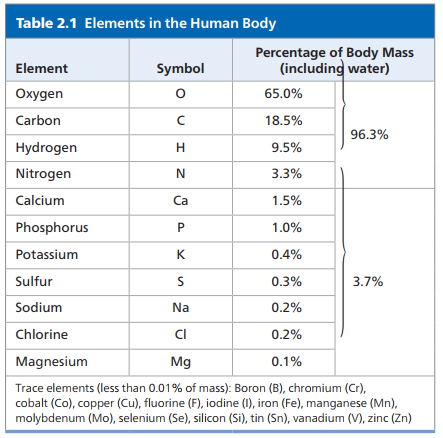
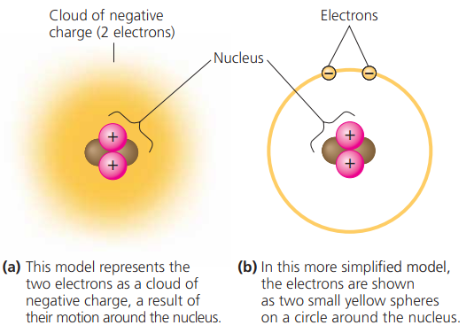
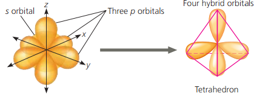
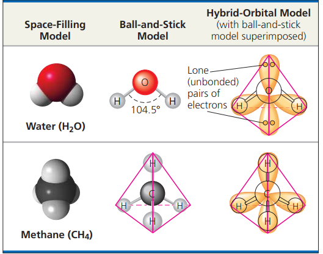
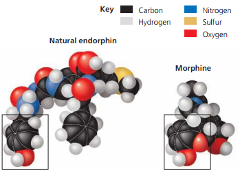

# Chemical Context of Life

## Overview

- The structure of compounds determines its property
  - Compounds consists of atoms joined by bonds
  - Number of protons (atomic number) determines an atom's identity
  - Atom's electron distribution, determines its ability to form bonds
  - A compounds properties depends on its atoms and how they are bonded together

## Matter

- Organisms are composed of **matter**
  - Matter is anything that occupy space and have mass
- **Matter** consists of element
  - **Element** is a substance that can not be broken down to other substances by chemical reactions
    - 92 naturally occurred elements
    - $[0.2,0.25]$ elements are **essentially elements** that an organism needs to function properly.
      - $\ce{O}$, $\ce{C}$, $\ce{H}$, $\ce{N}$ consists of 96% of living matter
      - $\ce{Ca}$, $\ce{P}$, $\ce{K}$, $\ce{S}$ consists for the majority of remaining 4%
      - **Trace elements** are required, but only a little
        - e.g, Iron is required by all species
        - vertebrates require Iodine, which is used for thyroid gland. If not, it will grow to an abnormal size, i.e., goiter.
      - Some elements are toxic, too
        - Arsenic, which are infamous for causing lethal diseases
        - Evolution of adaptation
          - Serpentine soil contains toxic elements for most plants. However, some plants are able to survive in that condition. [[Evolution, the Themes of Biology, and Scientific Inquiry]]
      - 
        - This is a table of elements that human requires. High percentage of oxygen, is because of respiration and aerobic respiration as to consume sugar.
  - Elements consists of a certain type of atom.
    - Different element has different atom, i.e., atom consists criteria to determine if two elements are different.
    - **Atom** is the smallest unit of matter that still retains the properties of an element. The size if very small.
      - Atom processes same name for the elements
      - Subatomic particles
        - Atomic nucleus
          - Neutrons
            - Mass number, the total number of protons and neutrons in the nucleus of an atom.
          - Protons
            - Number of protons is unique to the elements
            - Atomic number
          - Atomic mass and mass number
            - Atomic mass, the mass of an atom is very close to mas number, but not exact, due to the existence of **isotopes** make it an weighted average.
            - Isotopes behaves exactly the same in chemical reactions.
            - Stable isotopes and radioactive isotopes
              - Stable are isotopes which does not decay
              - Radioactive isotope is one which the nucleus decays spontaneously, giving off particles and energy. Then it become an different elements. e.g, $\ce{{}^14C -> {}^14N}$ after decay. 
                - Very useful in biology, for example, serve as radioactive tracers, as radioactive atoms can be incorporated into biologically active elements and used by cells.
                  - PET scannerr, imaging instruments
                  - Detect kidney disorders by eating radioactively labelled substances.
                  - **Sometimes, it damages** cellular molecules.
                - Radiometric dating
                  - Radioactive isotope has half-life, which is the time it takes for 50% of the parent isotope to decay.
                  - The half-life is not affected by any environmental variable, e.g., temperature.
                  - Measure ratio of different isotopes, we can calculate how many half-lives has passed, and thus, dating fossils which helps archaeologists and biologist.
        - Electrons
        - 
        - Different model of atoms. Notice that nucleus is actually very small, and they are not to scale.
      - Mass units
        - Dalton, or amu(atomic mass units). Neutrons and protons have masses close to 1 dalton.
        - Electron's mass is so small, 1/2000 of neutron or proton. Therefore, we shall ignore the mass of electron.
      - 
- **Compounds** consists of `>=2` elements
  
  - Example: $\ce{NaCl}$ is an compound. 
  - Compounds has characteristics **different** from those of its elements.
    - **Emergent properties** of compounds. Elements demonstrate new properties when we move up to higher organization level, compounds.
  
  - Information and function of molecules and ionic compounds depend on chemical bonding

## Weak Chemical Interactions

- Many large biological molecules are held in their functional form by weak interactions  
- Those interactions helps shape of molecule,too.

### Hydrogen Bond

- When a $\ce{H}$ atom is covalently bonded to an electronegative atom, the hydrogen atom has a partial positive charge that allows it to be attracted to a different electronegative atom with with a partial negative charge nearby.
  - **Hydrogen bond**, usually with $\ce{O}$ or $\ce{N}$

### Van der Waals Interactions

- Electron are not always evenly distributed, but at any instant, they may accumulate one part of a molecule or another.
- Result are ever changing region of positive and negative charge that enable all atoms and molecules to stick to one another -- **van der walls interactions**.
- It is weak, but a lot make difference -- Gecko(壁虎) use that to climb the wall.

## Molecular Shape and Function

- When an atom forms an covalent bonds, the **orbitals** in its valence shell undergo rearrangement.
- 
  - **Hybridization of orbitals.** The single s and three p orbitals of a valence shell involved in covalent bonding combine to form four teardrop-shaped hybrid orbitals.  
  - 
- Molecular shape is crucial: It determines how biological molecules recognize and respond to one another with specificity.  
  - Morphine relieves the pain, because it has similar structure/shape like endorphin in the brain, which bind to endorphin receptors on surface of a brain cell.
  - Therefore, although it is not endogenous (made by human), it still works!
  - 

## Chemical Reaction

- Equilibrium
- All the reactions reversible. Some just occur at the rate that is so low, that it completes all the way to the end.

- Law of Conservation of Mass

$$
\ce{
C6H12O6 + 6O2->6CO2 + 6H2O + energy
}
$$

- This is **cellular respiration**, where we breath oxygen and release CO2 and get energy, the reverse process of photosynthesis

