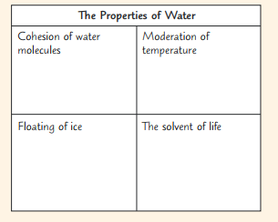
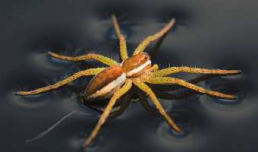
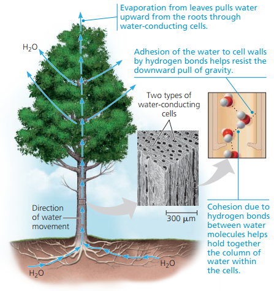

# Water

## Overview

- Water is a polar molecule
- Weak attractions between oppositely charged regions of water molecules form **hydrogen bonds**, allow water molecules to bond to each other
- In liquid water, the hydrogen bonds is constantly break and re-form, hence, they slip and slide to each other.
- In ice, the hydrogen bonds are stable and water molecules are **farther apart**, allows it to float on top.
  - **Insulates the water below**, enabling survival of aquatic life.

## Polar covalent bonds in water molecules result in hydrogen bonding

- V shaped $\ce{H-O-H}$
- Oxygen is more electronegative than hydrogen
  - Electrons of the covalent bonds spend more time closer to $\ce{O}$, forming **polar covalent bonds**
  - This makes water molecule a **polar molecule**
    - $\delta -$ charge for oxygen
    - $\delta +$ charge for hydrogen
- Hydrogen bond
  - Hydrogen bonds form, break, and re-form with great frequency.
  - The extraordinary properties of water emerge from this hydrogen bonding  

## 4 Emergent properties of water

### Cohesion of Water Molecules

- At any instant, water molecules are linked by hydrogen bonds.
- This linkage, make water more structured than most other liquids as they are hold together by hydrogen bonds creating **cohesion**
  - **High surface tension**
    - Water has high-surface tension due to all the hydrogen bond at surface of water bond to water itself, but not air. Such asymmetry gives water high **surface tensions**
    - Plant, raft spider, etc. utilize this property.
    - 
  - **Adhesion**
    - Plant use that to grab water upwards. Adhesion of water by hydrogen bonds to the molecules of cell walls helps counter the downward pull of gravity.
    - 

### Moderation of Temperature

- 水可以在自身温度几乎不变的情况下吸收相对来说很多的热
  - 天热吸热
  - 天冷放热
- 