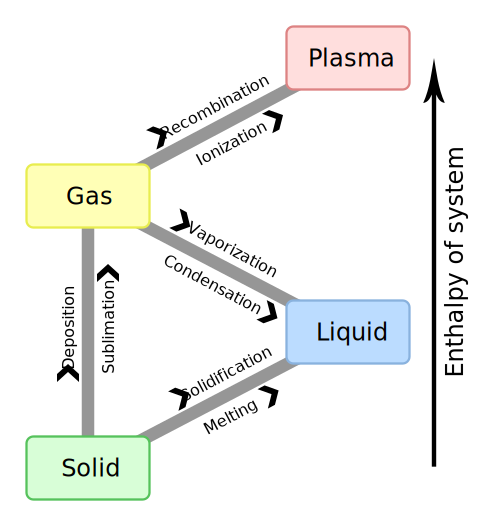
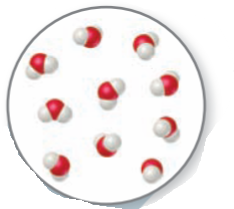
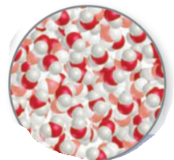
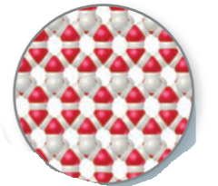
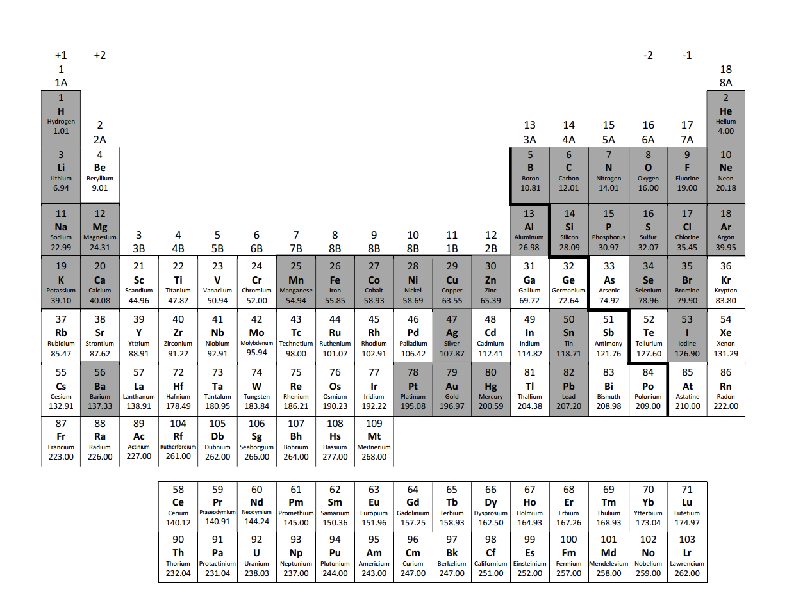
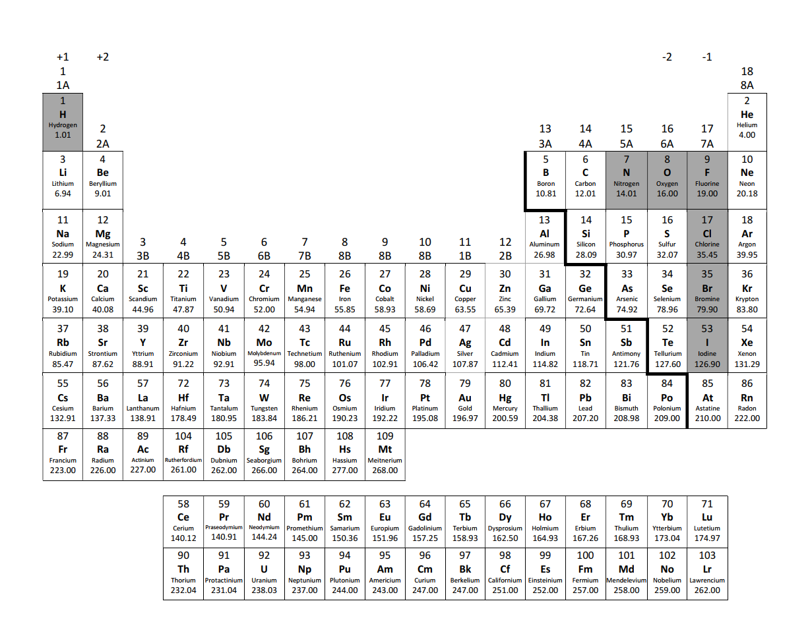
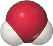

# Unit 1 - Introduction to Chemistry

## Introduction

- Chemistry is the study of the properties and behaviour of matter
- **Matter**
  - Anything that has mass and occupies space
- **Property**
  - Any characteristics that allow us to recognize a particular type of matter and to distinguish it from other types.
- **Elements**
  - Substances that comprise matter.
- **Atoms**, the smallest piece of a matter that still preserve its original property.
  - Every elements is composed of a unique kind of atom.
- **Molecules**, two or more atoms that are joined in specific shapes.
- **Macroscopic**
  - The world of ordinary size
- **Submicroscopic**
  - The world of atoms and molecules

## Scientific Method

- Collect information
- Formulate a hypothesis
- Test the hypothesis
- Formulate the theory
- Publish the theory
- Repeat test processs

## Classification

### Physical State

Gas, liquid, and solids are **states of matter**. Plasma is another state of matter.



| State     | Volume          | Shape          | Compressible (Appreciable) | Molecules                                                    |
| --------- | --------------- | -------------- | -------------------------- | ------------------------------------------------------------ |
| gas/vapor | no fixed volume | no fixed shape | True                       |  |
| liquid    | fixed volume    | no fixed shape | False                      |  |
| solid     | definite volume | definite shape | False                      |  |

### Composition

- **Pure substance** (substance), matter that has distinct properties and a composition that does not vary from sample to sample, i.e., **homogeneous**
  - **Elements** are substances that can not be decomposed further.
    - Composed on only one kind of atom
  - **Compounds** are substances that composed of >2 elements.
    - Composed of one kind of molecule, which are composed of >2 elements.
  - **Mixture**
    - Composed of multiple compounds and elements.
    - Each substance retains its chemical identity here

### Elements

- 118 kinds of elements
- Some data
  - $\ce{O (49.5\%)}$, $\ce{Si (25.7\%)}$, $\ce{Al (7.5\%)}$, $\ce{Fe (4.7\%)}$, and $\ce{Ca (3.4\%)}$ account for >0.9 of Earth's curst.
  - $\ce{O (65\%)}$, $\ce{C (18\%)}$, and $\ce{H (10 \%)}$ >0.9 of human body.
- Common elements and their name :notebook:
  - 
- Molecular structure
  - Atoms, i.e., $\ce{Na}$, $\ce{Cl}$
  - Diatomic molecules, i.e., $\ce{H2}$, $\ce{N2}$, $\ce{F2}$, $\ce{O2}$, $\ce{I2}$, $\ce{Cl2}$, $\ce{Br2}$ $\ce{}$ :notebook:
    - 

### Compounds



- Multiple atoms form elements. Consider formation of water
  - $\ce{2H2(g) + O2(g) -> 2H2O(g)}$
    - Burn hydrogen gas in oxygen gas to produce water
  - $\ce{2H2O(l) -> O2(g) + 2H2(g)}$
    - Pass electricity through water to obtain oxygen and hydrogen gas
- **Law of constant composition(Law of definite proportion)**
  - A pure compound has the same composition and properties in under conditions regardless of its source.

### Mixture

- Substances that makes up a mixture are **components** of the mixture.

- **Homogeneous** (**solution**)
  - Mixtures that are uniform throughout, e.g., salt water, alloy, air
- **Heterogeneous**
  - Mixtures that are not uniform throughout, e.g., granite with weird texture/pattern

```python
if uniform:
    "homogeneous mixture (solution)"
    if not variable_composition:
        "substance"
        if more_than_one_element:
            "compound"
        else:
            "element"
else:
    "heterogeneous mixture"
```

## Properties of Matter

- Chemical property
  - The way a substance may change, or react, to form other substance
  - Example
    - Flammability
- Physical property
  - The properties can be observed without changing the identity and composition of the substance
  - Example
    - color, odor, density, melting point, boiling point
- Intensive property
  - **do not depend on the amount of sample being examined**
  - particularly useful in chemistry because can used to identify substance
  - Example
    - melting point
- Extensive property
  - **depend on the amount of sample/relate to the amount of substance present**
  - Example
    - mass and volume

### Physical and Chemical changes

- **Physical change**, a substance changes its physical appearance but not its composition
  - State change
  - Separation of mixtures, e.g., $\ce{CO2}$ from drink
    - Filtration
    - Distillation
    - Chromatography
- **Chemical change** (**reaction**), substance is transformed into a chemically different substance

## Unit of Measurement

- Units of measurement
  - many properties of matter are quantitative——associated with numbers
  - **metric system** is the units used for scientific measurements
  - SI units :notebook:
    - | Physical Quantity   | Name of Unit | Abbreviation |
      | ------------------- | ------------ | ------------ |
      | Mass                | Kilogram     | kg           |
      | Length              | Meter        | m            |
      | Time                | Second       | s or sec     |
      | Temperature         | kelvin       | K            |
      | Amount of substance | Mole         | mol          |
      | Electric current    | Ampere       | A or amp     |
      | Luminous intensity  | Candela      | cd           |
  
  - Prefix :notebook:
  
    - | Prefix | Abbreviation | Meaning    |
      | ------ | ------------ | ---------- |
      | Peta   | P            | $10^{15}$  |
      | Tera   | T            | $10^{12}$  |
      | Giga   | G            | $10^9$     |
      | Mega   | M            | $10^6$     |
      | Kilo   | k            | $10^3$     |
      | Deci   | d            | $10^{-1}$  |
      | Centi  | c            | $10^{-2}$  |
      | Mili   | m            | $10^{-3}$  |
      | Micro  | $\mu$        | $10^{-6}$  |
      | Nano   | n            | $10^{-9}$  |
      | Pico   | p            | $10^{-12}$ |
      | Femto  | f            | $10^{-15}$ |
      | Atto   | a            | $10^{-18}$ |
      | Zepto  | z            | $10^{-21}$ |

- Length, a measure in size
- Mass, a measure in amount of material in an object
  - Notice mass $\ne$ weight
- Temperature, a measure of hotness or coldness of an object, or average kinetic energy of atoms in the substance.
  - Celsius
    - $0\,\celsius$ is define as temperature of freezing point of water at sea level
    - $100\,\celsius$ is defined as temperature of boiling point of water at sea level
  - Kelvin
    - $0\,\textrm{K}$ is absolute zero, equal to $-273.15\,\celsius$. At this temperature, all atom are supposed to cease to move.
    - Since 0 degree in kelvin is far lower than in Celsius, $\textrm{K} = \celsius + 273.15$
  - Fahrenheit
    - $32 \degree\textrm{F}$ is defined as temperature of freezing point of water at sea level
    - $212 \degree\textrm{F}$ is defined as temperature of boiling point of water at sea level
    - Therefore, $\degree\textrm{F} = \frac{9}{5}\celsius + 32$ 

- Derived unit

  - Multiply or divide one or more of the base unit create derived unit.

- Volume, cube of length

  - $\textrm{cm}^3$, cubic centimeter, is volume of a cube that is 1 centimeter on each edge, also write as $\textrm{cc}$ sometimes.
    - $\textrm{dm}^3$, $\textrm{m}^3$ also exists
  - $\textrm{L} = \textrm{dm}$

- Density, amount of mass in a unit volume of a substance, i.e., [mass] / [volume]

  - $g/cm^3$
  - $g/ml$

- Energy, the capacity to do work or transfer heat.

  - Work is force times displacement
  - Heat is change in temperature of an object
  - Joule, is defined as amount of kinetic energy possessed by a 2 kg substance moving at velocity of 1m/s is $1 J$

  - calorie (cal), is amount of energy required to raise the temperature of 1 g of water up 1 celsius. （14.5 Celsius -> 15.5 Celsius)
  - Caloire (Cal), is 1000 caloires, which is usually seen in food label, Cal = 1 kcal = 1000 cal

## Uncertainty

### Significant figures

Two kind of numbers

- Exact
  - Counting
  - Defined, i.e., 1 km  = 1000 m, 1 in = 2.54 cm
- Inexact (measured)
  - Uncertain arises from
    - Equipment errors, e.g., a scale that only measure to 0.01 gram
    - Human errors, e.g., measure mass without zero the scale
    - **Can not avoid**
  - Keep track of uncertainty

Significant figures are just lazy way to represents uncertainty

- $2.2405 \pm 0.0001 g$ has an uncertainty to order of magnitude of $10^{-4}$. But obviously, write them every time is tedious. Therefore, we shall assume that *there is always some uncertainty in the last digit reported for any measured quantity*
- all digits of a measured quantity, including the uncertain one, are called **significant figures**
  - zero between nonzero digits are always significant
  - zero at beginning of number are not significant
  - zero at end of number are significant only if it contains a decimal point
    - If zero at end of number is significant but number does not have decimal point, use exponential/scientific notation.
  - Exact number have infinite significant figures

When calculation, keep uncertainty in mind. There should only be one uncertain digits presented in the final answer. 

- Addition and subtraction, the result has the same number of decimal places as the measurement with the fewest decimal places.
- Multiplication and division, the result contains the same number of significant figures as the measurement with the fewest significant figures.

When a calculation involves two or more steps and you write answers for intermediate steps, retain at least one nonsignificant digit for the intermediate answer, i.e., **don't clear you calculator**

### Precision and Accuracy

- Precision is how close the measurement agrees with each other.
  - Variance $\frac{\sum_{i=0}^{n}(x_{i} - \overline{x})^2}{N}$
  - Standard deviation  $\sqrt{\textrm{variance}}$
- Accuracy is how close the measure agrees with the accepted value.
  - Difference between average and accepted value.

## Dimensional Analysis

- Technique helps to keep track of unit.

### Conversion factors

- A conversion factor is a fraction whose numerator and denominator are the same quantity expressed in different units.
  - Numerator is target unit
  - Denominator is given unit

### Example

Convert 115 lb to grams: $115 \cancel{lb} \times \frac{456.6 g}{1 \cancel{lb}} = 5.22 \times 10^4 g$

Nothing prevent us from apply this technique recursively! Let's use more conversion factor.

Convert speed of nitrogen molecule in air at room temperature, $515 m/s$, to miles per hour: $515 \cancel{m/s} \times \frac{1 \cancel{km}}{1000 \cancel{m}} \times \frac{1 mi}{1.6093 \cancel{km}} \times \frac{3600 \cancel{s}}{1 hr} = 1.15 \times 10^3 mi/hr$

We observed that for derived unit, convert each dimensionality/base unit individually would do the work.
