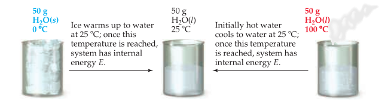

# Energy

- Study of energy and it's transformations, is **thermodynamics**
- **Thermo chemistry**, is the study of chemistry that involves heat (chemical reaction and energy changes)

## Nature of Chemical Energy

$$
w=F\times d
$$

$$
E_{\textrm{el}}=\frac{kQ_1Q_2}{d}
$$

- Electrostatic potential energy
- $k$ is proportionality constant and equal $8.99\times 10^9\textrm{J}\cdot \textrm{m}/\textrm{C}^2$

- Properties
  - All the electrons try to achieve the state that has lower electrostatic potential energy.
  - Opposite charge: move closer.
  - Same charge: move infinitely far $E_{el}(\infty)=0$
- **Fundamental Principle of Thermo chemistry**
  - Energy is released when chemical bonds are formed
  - Energy is consumed when chemical bonds are broken.

## The First Law of Thermodynamics

- Energy can be converted from one form to another, but it is never destroyed.
- To quantitatively apply this law, we need separate world into individual pieces.

### System and Surrounding

- The portion of the world that we care about (to study), is called **system**
- Everything else is **surroundings**
- Types of System
  - *Open system*, matter and energy can be exchanged with the surroundings
  - *Closed system*, energy can be exchanged (in form of work and heat), but not matters
  - *Isolated system*, neither energy nor matter are exchanged.

### Internal Energy

- Internal energy is sum of all energies of the components of the system.
- $E$ is almost impossible to calculated. Hence, $\Delta E$ is the only thing we concern.
  - $\Delta E = E_{\textrm{final}}-E_{\textrm{initial}}$
  - We are taking the perspective of the system. Hence, $\Delta E >0$ if system gained energy, and $\Delta E < 0$ if the system losses energy to the surroundings.

### Another Way

$$
\Delta E=q+w
$$

- Since system can only exchange energy in form of heat or work, then the exchange can be re-written as above.

| Symbol     | Positive                             | Negative                         |
| ---------- | ------------------------------------ | -------------------------------- |
| $q$        | system get more heat **endothermic** | system loses heat **exothermic** |
| $w$        | work done on system                  | system do work                   |
| $\Delta E$ | gain energy                          | loses energy                     |

### Idempotent/State

- Internal energy is a state function, **system always have the same energy under the same condition.** 
- The path it takes to reach this state, is irrelevant to the internal energy of the system.

- However, the $q$ and $w$, which constitutes the path to reach this energy, depends on the path.

## Enthalpy

$$
H=E+PV
$$

- **Enthalpy** is defined as internal energy plus the product of the pressure and volume. 
- Internal energy, pressure, and volume are only state functions. Hence, the enthalpy is a state function too. 

### Pressure Volume Work

