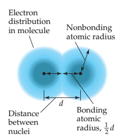
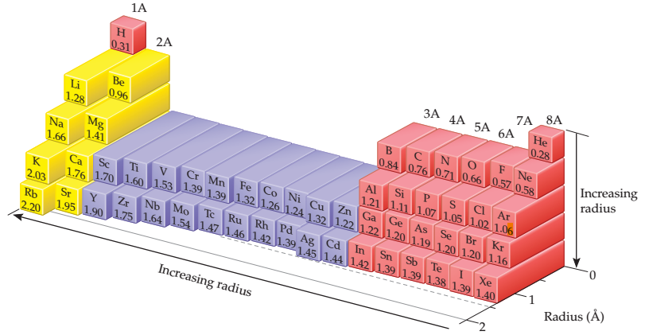
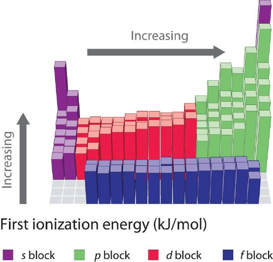

# Periodic Trends of Elements

## Periodic Table

- In 1869, Dmitri Mendeleev (1834–1907) in Russia created periodic table of elements.
- Arranged the elements in their atomic weight, rather than atomic number due to negligence of such number.
- Atomic number arranged periodic table handled some problem with atomic weight, as some atom with higher weight even with lower atomic number.

## Effective Nuclear Charge

$$
F=\frac{Q_1Q_2}{d^2}k
$$

- The magnitude of attractive force between an electron and the nucleus depends on 
  - magnitude of the nuclear charge
  - average distance between the nucleus and the electron

- When multiple electron exists, **many electron atom**, each electron experiences the repulsion due to other electrons too.
  - **Effective nuclear charge**, the net nuclear charge that electron experiences under shielding of other.
  - **Actual nuclear charge**, $Z$
  - **Screening constant, ** $S\in \{x>0|x \in \R\}$

$$
\begin{align}
Z_{\textrm{eff}}&=Z-S\\
&= \begin{aligned}
&0.35 \times (\textrm{e with n}) +    \\ 
&0.85 \times (\textrm{e with}\ n-1) +  \\ 
&1\times (\textrm{e with}\ n \le n-1)  
\end{aligned}
\end{align}
$$

- It also explains why the energy of orbitals with the same $n$ increase with increasing $l$ value
  - The radial probability function of $s$ has small peak near nucleus, and $p$ is general has larger probably when further away from nucleus.
  - Hence, the electron of $s$ are less screened compare to $p$, make them has lower energy due to increase effective nuclear charge.

> The effective nuclear charge increases from left to right across any period 
> of the periodic table.

- Only core electrons, a.k.a., noble gas short hand electrons effectively shield nuclear charge. As move from left to right across period, the nuclear charge increase but not shield – so it increase.

> The effective nuclear charge slightly increases from top to bottom.

- As electron cloud are diffuse, they are shield electrons less.

## Size of Atoms and Ions

### Atomic Radius

- Atoms are a small nucleus and a electron cloud, thus, their size need to be defined before we continue.
  - The shortest distance separating the two nuclei during collision between two atoms (and then they should bounce off from each other), is called **nonbonding atomic radius** or **van der Waals radius**
  - The length of chemical bond between two same atom  and divide by two is called **bonding atomic radius**, which usually smaller from **nonbonding atomic radius**

- One may estimate the distance between two atoms in a chemical compound by simply adding their bonding atomic radii together.

#### Periodic Trends

- Atomic radius decrease as $\rightarrow$
  - Larger $Z_{\textrm{eff}}$ cause valence electron closer to the nucleus.
- Atomic radius increase as $\downarrow$
  - Increase in principal quantum number simply make shell larger.

### Ionic Radius

- Measure the inter atomic distance in **ionic compound** to obtain **ionic radius**.
  - Cation, due to the lost of valence electron (i.e., the electron which are farthest from the nucleus), generally smaller than original atom.
  - Anion, due to obtain of electron and fill of shell, generally larger than original atom.

#### Periodic Trends

- For ions carrying the same charge, ionic radius increase as $\downarrow$
- For period
  - Ionic radius of metal usually smaller than of nonmetal
  - Ionic radius of metal/nonmetal decrease as $\rightarrow$

- **Isoelectronic series**
  - A group of all ions containing the same number of electrons.
  - Their ionic radius decrease as atomic number increase.

## Ionization Energy

- The **ionization energy** of an atom or ion is the minimum energy  required to remove an electron from the ground state of the isolated gaseous atom or ion. 
  - **First ionization energy**, $I_1$, is energy needed to remove the first electron from the neutral atom.
  - **Second ionization energy**, $I_2$, is energy needed to remove the second electron.
  - $\ldots$
- The higher the ionization energy, the more difficult it is to remove an electron.
- Removal of successive electron require more energy. Remove of inner shell electron (i.e., noble gas electrons), require a huge amount of additional energy.

###  Periodic Trends

- $I_1$ generally increases as $\rightarrow$
  - Higher attraction ($Z_{\textrm{eff}}$) and lower average distance (atomic radius)
- $I_1$ generally decreases as $\downarrow$ 
  - Attraction increases slightly, but average distance increases a lot.
- s, p block elements $I_1$ increase significantly

- $\ce{N}$ to $\ce{O}$, the ionization energy decreases due to $2p^4$ subshell of oxygen and repulsion in the pair.
- $\ce{Be}$ to $\ce{B}$, the ionization decreases because occupation of another electron in $2p^1$
  - Notice when electrons are removed from an atom, they are always removed from largest principal quantum number $n$ and largest angular quantum momentum number $l$
  - When electron is added to an atom, it will filled an empty or partially filled orbital with the lowest value of $n$

##  Electron Affinity

- The energy change that occurs when an electron is added to a gaseous atom is called the **electron affinity**
- It measures the attraction of atom to an electron.
  - For most atom, the energy is released when an electron is added.
  - The greater the attraction between an atom and an added electron, the more negative the atom’s electron affinity
- If it is positive, it means, the atom refuse to obtain an electron.

### Periodic Trends

- Electron affinity increase as $\rightarrow$
  - Notice electron affinity decrease when move from C to N – N refuse any electron and have positive electron affinity. C has electron affinity of $-122 kJ/mol$
    - Because they have half filled $p$ and electron already in orbital would hate them.
  - Halogens like electron a lot.
  - All noble gas does not like electron, for doing so require reside an electron reside in higher orbital.
- Electron affinity slightly decrease as $\downarrow$
  - Because the average distance between electron and orbital increase, and thus, less attractive.

## Electronegativity

- Measure of ability of an atom in a chemical compound to attract e-
- a relative scale running from 0.79 to 3.98

### Periodic Trends

- Electronegativity increase as $\rightarrow$
- Electronegativities decrease as $\downarrow$

