# Unit 2 - Understand Atom

## Introduction

- The key to understand the properties around us, is the atoms structure and behavior
- There are only 118 kinds of elements, therefore, only 118 kinds of atoms, but it consists infinite number of matters

## **Dalton -- Atomic Theory of Matter**

### Content

- Each element is composed of extremely small particles called atoms
  - 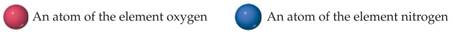
- All atoms of a given element are identical, but the atoms of one element are different from the atoms of all other elements
  - 
- Atoms of one element cannot be changed into atoms of a different element by chemical reactions; atoms are neither created nor destroyed in chemical reactions
  - 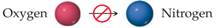
- **Law of conservation of mass**
  - the total mass of materials present after a chemical reaction is the same as the total mass present before the reaction
- **Law of constant composition**
  - Compounds are formed when atoms of more than one element combine; a given compound always has the same relative number and kind of atoms
    - 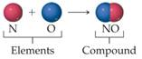

- **Law of multiple proportions**
  - If two elements A and B combine to form more than one compound, the masses of B that can combine with a given mass of A are in the ratio of small whole numbers.

### Caveats

- It claims all atoms of a given elements are identical, which is wrong.
- Everything else is correct.

## Some Experiments

### **JJ Thomson** & Electron

- Cathode ray tube is a tube containing a gas at low pressure with metal electrodes at opposite ends, and an electric current passed through
- Particles in a gas at low pressure pass from cathode (-ve terminal) to anode (+ve terminal) and cause
  - a paddle wheel inside tube to move
  - a fluorescent screen to fluoresce
- Cathode rays were deflected from a magnetic field, and also from a negatively charged plate
- **Deflected by electronic charges & magnetic fields**, hence, **ELECTRONS**
- **Independent of material of cathode nor gas**, electrons are part of atoms of all elements

- Find ratio of electronic charge and mass of electron.
- **Plum pudding model**

### Millikan

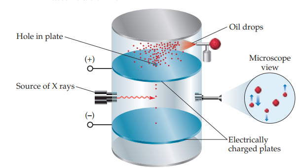

- found the quantity of charge carried by an electron (1.602 x 10-19 coulombs)
- found mass of an electron is 1/1840 of a H atom

### Rutherford

**Ernest Rutherford** (1911) NZ – Gold foil experiment

- Aimed a narrow beam of alpha particles at a thin sheet of gold foil

  - Expected alpha particles to pass right through, with only a slight deflection due to negative charge of the atoms, arising from plum pudding model.

  - But majority passed through without deflection – some bounced off gold at large angles, some bounced straight back

- **Nucleus model**
  - Proposed that atom is mostly empty space with a small nucleus in the middle.

## Atomic Number

- Atomic numbers
  - The atoms of each element have a **characteristic number of protons**
    - **atomic number**-the number of protons in an atom
    - Protons number is equal to electrons number
  - Mass numbers
  - Atoms of a given element can differ in the number of **neutrons** they contain, so in **mass**
- Isotopes
  - Atoms with identical atomic numbers but different mass numbers(same protons, different in numbers of neutrons) are called isotopes
  - A isotope of any given element are all alike chemically

## Atomic Weights

- Atomic mass unit
  - The mass of $\frac{1}{12}$ of a $\ce{^12C}$ atom.
- Average atomic mass of an elements, which is

$$
\sum{(\textrm{isotope's atomic mass})(\textrm{natural abundance})}
$$

## Periodic Table

- Periodic table

- Definition
  - *the periodic table is the most significant tool that chemists use for organizing and remembering chemical facts*
  - Way to write
  - arrange elements in order of increasing atomic number
    - Horizontal rows of periodic table are called *periods*
    - Vertical columns of the periodic table are called *groups*
    - Steplike line divide metals from nonmetals
  - Way to read

    - 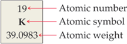
  - Groups number
  - IUPAC(International Union of Pure and Applied Chemistry)
    - 1-18 number
  - America convention
    - using 1A, 2A…. 1B, 2B
  - Groups property
    - Elements in a group often exhibit similarities in physical and chemical properties--  

- | Group Number | Group name | Sample elements |
  | ---- | ------------------------------------ | ----------------- |
  | 1A | Alkali metals | $\ce{\ce{Li}}$, $\ce{ \ce{Na}}$, $\ce{ \ce{K}}$, $\ce{ \ce{Rb}}$, $\ce{ \ce{Cs}}$, $\ce{ \ce{Fr}}$ |
  | 2A | Alkaline earth metals | $\ce{Be}$, $\ce{Mg}$, $\ce{Ca}$, $\ce{Sr}$, $\ce{Ba}$, $\ce{Ra}$ |
  | 6A | Chalcogens (Oxygen)                  | $\ce{O}$, $\ce{S}$, $\ce{Se}$, $\ce{Te}$, $\ce{Po}$ |
  | 7A | Halogens (Metals can create sodium) | $\ce{F}$, $\ce{Cl}$, $\ce{Br}$, $\ce{I}$, $\ce{At}$ |
  | 8A | Noble gases (or rare gases)         | $\ce{He}$, $\ce{Ne}$, $\ce{Ar}$, $\ce{Kr}$, $\ce{Xe}$, $\ce{Rn}$ |

- Nonmetal and metal
  - Metal
    - Position
      - All elements(except hydrogen) on the left and in the middle of the table are **metallic elements**, or **metals**
      - Property
        - luster-- High electrical conductivity
        - High heat conductivity
        - All metal except mercury(Hg) are solid at room temperature

    - Nonmetals
      - Position
        - Right the stepped line that runs from boron to astatine-- **nonmetallic elements, nonmetal**

      - Property
        - at room temperature, some of the nonmetals are gaseous, some are solid, and one is liquid(bromine)

    - Metalloids
      - Position
        - elements that lie along the line

## Molecules

- Several atoms bond together to create a **molecule**.

- A molecule made up of two atoms is called a **diatomic molecule**
  - $\ce{H2}$, $\ce{ O2}$, $\ce{ N2}$, $\ce{ F2}$, $\ce{ Cl2}$, $\ce{ Br2}$, and $\ce{I2}$

- Compounds composed of molecules contain more than one type of atom and
  are called **molecular compounds**

*Most of the molecular substances we will encounter contain only nonmetals.*

### Molecular and empirical Formulas

- Chemical formulas that indicate the actual numbers of atoms in a molecule are called **molecular formulas**.

- Chemical formulas that give only the relative number of atoms of each type in a molecule are called **empirical formulas**.

### Representations

- Structural formula
  - Definition
    - A **structural formula** shows which atoms are attached to which
    - Example
      - 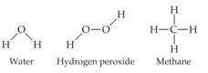
    - Part
      - Atoms are represented by their chemical symbols
      - lines are used to represent the bonds that hold the atoms together
- Perspective drawing-three dimensional shape
  - Example
    - 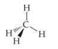
  - Part
    - Dashed wedge is a bond behind page - wedge is a bond out of page
      - solid line is a bond in plane of page
- Ball-and-stick
  - Part
    - Atoms spheres
    - Bonds sticks
      - Use color to represent chemical elements, sometimes with chemical symbol
  - Advantage
    - Accurately represent the angle at which the atoms are attached to one another
  - Example
    - 
- Space-filing model
  - Advantage
    - relative sizes of the atoms
  - Defect
    - Difficult to see the angles
    - Use colour to represent chemical elements, sometimes with chemical symbol
  - Example
    - 

## Ionic

- If electrons are removed from or added to an atom, a charged particle called an **ion** is formed.
- An ion with a positive charge is a **cation**.
- A negatively charged ion is an **anion**.  

In general, metal atoms tend to lose electrons to form cations and nonmetal atoms
tend to gain electrons to form anions. Thus, ionic compounds tend to be composed
of both metal cations and nonmetal anions, as in $\ce{NaCl}$.

## Nomenclature :notebook:

### Cation

- Cations formed from metal atoms have the same name as the metal
  - Most alkaline metals and 3 specifics
    - | Compound        | Name      |
      | --------------- | --------- |
      | $\ce{Al^{3+}}$  | Aluminium |
      | $\ce{Zn^{2+}}$  | Zinc      |
      | $\ce{Ag+}$      | Silver    |
      | $\ce{Hg2^{2+}}$ | Mercury   |
  
- If a metal can form cations with different charges, the positive charge is indicated by a Roman numeral in parentheses following the name of the metal
  - | Compound       | Name       |
    | -------------- | ---------- |
    | $\ce{Fe^{2+}}$ | Iron (II)  |
    | $\ce{Fe^{3+}}$ | Iron (III) |
    
  - If it is not alkaline metals and not alkaline earth metals and not three one charge metals listed above, put a Roman numeral after it. If unsure, put it here since redundant is better than a mistake.
  
- Cations formed from molecules composed of nonmetal atoms have names that end in `-ium`
  
  - | Compound    | Name      |
    | ----------- | --------- |
    | $\ce{H3O+}$ | Hydronium |
    | $\ce{NH4+}$ | Ammonium  |

### Anion

- The names of monatomic anions are formed by replacing the ending of the name of the element with `-ide`

  - $\ce{Cl-}$ Chloride
  - Halogens always have $1-$ charge
  - Chalcogens always have $2-$ charge

- Polyatomic anions containing oxygen have names ending in either -ate or -ite and are called oxyanions

  - | Compound | Name |
    | --- | --- |
    | $\ce{NO3-}$ | Nitrate |
    | $\ce{SO4^{2-}}$ | Sulfate |

  - Meaning of suffix

    - Most common one end with `ate`
    - One more $\ce{O}$ than `ate` create `per` prefix
    - One less $\ce{O}$ than `ate` create `ite` suffix
    - One less $\ce{O}$ than `ite` create `hypo` prefix

  - | Oxyanions of $\ce{Cl}$ | Name         |
    | ---------------------- | ------------ |
    | $\ce{ClO4-}$           | Perchlorate  |
    | $\ce{ClO3-}$           | Chlorate     |
    | $\ce{ClO2-}$           | Chlorite     |
    | $\ce{ClO-}$            | Hypochlorite |

  - 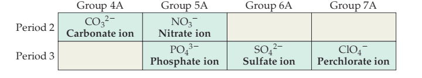

- If a $\ce{H}$ is attached to the polyatomic anions, put `hydrogen` or `dihydrogen` before the name. Sometimes, `bi` is also used.

  - | Chemical Formula | Name                           |
    | ---------------- | ------------------------------ |
    | $\ce{HCO3-}$     | Hydrogen carbonate/bicarbonate |
    | $\ce{H2PO4-}$    | Dihydrogen phosphate           |

| Name(s)                             | Formula         | Name(s)      | Formula |
| ----------------------------------- | --------------- | ------------ | ------- |
| acetate                             | $\ce{C2H3O2-}$ or $\ce{CH3COO-}$ | iodate       | $\ce{IO3-}$   |
| ammonium                            | $\ce{NH4+}$            | nitrate      | $\ce{NO3-}$    |
| arsenate                            | $\ce{AsO4^3-}$          | nitrite      | $\ce{NO2-}$    |
| bromate                             | $\ce{BrO3-}$           | oxalate      | $\ce{C2O4^2-}$  |
| carbonate                           | $\ce{CO3^2-}$           | perchlorate  | $\ce{ClO4-}$   |
| chlorate                            | $\ce{ClO3-}$           | periodate    | $\ce{IO4-}$    |
| chlorite                            | $\ce{ClO2-}$           | permanganate | $\ce{MnO4-}$   |
| chromate                            | $\ce{CrO4^2-}$          | peroxide     | $\ce{O2^2-}$    |
| cyanide                             | $\ce{CN-}$             | phosphate    | $\ce{PO4^3-}$  |
| dichromate                          | $\ce{Cr2O7^2-}$         | phosphite    | $\ce{PO3^3-}$  |
| hydrogen carbonate (or bicarbonate) | $\ce{HCO3-}$           | silicate     | $\ce{SiO4^4-}$  |
| hydrogen phosphate (or biphosphate) | $\ce{HPO4^2-}$          | sulfate      | $\ce{SO4^2-}$   |
| hydrogen sulfate (or bisulfate)     | $\ce{HSO4-}$           | sulfite      | $\ce{SO3^2-}$   |
| hydroxide                           | $\ce{OH-}$             | thiocyanate  | $\ce{SCN}$|
| hypochlorite                        | $\ce{ClO-}$           | thiosulfate  | $\ce{S2O3^{2-}}$   |

### Ionic

- Names of ionic compounds consist of the cation name followed by the anion name  
- $\ce{NaCl}$ sodium chloride

### Acids

- an acid is a substance whose molecules yield hydrogen ions $\ce{H+}$ when dissolved in water  

- Acids containing anions whose names end in -ide are named by changing the -ide ending to -ic, adding the prefix hydro- to this anion name, and then following with the word acid

  - | Anion    | Corresponding Acid   |
    | ------------------------------------ | ------------------------------------------------------------ |
    |  Cl- (chloride)                                    | HCl (hydrochloric acid)                                                             |
    |  Br- (bromide)                                     | HBr (hydrobromic acid)                                                             |

- Acids containing anions whose names end in -ate or -ite are named by changing -ate to -ic and -ite to -ous and then adding the word acid. Prefixes in the anion name are retained in the name of the acid

  - | Anion | Corresponding Acid |
    | ------- | -------------------- |
    | HClO4 | (perchloric acid)   |
    | HClO3 | (chloric acid)      |
    | HClO2 | (chlorous acid)     |
    | HClO  | (hypochlorous acid) |

### Molecules :notebook:

- The name of the element farther to the left in the periodic table (closest to the metals) is usually written first. An exception occurs when the compound contains oxygen and chlorine, bromine, or iodine (any halogen except fluorine), in which case oxygen is written last.
- If both elements are in the same group, the one closer to the bottom of the table is named first.
- Greek prefixes indicate the number of atoms of each element. (Exception: The prefix mono- is never used with the first element.) When the prefix ends in a or o and the name of the second element begins with a vowel, the a or o of the prefix is often dropped.

| Prefix  |Meaning|
| ------- | ----- | 
| mono- | 1 |
| di- | 2 |
| tri- | 3 |
| tetra- | 4 |
| penta- | 5 |
| hexa- | 6 |
| hepta- | 7 |
| octa- | 8 |
| nona- | 9 |
| deca- | 10 |  

### Simple Organics

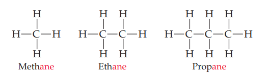

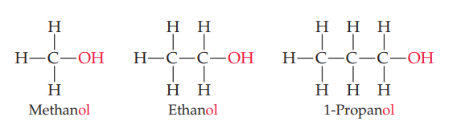

## Electromagnetic Radiation

- **Electromagnetic radiation** is a type of wave, e.g., light waves, radio waves, infrared (heat), X-ray, etc. Also known as **radiant energy**
- All types of electromagnetic radiation move through a vacuum at $c=2.998\times 10^{8} m/s \approx 3.00 \times 10^8 m/s$, the speed of light.

### Anatomy of Wave

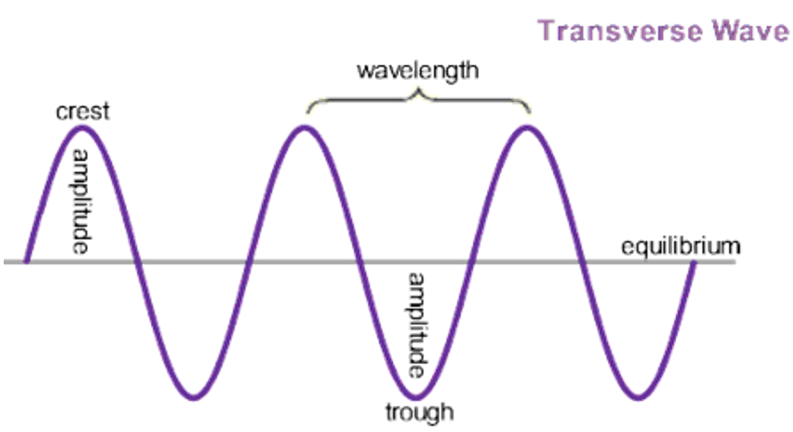

- **Wavelength**, the distance between two adjacent peaks (or between two adjacent troughs), denoted as $\lambda$
- **Frequency**, the number of complete wavelengths, **cycles**, pass at a given point in a second, denoted by $\nu$. Measured by cycles per second, $Hz=s^{-1}$, is one measurement.
- All electromagnetic radiation moves at the same speed $c$. Therefore, :notebook:

$$
\lambda\nu=c
$$

- The frequency of wave gives them different property, see electromagnetic spectrum below:

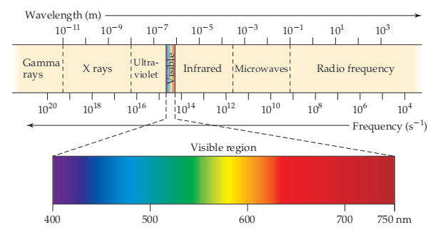

## Quantized Light

### Motivation

The wave model of light is limited and can not explain several problem:

- the emission of electrons from metal surfaces which put under light, **photoelectric effect**
- the emission of light from electronically exited gas atoms, **emission spectra**

### Model

- Max Planck proposed this model.
- Energy can be either released or absorbed by atoms only in discrete “chunks” of some minimum size, **quantum**.
  - Essentially, energy absorbed or released can only be one discrete number in multiples of $h\nu$, which makes it **quantized**
  - However, since Planck constant is too small, it is beyond our ability to observe any appreciable jump in energy.

$$
E=h\nu
$$

- **Planck constant**, $h=6.626\times 10^{-34} J\cdot s$

- Einstein proposes that **radiant energy is composed of photon**, and energy of each photon equals to $h\nu$, according to model proposed by Plank.

## Bohr Model

### Overview

1. Electrons exist only in certain discrete energy levels, which are described by quantum numbers.
2. Energy is involved in the transition of an electron from one level to another.

### Content

1. Only orbits of certain radii, corresponding to certain specific energies, are permitted for the electron in a hydrogen atom.
2. An electron in a permitted orbit is in an “allowed” energy state. An electron in an allowed energy state does not radiate energy and, therefore, does not spiral into the nucleus (*caveat: unexplainable in classical physics*).
3. Energy is emitted or absorbed by the electron only as the electron changes from one allowed energy state to another. This energy is emitted or absorbed as a photon.

<div style="display:flex">
  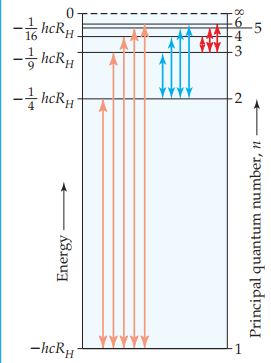
  
</div>

The energy of attracting between nucleus and electron at a given orbit is

$$
E=(-hcR_{H})(\frac{1}{n^{2}}) = (-2.18\times 10^{-18}J)(\frac{1}{n^2})
$$

- $n \in Z^{+}$, **principal quantum number**
  - $n\to \infin, E \to 0$ and radius of orbit increases. When $n$ is infinitely close to infinity, the electron is completely separated from the nucleus, **reference/zero energy state**
  - $n=1$, **ground state**
  - $n \in \{x | x \in Z \land x \ge 2\}$, **excited state**

The amount of energy that electron would require to move to higher-energy/lower energy state is :notebook:
$$
\Delta E = E_{f} - E_{i} = (-2.18\times 10^{-18} J)(\frac{1}{n^{2}_{f}} - \frac{1}{n^{2}_{i}})
$$

- When $\Delta E > 0$, or $n_{f} > n_{i}$, a photon with energy $\Delta E$ is emitted.
- When $\Delta E < 0$, or $n_{f} < n_{i}$, a photon with energy $-\Delta E$ is absorbed. (notice you can't absorb a negative energy photon)

Therefore, with a little bit of algebra, we can determine the frequency that a hydrogen gas's line spectra would emit
$$
\lambda = \frac{c}{\nu} = \frac{c}{\frac{-\Delta E}{h}} = \frac{hc}{-\Delta E} = \frac{hc}{hcR_{H}(\frac{1}{n^{2}_{f}} - \frac{1}{n^2_{i}})} = \frac{1}{R_{H}(\frac{1}{n^{2}_{f}} - \frac{1}{n^2_{i}})}
$$
Therefore, the frequency of light emitted in a line spectra is

$$
\frac{1}{\lambda} = (R_{H})(\frac{1}{n_{1}^{2}}-\frac{1}{n_{1}^{2}})
$$

- $R_{H}=1.096776\times 10^{7}m^{-1}$, **Rydberg constant**
- $n_{1}, n_{2} \in \Z^+$ and $n_{1} < n_{2}$

### Line Spectra

- **Monochromatic**, radiation composed of a single wavelength

- **Polychromatic**, radiation containing many different wavelengths

- A **spectrum** is produced when radiation from a polychromatic source is separated into its component wavelengths

  - **Continuous spectrum**, containing light of all wavelength

  - **Line spectrum**, containing only specific wavelength, which is emitted by high voltage pass through gas.

    - <div style="display:flex">
      
      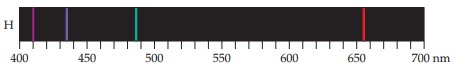
      </div>

### Limitation

- Only work with Hydrogen. A more complex model is necessary for other gas.

## More Quantum Physics

- Wavelength of the electron, or any other particle, depends on its mass and velocity.
- **Matter waves**, the wave characteristics of particles.

$$
\lambda =\frac{h}{mv}
$$

- Any ordinary size object would not show any wave like characteristics, simply because wavelength are too small.

- Because of wave like behaviour of electron, it is **impossible to measure both location and momentum of an object at high degree of accuracy simultaneously**.
  - Another explanation is, we must disturb an object with our measuring device to measure an object, e.g., you must use photon to hit your screen to see anything in screen.
  - You can't measure anything to greater accuracy then the frequency of light you used. However, increase frequency means increase disturb, as energy of photon has increased. Reduce frequency means reduce accuracy in position. Hence, **you just can't**
- Heisenberg/Uncertainty principle

$$
\Delta x \cdot \Delta (mv) \ge \frac{h}{4\pi}
$$

## Wave Function Model

- The Bohr's model requires electron to be on specific orbital. Since we want higher accuracy in momentum rather than location, we will use **probability** of electron at certain position to describe electron's position.
  - Wave function, describe electron in atom, which from solving Schrodinger's equation. Usually represented by $\psi$
  - $\psi^2$ gives **probability density/electron density** of electron will be found at certain location.
- This model claims **nucleus surrounded by electron cloud**

### Orbitals and Quantum Number

- **Orbitals** :notebook:
  - A set of wave functions
  - Characteristic shape and energy
- 3 number is introduced :notebook:

| Number | Values | Properties |
| ------------------------------------ | ---------------------------------------------------------- | ------------------------------------------------------------ |
| Principal quantum number, $n$        | 1, 2, 3, ...                                               | When $n$ increase, orbital become larger and electron has higher energy |
| Angular momentum quantum number, $l$ | s, p, d, f (0, 1, 2, 3). Must smaller than or equal to $n$ | Defines the shape of the orbital |
| Magnetic quantum number, $m_{l}$     | $x \in [-l, l] \land x\in Z$                               | Describe orientation of the orbital in space |
| Spin magnetic quantum number, $m_s$  | $+\frac{1}{2}, -\frac{1}{2}$                               | Describe the electron spin, or magnetic fields 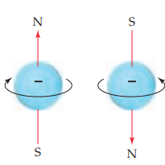 |

- Notice principal quantum number does not converge as $x\to \infin$. Hence, you have **INFINITE** number of orbitals. But only orbitals with electron are **occupied**, and others are **unoccupied** (so we will ignore them)

- The collection of orbitals with the same value of n is called an **electron shell**.
- The set of orbitals that have the same $n$ and $l$ values is called a **subshell**.
  - You denote the subshell as `f'{n}{l}'`, example 1s, 2s, 2p, etc.
- Properties
  - The shell with principal quantum number $n$ consists of exactly $n$ subshells
  - Each subshell consists of a specific number of orbitals, $(2l + 1)$
  - The total number of orbitals in a shell is $\sum_{i=0}^n(2i+1) = n^2$. Since each shell would hold 2 electrons, $2n^2$ elements exists in each period of periodic table.

### S Orbital

- It is **spherically symmetric**, i.e., the electron density/probability density is same regardless of the direction.
  - **radial probability density**, the probability that the electron is at a specific distance from the nucleus.
- 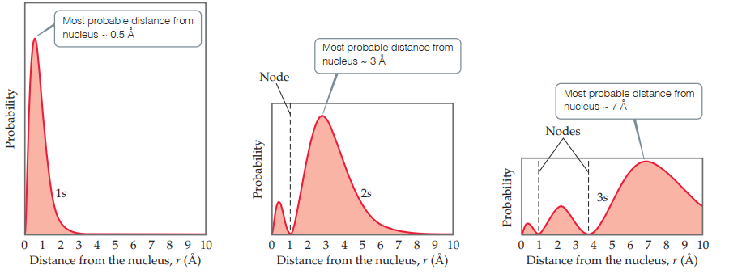
- 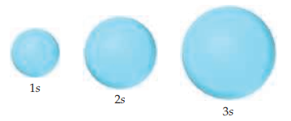
  - As the principal quantum number increase, the size of s orbital increase (more accurately, greater probability of finding the electron in further distance).
  - There will always be $n-1$ node and $n$ peaks in radial probability function of s orbital

### P Orbitals

- $p$ subshell has 3 orbitals.
- the probability distribution has a dumbbell shape, with 3 orientation, $p_{x}$, $p_{y}$, and $p_{z}$

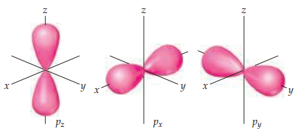

- The magnetic quantum number determines the orientation of P orbital.

### D & F Orbitals


## Many Electron atoms

:notebook:

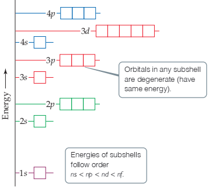

- In a many-electron atom, for a given value of $n$, the energy of an orbital increases with increasing value of $l$

### Pauli Exclusion Principle

- No two electrons in an atom can have the same set of four quantum numbers $n$, $l$, $m_l$, and $m_s$.
- Therefore, an orbital can hold a maximum of two electrons and they must have opposite spins.

### Electron Configurations

- Electrons always want to fill the orbitals with lowest energy possible.

- Thus, the orbitals are filled in order of increasing energy, with no more than two electrons per orbital.

- Two way of representation
  - 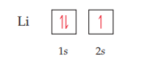
    - Orbital diagram
    - An arrow point up represents a positive spin magnetic quantum number.
    - An arrow point down represents a negative spin magnetic quantum number.
    - Paired and unpaired
  - $1s^22s^1$

### Hund's rule

- When filling degenerate orbitals the lowest energy is attained when the number of electrons having the same spin is maximized.
- **Electron occupy orbitals singly to the maximum extent possible**

### Noble gas shorthand

- Condensed electron configuration.
- We refer to the brackets symbol are **noble gas core** of the atom, or **core electrons**. The other electrons are **valence electrons**.
- $\ce{Na: 1s^2 2s^2 2p^6 3s^1}$ can also be written as $\ce{Na: [Ne] 3s^1}$

### Periodic Table Trick

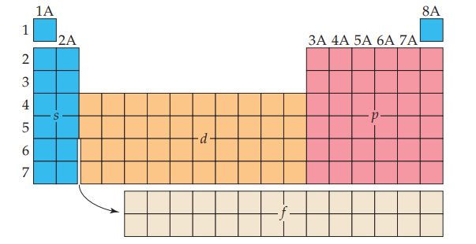

- The s block and the p block elements together are the representative elements, sometimes called the main-group elements.
- The d block containing the transition metals
- The f block containing rare earth elements, which mostly are radioactive (lanthanide/actinide)

- Just follow the periodic table/fill order to determine the relative strength of orbitals and write electron configuration during exam.

### Anomaly

- You won't need to know that in exam, your teacher won't trick you about that.
- $\ce{Cu: [Ar] 4s^1 3d^10}$
- $\ce{Cr: [Ar] 4s^1 3d^5}$
- The elements around $nd^5$ and $nd^{10}$ tend to give up some electron from $s$ orbitals to better fill $d$ orbitals. This is caused because of closeness of $3d$ and $4s$ and similar orbital energies. It happens if they can half fill or completely fill another orbital entired.

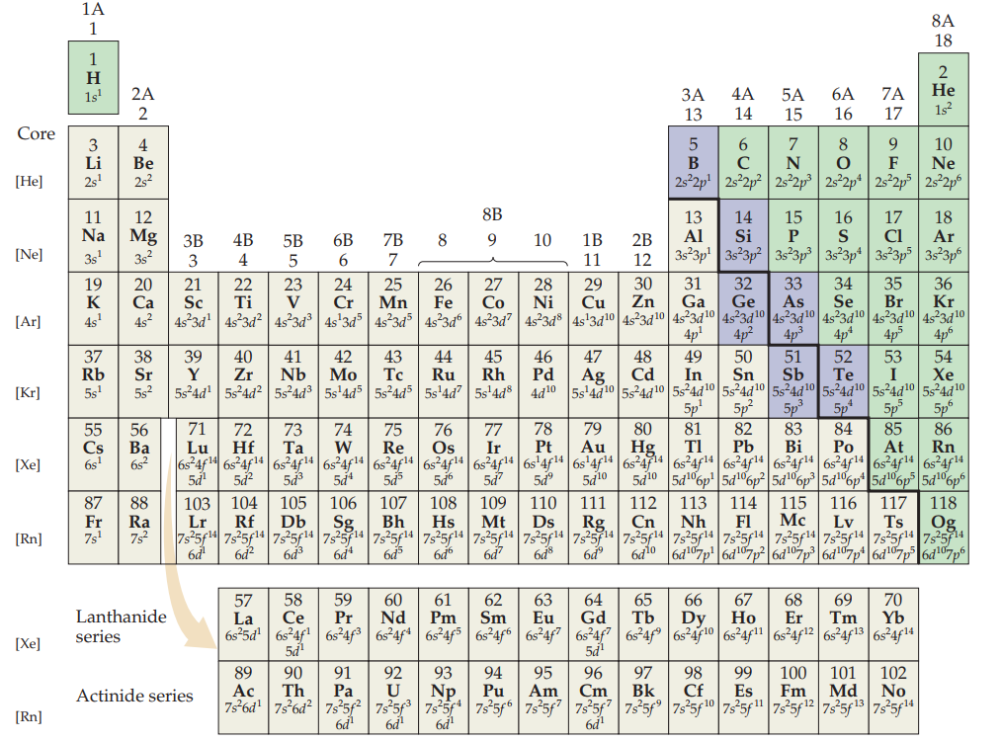

## Extra

Ignore this. Just some script for me to format this documents.

```python
import regex
import pyperclip
cpd = regex.compile(r'\$(?P<compound>\\ce(?P<br>(?:\{(?:[^{}]+|(?P>br))*+\})))\$ (?<name>\w+)')

def lcpd():
    result = '\n'.join(['| Compound | Name |', '| --- | --- |'] + [f'| ${t[0]}$ | {t[2]} |' for t in cpd.findall(pyperclip.paste())])
    pyperclip.copy(result)

def ccpd():
    es = pyperclip.paste().split(',')
    pyperclip.copy(', '.join(f'$\ce{{{e}}}$' for e in es))
 
```
