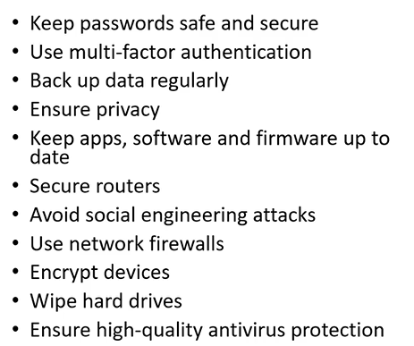

# Goal of the GenCyber camp

- Sponsored by National Security Agency and National Science Foundation
- Ignite, sustain, and increase awareness of K-12 cybersecurity content and cybersecurity postsecondary and career opportunities
- Strives to be a part of the solution to the Nation's shortfall of skilled cybersecurity professionals.

## Schedule

- Start at 9:00 am
- 15 minutes break around 10:15
- Start back at 10:30 am
- 15 minutes break around 11:45
- Wrap up at 1:00 pm

## 6 Cybersecurity Concepts

### Defence in Depth

- **Multiple, redundant** defensive measures in case a security control fails or a vulnerability is exploited.
- Helps ensure that you are protecting your assets as effectively as possible
- **Castle approach**

### CIA triangle

- Unintentionally disaster may also cause CIA triangle to fail.
  - Natural disaster, and server goes down.
  - Thunder damaged the HHD.
  - User, by mistake, may cause the malfunction inside the system too.
- **Threat not only come from hacker!**

#### Confidentiality

- **Ensures that only authorized users may view(or understand) the information.** 
  - One may have access to the information, but can not understand it, e.g., encryption.
- Applies whether data is in storage, transit, or processing -- **entire lifecycle**
- Methods
  - Encryption
  - Manage data access, e.g., passwords|locks|fingerprints
  - Secure devices

#### Integrity

- Protect data from modification (changed) from any unauthorized party.
- **Ensure data can be trusted**
  - For example, teacher wants to make sure student does not change the grade, and thus, the grade can be trusted.
- Methods
  - User access control
    - Some user does not have write access to the data. 
  - Error detection
    - Detect if the data is altered during the transmission. Checksum, hash function.
  - Keep logs
    - Keep logs if the data is altered. Therefore, we can see what happened with the data.

#### Availability

- Integrity and Confidentiality is easy to maintain. Unplug computer would be enough.
- **Ensure data can be accessed to valid requests**
  - Teacher and student should have access to your grade. If system is attacked and crashed, then you can not see your data, and availability is violated.
  - The natural disaster, may cause problem with availability.
- Methods
  - **Redundant data copies may be necessary.**

### Think like an adversary

- Put yourself inside the mindset of a potential attacker, allows you to anticipate attack strategies and defend your systems accordingly
- **Proactive** is better than **reactive**
  - Reactive, is possibly too late!
  - Sample questions
    - Does user understand what to do? Strong password?
      - Post note on the monitor.
    - Is there update to be applied?
- **Ethical hacking** allows you to look for weaknesses in your systems so that you can strengthen and harden the systems against attacks.
  - **Only time when the hacking is approved**
  - Phishing test: if the employees will yield their password.

### Keep it Simple

- Lack of complexity allows system designers and programmers to identify unwanted access paths.
  - If a password requirements, is 40 characters. 
  - Then it is impossible for users to access the system without using post note records.
- **Easy to understand, maintain, and test**
- Users can easily translate their general protection goals to what to do.

### QFA

- KISS principle and defence in depth, may be achieved simulanteously.
  - Layers can be made simple and easy to use, without adding too much extra complexity.
  - Think critically to make all those works together.

## Cyber Ethics

- Understand what ethics are and why they are important
- Understand how to act ethically
- Understand the responsibility that comes with knowing and using cybersecurity principles
- Understand how to apply ethics to real-world situations

### Ethics

- Impartiality

- Rules and acceptable behaviour

  - Identify the unacceptable behaviour -- how do they looks and feels like.
  - Moral guidelines, rather than regulations.

  - **Written and unwritten**, both exists
    - Code of ethics
    - Something unwritten, e.g., don't holding elevators for people.
  - There are 
    - Laws for cybersecurity
    - Feelings, Social norms, Religion, Philosophy, and Family.

### Ethical Behaviour

- People does not always make good decisions
- But it does not necessary make you unethical.
- Knowing right from wrong doesn't automatically make us **do** the right thing.

- Ethical decisions, sometimes presents to us even not under the scope of Cybersecurity.

### Requires

- Courage
  - See something, say something
  - Willing to go against your friends/peers
  - Stand up to bullies
- Humility
  - Make a wrong decision is possible.
    - Are you more **ethical**? 
    - Are you any **better** then other driver? 88% people answer so.
  - **Overconfidence bias** -- one consider himself always right. 
    - This avoid people from think critically about the consequences of their decisions.

### Ethical Behaviour all around

- Anonymity, provided by Internet, makes it harder to act ethically.
- Internet provide a way to spread unethical thought to a wider audience, exacerbated the situation.
- However, **under supervision**, people do better. The situation can be more complex, consider choose between friends and ethical behaviour.
- **Don't use computer to do harm**
  - Copy proprietary software for which you have not paid
  - Appropriate other people's intellectual property.
  - **Think about social consequences when you are developing something**
  - **Secure your computer, and ensure consideration/respect to others**
- Ethical issues is usually enforced through public
  - Des Hague, was forced to resign, as his behaviour of kicking a dog was revealed to public.
  - Maintain ethics is very important, because even some ethics is not directed by law, severe consequences may result.

### Principle

- Avoid **single point of failure**
  - Terry Childs, is the only people who have access to the system's password.
  - In such situation, the cities network's availability can not be ensured, and failed!
  - Avoid to be too short-sighted

## Digital Footprint

### Overview

- The traces that has been left while surfing the Internet.
- Two types of digital foot print
  - Active: when you choose to share information
    - Posting on social networking sites
    - Completing an online form
    - Agree to **cookies**
      - Cookies allow them to track you.

  - Passive: data collected about you without you knowing
    - Your IP address
    - Sites that you visit, how often, what time
    - Your physical location
    - **Awareness is important**

### Clean up

- Use search engines to check your digital footprint
- Reduce number of info sources that mention you.
- Check your privacy settings
  - Default may be undesirable
- Avoid using unsafe websites, oversharing on social media, disclosing private data.
- Delete old accounts and check your password manager -- what things you no longer use.
  - Use **password manager** and **stronger password**
- Keep an eye on your medical record
- Do not use third party login, e.g., login in with Google. This would create a lot of footprints and enables Google to access more information.
- Review your use of mobile phones.
- Keep software up to date
- Act fast after a breach
- Think before you post

### Why

- Digital footprints are permanent. Once collect, there is no way to control the usage of them.
- They constitutes your digital reputation, which may affects your background check (colleges & employers have access to that)
- Photos & Text can be mis-interpreted, and thus, used against you.
- Cybercriminals can exploit them for phishing or creating false identities (to get your account!)

### Cyber Hygiene

- Steps that users take to improve online security and maintain system health
- Pre-emptive activities, to prevent bad things happen

### Disadvantage of Cybersecurity

- Expensive
- Complicated
- Not one shot. Require constant monitoring.

## Careers in Cybersecurity

- Career paths

### Cryptographer

- Require Master's Degree that focus on Mathematics or Computer Science is encouraged
- $100,000 is median salary
- 21% job growth

### Cyber Crime Investigator

- NO Degree
- $67,000

### Forensics

- Bachelor's Degree
- $70,000
- 28% job growth

### Legal Advisor

- Juris Doctorate Degree, Lawyer
- $92,000
- 28% job growth

## Topics of Person Session

- Physical Security vs Digital Security
- IP addressing and the Internet
- Building and managing a small virtual network
- Linux and ACL
  - Permissions and user access
- Intrusion detection and firewalls
  - Firewalls: filter of the network
- Computer forensics
  - Tools to extract information
  - Look at the system's logs
- Cryptography and cryptology
  - Different cryptography algorithms
- Blockchain
- Working with Raspberry PI
  - For majority of the in person activity, a Raspberry PI is used.
- Social Engineering
  - Phishing, etc.
- **The logistics** is still in progress. Those information will be revealed later.