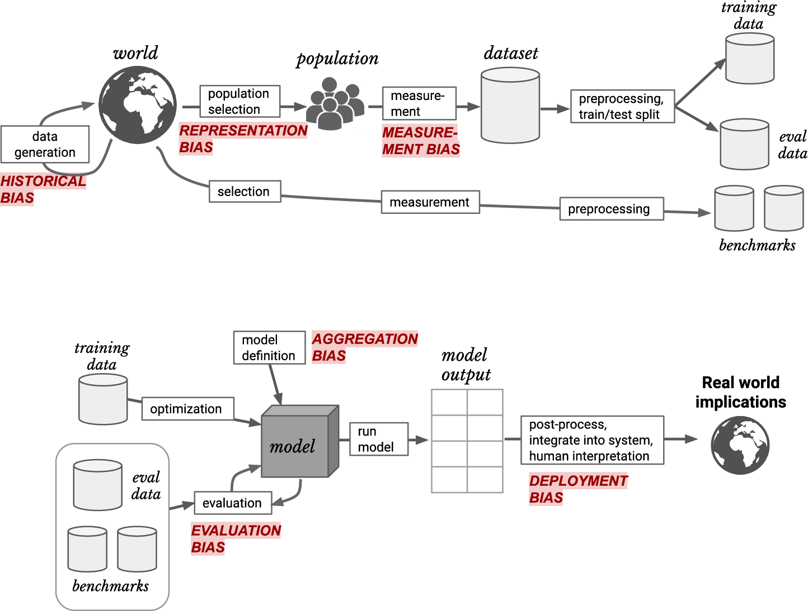
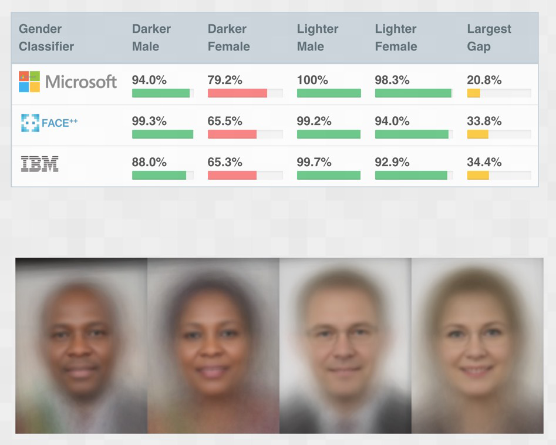

# Data Ethics

- ML mode can go wrong
  - Presented with out of domain data and behave queerly
  - Used for evil purposes
- Ethics
  - Well-founded standards of right and wrong that prescribe what humans should do
  - The study and development of one’s ethical standards

- We will dive into examples

## Examples

### Resource Processing

- there were mistakes in the software implementation of the algorithm, negatively impacting people with diabetes or cerebral palsy

### Feedback Loops

- Feedback loops can occur when your model is controlling the next round of data you get. 
  - The data that is returned quickly becomes flawed by the software itself
- Recommendation algorithm -- designed to optimize watch time, is responsible for around 70% of the content that is watched
  - It determines what people will see and use that to train it self...

### Bias

- Historically Black names received advertisements suggesting that the person had a criminal record, whereas traditionally white names had more neutral advertisements
- Such bias make black people disadvantaged in job markets -- they may feel like he/she had a criminal record.

> ##### Warning
>
> It is important for you to make sure that model/data product produced are not misused.

## How

- This entire pipeline needs to be considered as a whole if we’re to have a hope of getting the kinds of out‐ comes we want.
  - This is very hard, especially when you are in a big company and the work is highly compartmentalized.

### Recourse and Accountability

- In a complex system, it is easy for no one person to feel responsible for outcomes.
- Algorithmic development tend to extend bureaucracy, create a long chain of responsibility and end up that nobody are responsible. 
  - That is very problematic, since then, nobody will correct wrong data in the database.
  - Example
    - A database of suspected gang members maintained by California law enforcement officials was found to be full of errors, including 42 babies who had been added to the database when they were less than 1 year old

### Feedback Loops

- algorithm can interact with its environment to create a feedback loop
  - making predictions that reinforce actions taken in the real world
  - lead to predictions even more pronounced in the same direction

- example
  - recommend user with bad thing, and then predict user like bad thing, then user get more bad thing, etc...
  - use video desc and channel to classify video's topic, then use classified topic to classify channel, then channel goes very weird.

### Bias

#### Historical Bias

- Historical bias comes from the fact that people are biased, processes are biased, and society is biased.

- example
  - when bargaining for a used car, Black people were offered initial prices $700 higher and received far smaller concessions.
    - therefore, one should expect a model to do some weird thing for predicting price if they take name/race into considerations.

- example
  - face recognition algorithm do best when used with white male. it gets gradually worser when deal with female and darker people.
    - 
  - developers failed to utilize datasets containing enough darker faces, or test their product with darker faces
  - if we fail to make ethical and inclusive artificial intelligence, we risk losing gains made in civil rights and gender equity under the guise of machine neutrality

#### Measurement Bias

- It occurs when our models make mistakes because we are measuring the wrong thing, or measuring it in the wrong way, or incorporating that measurement into the model inappropriately.
- example
  - sinusitis and colonoscopy are correlated with stroke (predicted by model from historical medical care data), why? 
  - because people who would go to doctor with those ailment are more likely likely to get diagnosed by doctor -- you have a stroke. Other people may **NEVER** come to doctor and die quietly for stroke.

#### Aggregation bias

- models do not aggregate data in a way that incorporates all of the appropriate factors, or when a model does not include the necessary interaction terms, nonlinearities, or so forth
- example
  - HbA1c level are different across ethnicity. Hence, if data used to train model to determine diabetes are not comprehensive and diverse, model will do weird things.

#### Representation Bias

- model would reflect the gender imbalance in occupations, and amplify it (this is especially true for simple models.)

### Addressing Bias

- Read documentations of the dataset, which usually address the limitation and potential biases it contains.
- Remember, algorithm and human are different.
  - ML can create feedback loops
  - ML can amplify bias through representation bias
  - ML and human are used differently, e.g., may be in future, aristocrat are processed by human where proletarians are processed by algo.
  - ML is powerful, cheap, and scalable -- so as it's responsbility.

- Steps

  - Analyze a project you are working on.

    - Should we even be doing this?
    - What bias is in the data?
    - Can the code and data be audited?
    - What are the error rates for different subgroups?
    - What is the accuracy of a simple rule-based alternative?
    - What processes are in place to handle appeals or mistakes?
    - How diverse is the team that built it?

  - Implement processes at your company to find and address ethical risks.

    - Whose interests, desires, skills, experiences, and values have we simply assumed,  rather than actually consulted?
    - Who are all the stakeholders who will be directly affected by our product? How have their interests been protected? How do we know what their interests really are—have we asked?
    - Who/which groups and individuals will be indirectly affected in significant ways?
    - Who might use this product that we didn’t expect to use it, or for purposes we didn’t initially intend?

  - Support good policy.

  - Increase diversity

    

