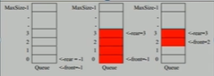

# 线性结构和非线性结构

## 线性结构

- 最常用
- 数据元素之间存在一对一的线性关系
- 顺序存储的线性表是顺序表，顺序表中的存储元素是连续的
    - 链式存储是链表。链式存储在内存地址可以不是连续的，每个元素节点存
      放数据元素以及相邻元素的地址信息。可以有效利用内存中分散的内存空间。
    - 顺序是数组。顺序存储在内存中地址值是连续的。
- 数组，队列，栈，链表，等都可以使用线性结构在实现。

### 稀疏数组 `sparsearray`

#### 需求

考虑一个 11 x 11 的五子棋棋盘。要求将棋盘中的信息保存存盘。常见的解决方案是
使用二维数组，其中 0, 1, 2 分别表示不存在棋子、黑子、白子三种情况。这样的存储
方式意味着大量的 0 （没有意义的数据） 被保存。使用**稀疏数组**来压缩数据。

#### 定义

一个大多数元素都是相同值的数组，可以使用稀疏数组来保存。

#### 介绍

- 记录原来数组不同值的数量（元数据）
- 然后把所有不同值元素的索引单独记录在小规模数组（稀疏数组）中，缩小程序规模。

例如，对于一个数组

```java
class Data {
    int[][] data = new int[][]{
            {0, 0, 22, 0},
            {0, 11, 0, 0},
            {0, 0, 0, 0},
            {0, 0, 0, 0}
    };
    // First line is metadata, store dimensionality data
    // Subsequent lines store as tuple of row, col, value
    int[][] sparseData = new int[][]{
            {4, 4, 2},
            {0, 3, 22},
            {1, 1, 11}
    };
}
```

使用这种方法，我们可以避免保存大量的重复数据，而能在某种程度上实现压缩。

#### 实现

- 稀疏数组应当提供和二维数组之间转化的方式。
    - 实现稀疏数组转化为原始二维数组。

    1. 遍历原始二维数组，得到有效数据的个数 `sum`
    2. 根据 `sum` 可以创建 `SparseArray`, `new int[sum+1][3]`
    3. 将二维数组中的有效数据存入到稀疏数组

    - 实现二维数组转化为稀疏数组。

    1. 读取稀疏数组的第一行，根据第一行数据创建原始的二维数组
    2. 将后几行的数据赋给原始的二维数组中
- 保存到磁盘的 IO 操作 以及 从磁盘读取稀疏数组。也就是 Serializable 即可。

```java
import java.io.*;
import java.util.Arrays;

public class SparseArray implements Serializable {
    public static final long serialVersionUID = 200L;
    int row;
    int col;
    int distinct;
    int[][] array;

    public SparseArray() {
        // Empty constructor is necessary for serialization
    }

    public SparseArray(int[][] array, int row, int col) {
        this.array = array;
        this.row = row;
        this.col = col;
        this.distinct = array.length;
    }

    public static SparseArray from2DArray(int[][] array, int de) {
        // 遍历获取非 0 数据的个数
        int sum = (int) Arrays.stream(array).flatMapToInt(Arrays::stream).filter(e -> e != de).count();
        int[][] sparseArray = new int[sum + 1][3];
        // 元数据，行、列、不同元素数
        int row = array.length, col = array[0].length;
        // 再次遍历二维数组进行存储。需要两次遍历，因为这样可以避免使用动态的集合列。
        int count = 0;
        for (int i = 0; i < array.length; i++) {
            for (int j = 0; j < array[i].length; j++) {
                int res = array[i][j];
                if (res != 0) {
                    // 行、列、元素
                    sparseArray[count][0] = i;
                    sparseArray[count][1] = j;
                    sparseArray[count][2] = res;
                    count++;
                }
            }
        }
        return new SparseArray(sparseArray, row, col);
    }

    public int[][] to2DArray() {
        // 行，列
        int[][] result = new int[row][col];
        // 从第二行开始读取数组内的数据
        for (int[] row : array) {
            result[row[0]][row[1]] = row[2];
        }
        return result;
    }

    @Override
    public String toString() {
        var result = new StringBuilder(array.length << 2);
        result.append(String.format("row=%d, col=%d, distinct=%d\n", row, col, distinct));
        for (int[] row : array) {
            result.append(String.format("%d\t%d\t%d\n", row[0], row[1], row[2]));
        }
        return result.toString();
    }

    public static void print(int[][] array) {
        for (int[] row : array) {
            System.out.println(Arrays.toString(row));
        }
    }

    public static void main(String[] args) {
        // 创建原始的二维数组
        int[][] chessArray = new int[11][11];
        chessArray[1][2] = 1;
        chessArray[2][3] = 2;
        chessArray[4][5] = 2;
        // 原始的二维数组
        print(chessArray);
        // 创建稀疏数组
        SparseArray array = from2DArray(chessArray, 0);
        System.out.println(array);
        print(array.to2DArray());
        // 测试 IO
        try (var out = new ObjectOutputStream(new FileOutputStream("ChessArray.data"))) {
            out.writeObject(array);
        } catch (IOException ignored) {
        }
        try (var in = new ObjectInputStream(new FileInputStream("ChessArray.data"))) {
            array = (SparseArray) in.readObject();
        } catch (IOException | ClassNotFoundException ignored) {
        }
        System.out.println(array);
    }
}
```

### 队列 `Queue`

#### 用例

银行排队。我们希望在业务员完成服务客户之后，就会把队列中的用户召唤出来进行服务。

#### 介绍

- 队列是一个有序列表，可以使用数组或者列表来实现
- FIFO，先进先出：先存入队列的数据，先取出；后存取的要后取出。

#### 数组实现



- 数组实现的队列，使用 `rear` 和 `front` 指针来存储队列的数据。其中， `maxSize`
是队列的最大容量。
  - `front` 在数据被取出的时候变化
  - `rear` 在数据被加入时变化

- `empty`
  - `rear == front`
- `enqueue`
  - 若指针 `rear < size - 1`，那么 `arr[rear++] = element`。
  反之，如果 `rear == size - 1`，队列满而无法加入数据。

## 非线性结构

- 二维数组（或更多维）
- 广义表 （注意）
- 树结构 （重要）
- 图结构 （重要）
- 这些数据结构的元素之间的关系不再是一对一的。
