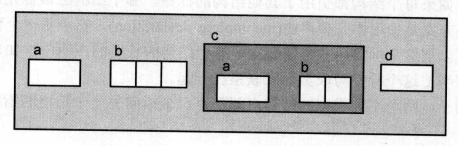
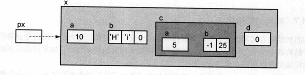
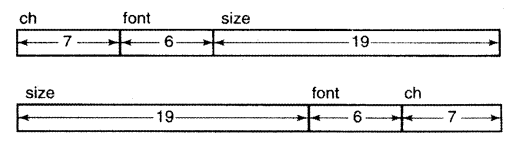

# 结构和联合

## 结构基础知识

- 聚合数据类型（aggregate data type）能同时存储超过一个的单个数据
  - 数组是相同类型的元素的集合，其每个元素通过间接引用来获得。
  - 结构是值的集合，每个值没成为其成员（**member**），但是结构的各个成员可能具有不同的类型。
    - 结构成员都有自己的名字，是通过名字访问的。

### 结构声明

- 声明的语法
  - `struct tag { members } vars`
  - 上面的可选部分至少要出现两个，除非你希望进行结构标签的不完整声明

```c
struct Simple {
    int a;
    char b;
    float c;
} y[20], *z;
```

- 上面的声明创建了 `y` 是一个包含 20 个结构的数组，`z` 是一个指向结构的指针
- 所有具有相同标签的结构都可以在后续的声明中使用，并被认为是同一类型

```c
struct Simple x;
struct Simple y[20], *z;
```

- 除上之外，还可以使用类型来创建一个新类型，如

```Hc
typedef struct {
    char *name;
    int age;
} Student;
```

- 这样，就可以如此声明结构体

```c
Student x;
```

- 结构成员的名字可以和其他结构成员的名字相同，只要他们的类型是不同的。结构成员的访问方式可以有效的避免这种歧义。

## 成员访问

- 通过点操作符进行访问
  - 点操作符的结合性是从左到右
  - 下标引用操作和点操作符有相同的优先级，都是从左向右

```c
struct Complex {
    float f;
    int a[20];
    long *lp;
    Simple s;
    Simple sa[10];
	Simple *sp;
}
```

- `comp.s.a` 表示访问 `comp` 结构成员`s` 的成员 `a`
- `comp.sa[4]` 表示访问 `sa` 成员的第五个元素
- `((comp.sa)[4]).c`  等同于 `comp.sa[4].c`，因为下标引用和点操作符具有相同优先级，并且结合性都是从左向右。

- 点操作符的优先级高于间接访问操作符的优先级，因此，如果想要访问指针的结构成员需要使用括号`(*cp).f`。C 提供了一个语法糖， `->` —— 箭头操作符接受一个指向结构的指针，和需要访问的结构体的名称。他会自动进行间接访问操作。

## 自引用

- 结构体内不可以包含一个类型为结构本身的成员——但是可以包含指向该结构类型的指针。

```c
struct SelfRef{
    int a;
    struct SelfRef *b; // 这里不能为 b；如果这样，将会形成永不终止的递归结构。
    int c;
}
```

- 指针的长度在知道结构的从长度之前就是确定的，因此编译器可以知道结构体的长度。递归的写法不可以。
- 上面的机枪用来实现链表，树，图等递归数据结构。用来指向下一个元素或者下一个分枝。

```c
typedef struct {
    int a;
    SelfRef *b;
    int c;
} SelfRef;
```

- 上述声明是错误的，因为类型名在结构体内尚未定义。为了定义自引用结构体，我们必须定义一个结构标签，如

```c
typedef struct self_ref_tag {
    int a;
    struct self_ref_tag *b;
    int c;
} SelfRef;
```

## 不完整声明

- 有些时候，结构是互相依赖的。也就是，一个结构包含另一个结构的一个或多个成员——这时，如果依赖产生一个环，就无法完成声明。
- 使用不完整声明（Incomplete declaration）可以用在不需要知道结构长度的声明中（如，指向这个结构的指针）

```c
struct B;

struct A {
    struct B *partner;
};

struct B {
    struct A *partner;
};
```

- 这里通过使用 B 的不完整声明声明 A, B 两个存在循环引用的结构

### 初始化

- 一个位于一堆花括号内部，由逗号分隔的初始化列表可以用来进行结构各个成员的初始化
- 如果其内部还包含数组或结构成员，那么使用类似于多维数组初始化的方式即可。

```c
#include <stdio.h>

typedef struct
{
    char *name;
    int age;
} Student;

void print_student_ptr(Student *student)
{
    printf("%s is %d years old.\n", student->name, student->age);
}

void print_student(Student student)
{
    printf("%s is %d years old.\n", student.name, student.age);
}

int main(int argc, char const *argv[])
{
    Student s1 = {
        "John",
        20};
    print_student_ptr(&s1);
    print_student(s1);
    return 0;
}
```

## 结构的使用

- 优先级

  - `->` 和 `.` 操作符的优先级高于解引用和寻址运算符号（`*`,`&`）

- 例子

  - ```c
    typedef struct {
        int a;
        short b[2];
    } Ex2;
    typedef struct EX {
        int a;
        char b[3];
    	Ex2 c;
        struct EX *d;
    } Ex;
    ```

  - 我们使用上面的声明声明了几个结构体。考虑如下表达式并求值

- 

- 上述图片展示了 `Ex` 在存储中的结构。事实上，编译器会尽量避免浪费成员间的空间。

  - ```c
    Ex x = {10, "Hi", {5, {-1, 25}}, NULL}
    Ex *px = x;
    ```

  - 上述声明产生如下的结构

  - 

  - | 表达式       | 左值                                              | 右值                                                         |
    | ------------ | ------------------------------------------------- | ------------------------------------------------------------ |
    | `px`         | 内存地址的存储位置被覆盖                          | 内存地址                                                     |
    | `px + 1`     | 非法，因为 `x` 不是数组                           | 下一个结构数组的元素，当且仅当 `x` 是数组。编译器不检查这样的错误 |
    | `*px`        | 结构接受所有成员的新址，指向结构的位置。          | 返回结构                                                     |
    | `px -> a`    | 结构的地址，和 `*px` 的左值一样（除了类型不一样） | `px, (int *)px, &px -> a` 都是相同的，除了他们的类型不一样。 |
    | `px -> b`    | 非法左值，数组是指针常量                          | 数组的内存地址                                               |
    | `px -> b[1]` | 数组第二个元素的位置                              | 数组第二个元素                                               |
    | `*px -> c.b` | 数组第一个元素                                    | 数组第一个元素的值                                           |

  - 如果我们将 `d` 初始化，我们就可以嵌套的访问下去。

### 结构的存储分配

- 编译器按照成员列表的属性顺序一个一个地给每个成员分配内存。
- 只有当存储成员需要满足边界对齐要求时，成员之间才可能出现用于填充的额为内存空间。
  - 结构即使位置必须不为空，所以开始位置总是边界要求最严格的数组类型所要求的位置。
- 通过在声明中对结构的成员列表重新排列，可以减少边界对齐造成的空间损失。
- 有些时候，我们希望把相关的结构成员存储到一起来提高程序的可读性——但是如果成千上百个结构被创建，减少内存浪费的需求就比程序的可读性更为重要，应重排结构并使用注释。

- `stddef.h`

  - `offsetof(type, member)`
  - 这个宏返回一个 `size_t` 值，表示这个指定成员开始存储的位置距离结构开始存储的位置偏移的字节数量。

- ```c
  #include <stdio.h>
  #include <stddef.h>
  
  struct Align
  {
      char a;
      int b;
      char c;
  };
  
  struct ImprovedAlign
  {
      int b;
      char a;
      char c;
  };
  
  int main(int argc, char const *argv[])
  {
      printf("%lu\n", offsetof(struct Align, a)); // 0
      printf("%lu\n", offsetof(struct Align, b)); // 4
      printf("%lu\n", offsetof(struct Align, c)); // 8
      // 这个结构体使用了 12 个字节，实际只利用了 6 个字节。
  
      printf("%lu\n", offsetof(struct ImprovedAlign, a)); // 0
      printf("%lu\n", offsetof(struct ImprovedAlign, b)); // 4
      printf("%lu\n", offsetof(struct ImprovedAlign, c)); // 8
      // 这个结构体使用了 8 个字节，利用了 6 个字节，比原来的结构体更紧凑。
      return 0;
  }
  ```

## 函数

- 结构是一个标量，因此，可以将函数的参数声明为一个结构。
  - 我们建议在传递结构的时候传递指向结构的指针，而非结构体（声明为 `struct Structure *`）。因为 C 语言使用拷贝传值的方式，传递结构体本身意味着大量的复制操作，效率低。
  - 指针往往比结构本身小，传递效率提高很大——尤其是结构体也很大的时候。
- 如果在函数中对结构体指针的间接访问超过两三次，建议将结构体参数声明为寄存器变量。
- 通过将参数声明为 `const`，可以避免结构变量被修改。

```c
#include <stdio.h>

#define PRODUCT_NAME_LEN 20

typedef struct
{
    char product[PRODUCT_NAME_LEN];
    int qty;
    float price;
    float total_amount;
} Transaction;

void print_receipt(register Transaction const *transaction)
{
    printf("%s\b", transaction->product);
    printf("%d @ $%.2f cost $%.2f\n", transaction->qty,
           transaction->price, transaction->total_amount);

    // 声明为 const 之后，结构体不可以被修改
    // transaction -> total_amount = transaction->qty * transaction->price;
}

// 最好的方案，并且将结构体声明的细节从调用者隐藏
void compute_total_amount(register Transaction *transaction)
{
    transaction->total_amount = transaction->qty * transaction->price;
}

int main(int argc, char const *argv[])
{
    Transaction t1 = {
        "iPhone",
        2,
        599.99,
        0};
    compute_total_amount(&t1);
    print_receipt(&t1);
    return 0;
}
```

- 在早期的 K&R C 编译器中，你甚至不能直接传递结构体。传递结构体指针几乎总是最好的方案，除非结构体极小。

### 位段（bit field）

- `int`,`signed int`, `unsigned int` 可以用来声明位段。其声明和结构声明几乎一致（除了 `:` 加上位段占用位的数目）。

  - 建议总是声明为 `signed` 或者 `unsigned` 否则，`int` 究竟被解释为有符号还是无符号是由编译器决定的。
  - 注重可移植性的程序应当避免使用位段，因为如下特性是不可移植的
    - `int` 是有符号还是无符号
    - 位的最大数目；32 位整形机器上的位段声明在 16 位整形机器上无法运行
    - 位段成员在内存中分配的顺序（`->` 还是 `<-`）
    - 如果一个声明制定了两个位段，且第二个位段比较大因此无法容纳与第一个位段剩余的位中，编译器把第二个尾端放置的位置是不可确定的，甚至可能造成内存位置的边界上的重叠。

- 例子

  - ```c
    struct Char {
        unsigned ch : 7;
        unsigned font : 6;
        unsigned size : 19;
    };
    struct Char ch1 = (struct Char*) 0xc200142;
    // 从此以后，，就可以直接访问
    ch1 -> ch;
    // 而不用写
    ch1 & 0xF8000000;
    ```

    - 上述结构体处理 128 不同的字符值，64 不同字体，以及 0-524287 个单位的字体大小。
    - 精确的计算和声明方式保证了这个位段可以存储于一个 32 位的整数中。

  - 

  - 不过，16 位的机器上就会报错，因为最后一个声明的长度超过整数的最大长度。

- 位段让位的处理过程变得更简单，但是在目标代码中，他们和移位运算一样，编译成移位运算或者屏蔽操作。唯一的好处就是极大地简化了源代码——所以，**权衡移植性和可读性**。

## 联合

- 联合的所有成员引用的是内存中的相同位置。这样，**我们就可以在不同的时刻吧不同的东西存储在同一个位置。**

- 例子

  - ```c
    #include <stdio.h>
    
    union Fi
    {
        float f;
        int i;
    };
    
    int main(int argc, char const *argv[])
    {
        union Fi fi;
        fi.f = 3.14;
    
        printf("%d\n", fi.i); // 把 pi 的浮点表示形式转换为整数表示形式
        printf("%f\n", fi.f); // 打印 pi
    
        return 0;
    }
    ```

  - 我们在实现自己的解释器时，这样的结构就会很有用

  - ```c
    struct Var {
        enum {INT, FLOAT, STRING} type;
        int int_val;
        float float_val;
        char *str_val;
    }
    ```

    - 上述结构体在任何时候，都有两个值是未使用的

  - ```c
    struct Var {
        enum {INT, FLOAT, STRING} type;
        union {
            int i;
            float f;
            char *v
        } val;
    }
    ```

    - 下面的结构体就不会。他们在同一个内存位置中保存这三种变量。访问的时候，只需要对 `type` 进行类型检查并访问联合存储的值即可。

### 变体记录（技巧）

- 内存中某个特定的区域将在不同的时刻存储不同类型的值，但是每个值都是一个完整的结构。

- 考虑下面的声明

  - ```c
    struct PARTINFO {
        int cost;
        int supplier;
    }
    ```

  - ```c
    struct SUBASSYINFO {
        int n_parts;
        struct {
            char partno[10];
            shot quan;
        } parts[MAXPARTS];
    }
    ```

  - ```c
    struct INVREC {
        char partno[10];
        int quan;
        enum {
            PART, 
            SUBASSY
        } type;
        union {
            struct PARTINFO part;
            struct SUBASSYINFO subassy;
        } info;
    }
    ```

  - 零件组成装配件。零件和装配件的集合组成一个存货信息。


### 联合

- 联合接受一个联合第一个成员的类型的数据来进行初始化。

## 问题

1. 成员使用成员名进行引用。成员并不是紧密的排列在一起的：对于需要边界对齐的机器，成员之间可能会有松散空间。

2. 结构名是以后声明结构变量的类型名。结构变量和数组变量都是指向首元素地址，但是对结构名进行解引用操作得到结构体，而非首元素。**数组不可以被赋值，因为是常量指针；结构可以**

3. ```c
   struct tag {
       members
   };
   struct {
       members
   } var;
   struct tag {
       members
   } vars;
   struct tag; //incomplete struct declaration
   struct tag var; // provided tag is already declared.
   ```
   
4. 有错误，因为 `tag` 只是结构体的蓝图，而不是结构。

5. 没有错误。

6. ```c
   struct {
       int a;
       char b[10];
       flaot c;
   } x = {
       3, "hello", 0
   }; // 事实上，因为这个变量是静态内存中，所以 c 将被初始化为 0 即使我们没有加上最后一个 0
   ```

7. | 表达式            | 值        | 表达式               | 值                                                     |
   | ----------------- | --------- | -------------------- | ------------------------------------------------------ |
   | `nodes`           | 200       | `&node[3].c -> a`    | 200                                                    |
   | `nodes.a`         | INALID    | `&node -> a`         | 200                                                    |
   | `node[3].a`       | 12        | `np`                 | `nodes[2]`                                             |
   | `nodes[3].c`      | 200       | `np`                 | 224                                                    |
   | `nodes[3].c -> a` | 5         | `np -> a`            | 22                                                     |
   | `*nodes`          | `node[0]` | `npp`                | 216                                                    |
   | `*nodes.a`        | INVALID   | `npp -> a`           | INVALID. 一层解引用只能得到指向 `node[4]` 的指针的地址 |
   | `(*nodes).a`      | 5         | `*npp`               | 248                                                    |
   | `nodes -> a`      | 5         | `**npp`              | `node[4]`, 结构体                                      |
   | `nodes[3].b -> b` | 248       | `*npp -> a`          | 18                                                     |
   | `&nodes`          | 200       | `&np`                | 未知                                                   |
   | `&nodes[3].a`     | 248       | `&np -> a`           | 232                                                    |
   | `&nodes[3].c`     | 244       | `&np -> c -> c -> a` | 216                                                    |
   
8. 在一个 16 位的机器上，上面的结构利用了 32 个 bits，但是使用了 48 bits 的空间。在一个 32 位的机器上 48 bits, 但是使用了 96 bits 的空间。

9. 从左到右还是从右至左的存储不确定，有符号还是无符号的存储不确定，长度大小的限制（16 位机器和 32 位机器）不确定，位段元素的放置的位置不确定。

10. ```c
    #include <stdio.h>
    
    struct Float
    {
        char sign : 1;
        char exp : 7;
        int mantissa : 24;
    };
    
    int main(int argc, char const *argv[])
    {
        float f = 3.14;
        struct Float *fi = (struct Float *)&f;
    
        printf("%d\n", fi->mantissa);
        printf("%d\n", fi->sign);
        printf("%d\n", fi->exp);
    
        printf("%f\n", f);
        return 0;
    }
    
    ```

11. 不使用位段的实现（假定 16 位机器并且从左向右分配内存）

    ```c
    struct {
        int a : 4;
        int b : 8;
        int c : 3;
        int d : 1;
    } x;
    
    x.a = aaa;
    x.b = bbb;
    x.c = ccc;
    x.d = ddd;
    ```

    ```c
    #include <stdio.h>
    
    int cpy_bits(int src, int dst, int offset, int len)
    {
        int mask = (~0 << offset) & (~(~0 << (offset + len)));
        // only appropriate position are 1
        int src_mask = src & mask;
        int dst_mask = dst & ~mask;
        return dst_mask | src_mask;
    }
    
    int main(int argc, char const *argv[])
    {
        int x = 0x123456, aaa, bbb, ccc, ddd;
        cpy_bits(x, aaa, 12, 4);
        cpy_bits(x, bbb, 4, 8);
        cpy_bits(x, ccc, 1, 3);
        cpy_bits(x, ddd, 0, 1);
        return 0;
    }
    ```

12. 打印 -2。因为这个整数似乎光速溢出了——我的机器上为有符号整数。如果编译器使用无符号整数，那么将会打印 2.

    ```c
    #include <stdio.h>
    
    int main(void) {
        struct {
            int a:2;
        } x;
        x.a = 1; // 1, 01
        x.a += 1; // 2, 10. 众所周知， 10 为 -2, 而 11 为 -1
        printf("%d\n", x.a);
        return 0;
    }
    ```

13. 有错误。因为他们同时存储在同一个内存地址，因此只会打印出对同一个值的三个不同的解释（`int float char`）

14. 我们必须知道信息的类型。

15. 最后一个形势会大量的占用内存空间，因为结构体要保证能够存储最坏情况。但是上一个声明就可以避免字符串拷贝（指针），并且极大的节省内存。

## 编程

1.

```c
typedef struct
{
    int area_code;
    int prefix;
    int line;
} PhoneNumber;

typedef struct
{
    PhoneNumber *caller_phone;
    PhoneNumber *callee_phone;
    PhoneNumber *payment_phone;
} PhoneCall;
```

2.


