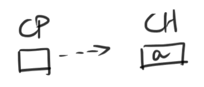
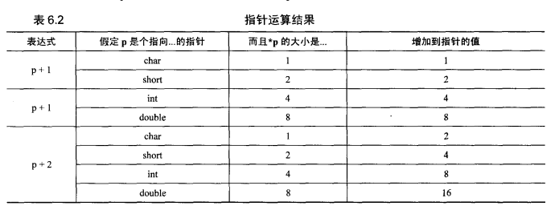

# 指针

## 内存和地址

- 内存中的每个地址都有一个字节
- 多个字节合并在一起组成**字**作为单位存储整数，如4个字节形成的32字长的字（**words**)。
  - 边界对齐，**boundary alignment**，整型只能在 2 或 4 的倍数位置上的字存储
  - 地址是左边字节还是右边字节的位置
- 但是，我们不关心这些细节。我们只对这两件事情感兴趣：
  - 每个位置都有一个 unique 的地址标识
  - 每个位置都包含一个值

## 地址和内容


- 我们使用变量，借此就可以通过名字而不是地址来访问内存位置。
- **名字和内存位置之间的关联是编译器实现的，硬件仍然通过地址访问内存位置**

## 值和类型

```c
int a = 112, b = -1;
float c = 3.14;
int *d = &a;
float *e = &c;
```

- 我们发现，`c` 实际存储的是浮点数。不过，因为他们不过是一序列 0 - 1 的位，这个值可以被解释成整数，或者浮点数——取决于使用整型算术指令还是浮点型指令。
  - **不能通过简单的检查一个值的位来判断其类型**
  - 值的类型不是值的固有特性，而是其使用方式。编译器会帮助我们避免不适当的使用方式，对浮点值作为整型访问时发出警告。

## 指针内容

- `&` 操作符返回操作数的内存地址，用于初始化指针变量。
- 仍然考虑上面的例子，在初始化之后
  - `a = 112`, `b=-1`, `c=3.14`, `d=100`, `e=108`
  - 指针变量的值仍然是分配给这个变量内存位置存储的数值；他们的虽然是指针，但是不能自动获得位置 100 和 108 的值，在求值时返回存储的内存位置。

## 间接访问

- 指针访问指向地址的过程为间接访问（`indirection`）或解引用指针（`dereferencing the pointer`）
- `*` 操作符用于干这个事情。
  - `*d = 112`
  - `*e = 3.14`
  - 接引用操作访问指针类型的类型，如对一个指向浮点型的指针 `float*`  进行间接访问返回 `float` 型值。


- 指针变量的值就是一个数字。箭头显示了数字的值，但是不改变这就是个数字的事实。

### 未初始化和非法指针

```c
int *a;
*a = 12;
```

- 这里创建了一个 `a` 的指针变量，然后把 12 存储到 `a` 指向的内存位置。
  - `static` 变量被自动初始化
  - `auto` 变量不被初始化
- 但是，我们不知道 `a` 到底指向哪里！它根本没有被初始化。
  - 取决于运气（`a` 的初始值是否为非法地址），如下情况可能发生
    - `Linux` 会抛出错误，`segmentation violation` 或者 `memory fault`
    - `Windows` 会抛出错误， `General Protection Exception`
    - 对于要求 `boundary alignment` 的机器，`bus error` 将会被抛出。
  - 但是，如果 `a` 包含合法地址，那么位于这个地方的值将会被错误的修改。

### `NULL` 指针

- 特殊的指针变量，表示不指向任何东西——这个值就是指针的0值。
  - 因此，很多`c` 函数会在出错时（或无法返回任何东西时）返回 `NULL` 指针。
    - 这样的操作时危险的，因为单一值被用于表示两种不同意思，以至于真正的用意被混淆。
    - 让函数返回两个值，一个状态值指示是否成功、另一个为真正的返回结果，更加安全。
  - `NULL` 指针不能被解引用，这是非法的。取决于机器，这个访问为内存位置0，并有可能报错。

- **在指针解引用前对其进行检查**

### 指针、间接访问和左值

- 间接访问操作符需要右值，产生一个左值。
- 地址操作符需要左值，产生一个右值。

```c
int a;
int *d = &a;
```

- `a`,`d`,和`*d` 都是左值。

```c
*d = 10 - *d; // Access a pointer variable, obtain its value to calculate a rvalue (i.e., 10). and then assign it back to memory address of it
d = 10 - *d; // ERROR: Nobody really want to use int as memory address
```

- 编译器对于第二种情况将会发出警告，而不是终止编译。

### 指针、间接访问和变量

```c
*&a = 25; // EQ: a = 25
```

### 指针字面量

- `*100 = 25` 是非法的，因为 100 是整型，而间接访问只接受指针类型表达式。
- `*(int*)100 = 25` 通过强制类型转换把 25 存储到 100 这个内存地址的位置（把100 转化为指向整型的指针）。**需要使用这种技巧的机会是绝无仅有的**，仅当我们必须通过地址访问内存中某个特定位置时，这是必需的——这事实上访问的是设备控制器接口。

### 指针的指针

```c
int a = 12;
int *b = &a;
int **c = &b;
```

- C 是一个指向 指向整型的指针 的指针，即指向指针的指针。因为指针变量同样占据内存中的特定位置，所以利用 & 操作符取得其地址是合法的。
- `*(*c)` ，因为 `*` 操作符具有从右向左的结合性。

| 表达式 | 值            |
| ------ | ------------- |
| `a`    | 12            |
| `b`    | `&a`          |
| `*b`   | a, 12         |
| c      | `&b`          |
| `*c`   | `b`, `&a`     |
| `**c`  | 12, `a`, `*b` |

### Pointer Cook book

### 格式

```c
char ch = 'a';
char *cp = &ch;
```



### 实例

计算字符串的长度

```c
#include<stdlib.h>

size_t strlen(char* str){
    int len = 0;
    while (*str++ != NULL)
        len++; // 因为返回的是当前的 str, 所以可以处理空字符串
    // 本函数不检查 NULL 指针
    return len;
}
```

在字符数组中寻找特定的字符

```c
#include <stdio.h>
#include <stdlib.h>

#define TRUE 1
#define FALSE 0

int find_char(char **arr, char val) {
    /*
    接受一个 NULL 终止的 array 和一个 char 值，
    返回一个 bool 值，表示是否在 array 中找到了 val。
     */
    char *str;
    while ((str = *arr++) != NULL) {
        char ch;
        while ((ch = *str++) != '\0' && ch != val)
            ;
        if (ch == val) return TRUE;
    }
    return FALSE;
}

int main() {
    char *arr[2] = {"No Hello", NULL};
    printf("%d\n", find_char(arr, 'x'));
}
```

破坏性的寻找字符。使用这个函数相会损坏数组的指针：我们直接对 `*arr` 进行运算，破坏了内部字符串的指针。

```c
#include <assert.h>
#include <stdbool.h>
#include <stdio.h>

bool find_char(char **arr, int val) {
    assert(arr != NULL);

    /*
    对于每个字符串
    */
    while (*arr != NULL) {
        /*
        观察字符串中每个字符
        */
        while (**arr != '\0') {
            if (*(*arr)++ == val) return true;
        }
        arr++;
    }
    return false;
}

int main(int argc, char const *argv[])
{
    char *arr[2] = {"No Hello", NULL};
    printf("%d\n", find_char(arr, 'x'));
    return 0;
}

```

## 指针运算

- 指针可以进行加减法运算

  - 所有加减法运算都会根据合适的大小调整，即，乘上存储数据存储的 `bytes` 的数量，保证指向的是下一个同种类型的数据结构，而非指向一个字的内部。
  - 如 `float *p = &a`, 那么 `p + 1` 就指向下一个 `float`
  - 

  - 这种运算的结果类型也是指针。

  - 这种运算常常用来遍历数组

    - 如果指针指向的元素越过了数组的边界，那么效果是未定义的。可以让指针指向最后一个元素后面的位置，但是进行间接访问时将会失败。

    - 初始化数组元素为 0

      - ```c
        #define N_VALUES 5
        
        int main(int argc, char const *argv[]) {
            float values[N_VALUES];
            float *vp;
        
            for (vp = &values[0]; vp < &values[N_VALUES];) {
                *vp++ = 1.0;
            }
            return 0;
        }
        ```

      - 在最后一次循环时，数组指向的位置在数组最后一个元素后面的位置。但是，这是合法的。

- 当两个指针都指向同一个数组的元素时，可以从一个指针减去另一个指针

  - 运算结果为 `ptrdiff_t` 是一个有符号整数。其值为两个指针在内存中的距离（以数组元素的长度为单位），或换言之，数组索引之差。
  - 如果指针指向的不是同一个数组中的元素，其结果是未定义的。

- 指针也可以通过关系运算符来进行比较

  - `<=` , `>=` , `>`, `<` 都要求这两个指针指向同一个数组的元素，否则运算结果为未定义。
  - `==` 和 `!=` 则可以为任意指针，因为两个指针要么指向同一个地址，要么指向不同的地址。

- ```c
  #include <stdio.h>
  #define N_VALUES 5
  
  int main(int argc, char const *argv[]) {
      float values[N_VALUES];
      float *vp;
      for (vp = &values[N_VALUES]; vp > &values[0];) 
          *--vp = 0;
      return 0;
  }
  ```

- ```c
  #include <stdio.h>
  #define N_VALUES 5
  
  int main(int argc, char const *argv[]) {
      float values[N_VALUES];
      float *vp;
  
      for (vp = &values[0]; vp < &values[N_VALUES];) *vp++ = 0;
      return 0;
  }
  ```

- ```c
  #include <stdio.h>
  #define N_VALUES 5
  
  int main(int argc, char const *argv[]) {
      float values[N_VALUES];
      float *vp;
  
      for (vp = &values[N_VALUES-1]; vp >= &values[0];vp--) *vp = 0;
      return 0;
  }
  
  ```

  - 需要注意的是，上面这个操作是错误的。因为 `vp` 最终指向数组的前一个元素，而不在同一个数组中的指针相比较，结果是未定义的。虽然在大多数 C 编译器中，这个写法都不会产生问题，但是这会造成不可移植的代码，还是不写为好。


## 问题

1. 通过其运算符来隐式推断
2. 因为在编译器负责分配变量的内存地址，写死的内存地址是毫无意义的——除非，你需要调用硬件提供的接口。
3. 因为你没有把它当作内存地址参与运算
4. 这将会返回 0，大多数时候，操作系统将会报错。
5. 我认为没有区别，除了 `offset` 可能需要局部变量求值。**重要的是， offset 需要在运行时求值用于动态的 offset 指针，产生了内存消耗。**而后面一个使用字面量的，就可以直接加上 12 bytes。
6. 假设这段代码想要初始化位置为 0 的值，它将不会被初始化。并且，`pi` 会越过数组最后一个元素并尝试对其解引用，会产生运行异常。
7. 假设整型的长度为4个字节

| 表达式      | 整型右值 | 整形左值（地址） | 整形指针右值       | 整形指针左值（地址） |
| ----------- | -------- | ---------------- | ------------------ | -------------------- |
| `m`         | 1008     | 1016             | 1008               | 1016                 |
| `v+1`       | 1037     | INVALID          | 1040               | INVALID              |
| `j-4`       | 996      | INVALID          | 984                | INVALID              |
| `a - d`     | 12       | INVALID          | 3 (ptrdiff_t)      | INVALID              |
| `v - w`     | -24      | INVALID          | -6 (ptrdiff_t)     | INvALID              |
| `&c`        | 1056     | INVALID          | 1056               | INVALID              |
| `&e + 1`    | 1036     | INVALID          | 1036               | INVALID              |
| `&o - 4`    | 1080     | INVALID          | 1080               | INVALID              |
| `&(f + 2)`  | INVALID  | INVALID          | INVALID            | INVALID              |
| `*g`        | INVALID  | INVALID          | 1000               | 1064                 |
| `*k+1`      | INVALID  | INVALID          | 1045               | 1052                 |
| `*(n + 1)`  | INVALID  | INVALID          | 1012               | 1060                 |
| `*h - 4`    | INVALID  | INVALID          | 1076               | INVALID              |
| `*(u - 4)`  | INVALID  | INVALID          | 1056               | 1076                 |
| `*f - g`    | INVALID  | INVALID          | INVALID (int - pt) | INVALID              |
| `*f - *g`   | INVALID  | INVALID          | 52                 | INVALID              |
| `*s - *q`   | INVALID  | INVALID          | -80                | INVALID              |
| `*(r - t)`  | INVALID  | INVALID          | INVALID            | INVALID              |
| `y > i`     | **0**    |                  | **0**              |                      |
| `y > *i`    |          |                  |                    |                      |
| `*y > *i`   |          |                  | 1                  |                      |
| `**h`       |          |                  |                    |                      |
| `c++`       | 1076     | INVALID          | 1076               | INVALID              |
| `++c`       | 1077     | INVALID          | 1080               | INVALID              |
| `*q++`      | INVALID  | INVALID          | 1080               | 1072                 |
| `(*q)++`    | INVALID  | INVALID          | 1080               | INVALID              |
| `*++q`      | INVALID  | INVALID          | 1056               | 1076                 |
| `++*q`      | INVALID  | INVALID          | 1081               | INVALID              |
| `*++*q`     | INVALID  | INVALID          | 1072               | 1084                 |
| `++*(*q)++` | INVALID  | INVALID          | 1021               | INVALID              |

