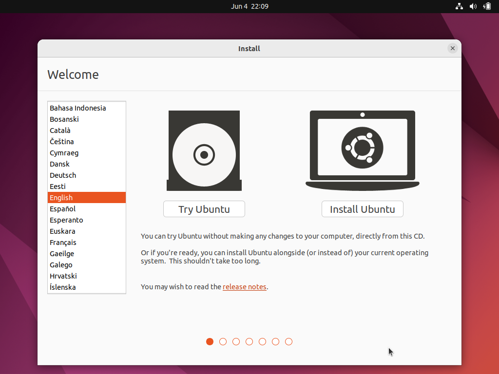
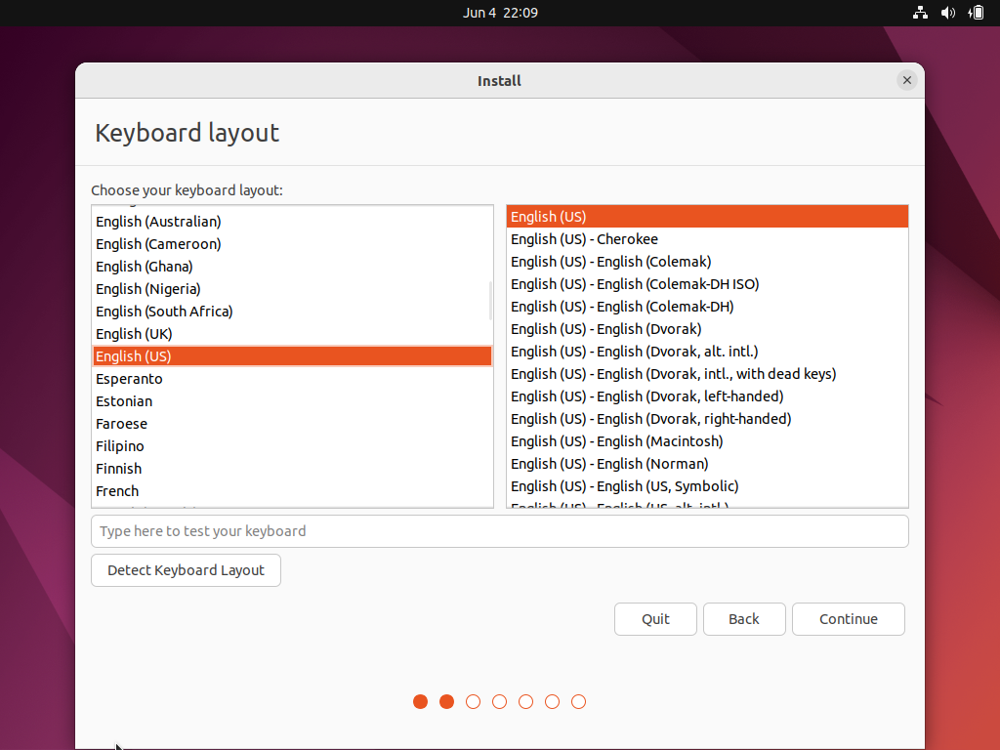
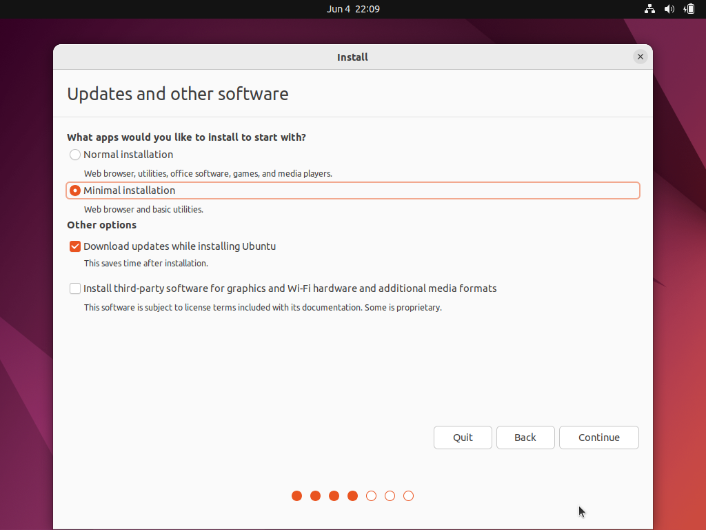
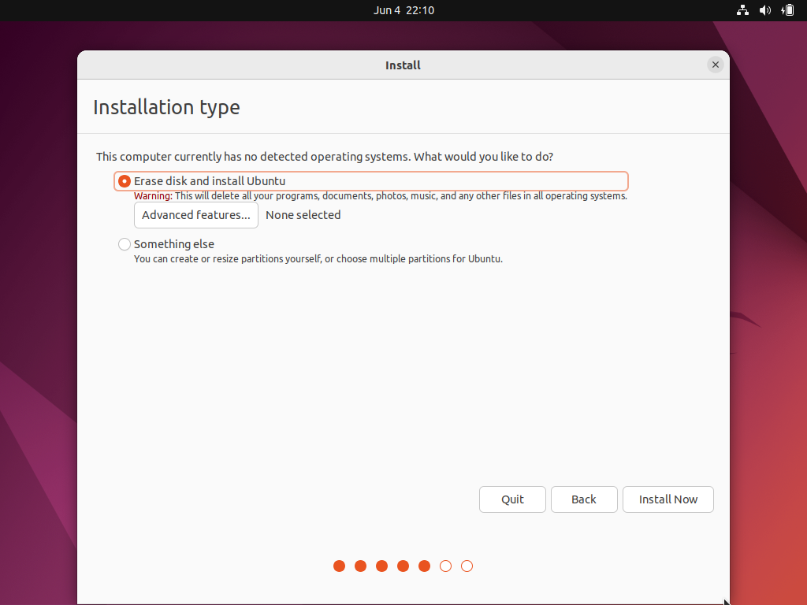
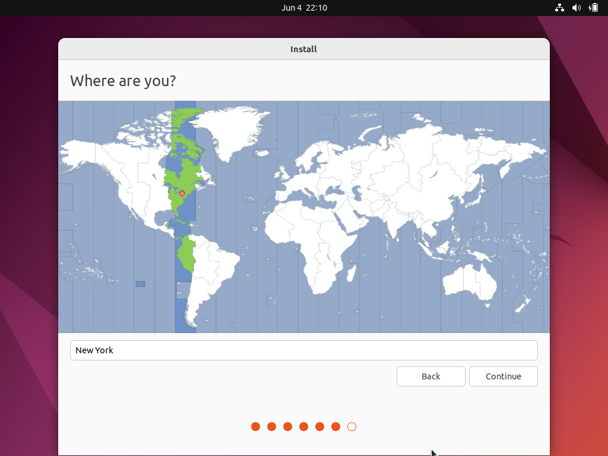
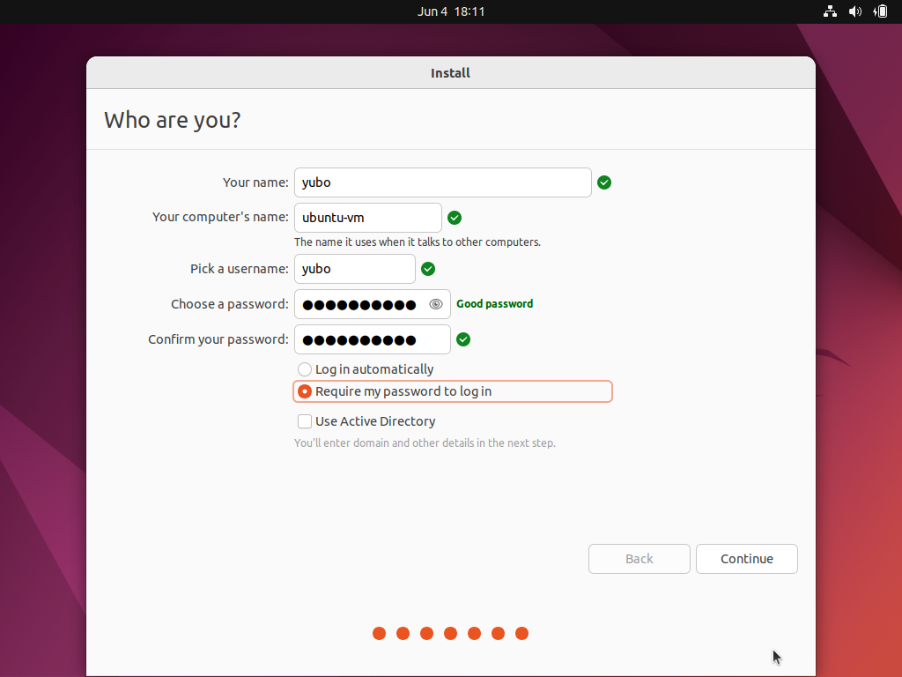
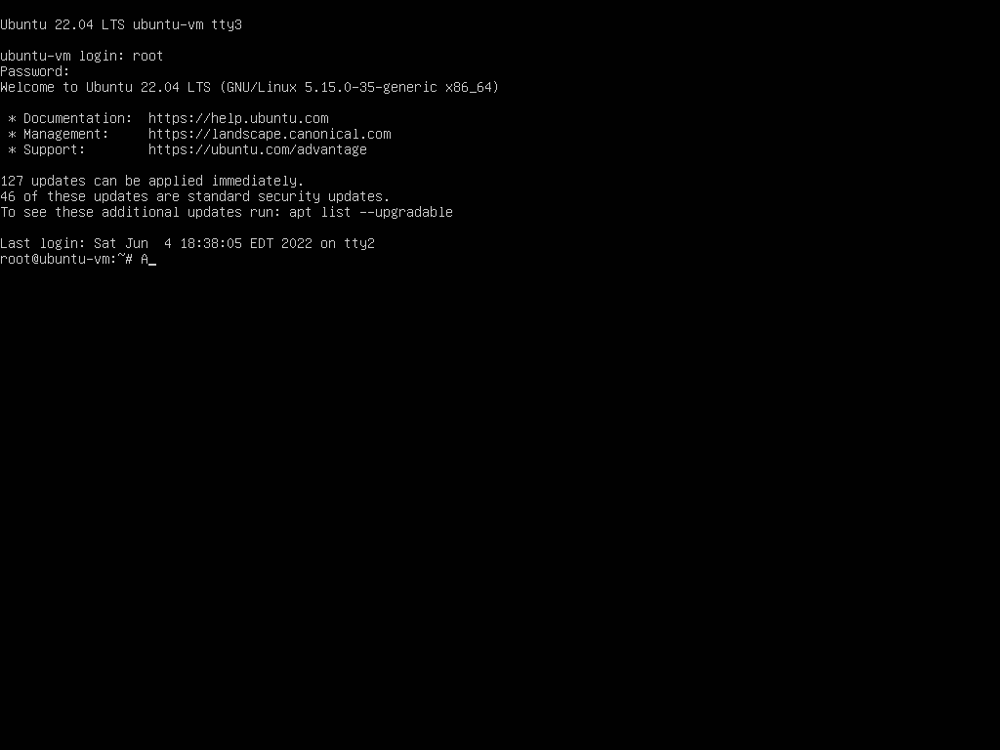
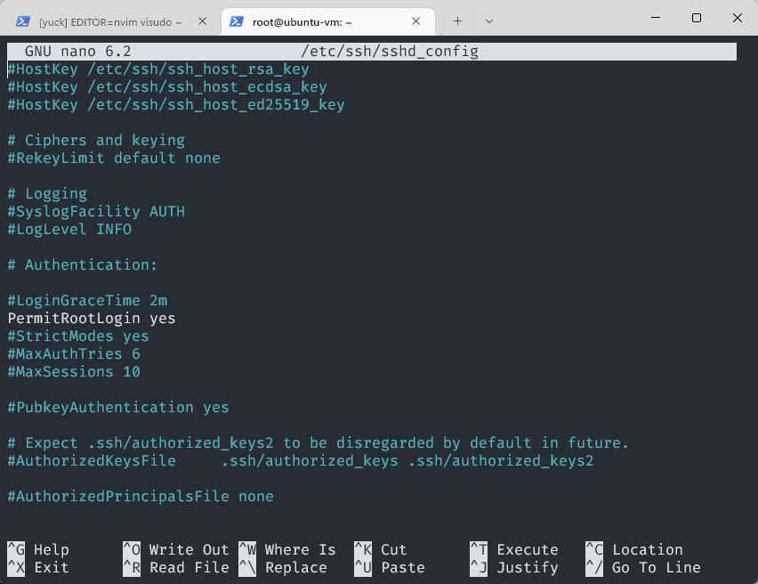

# Setup Linux Machine

## VMWare

- Download VMWare Player. It is free.

- Download Ubuntu iso. It is free.
- Create a virtual machine, using Ubuntu as system image. Follow the following procedures to make it:















## Root

### Terminal

- `Ctrl + Alt + T`
  - 
- **Don't worry** if this terminal looks shabby and you want to go back to your windows machine. **SSH** will help!


### Root

- Sudo allow you execute command with `root` privilege. 
- However, Ubuntu did some trick so that you can't login as `root`. Sometrick will be provided to address that.
- **Do not do that for competition machine**, this is just to make life easier, but make the system more vulnerable.

### `NOPASSWD`

- `sudo visudo`, go to the line where `%sudo` is presented, and modify it as follows

  - ```bash
    %sudo	ALL=(ALL:ALL) NOPASSWD: ALL
    ```

### `ROOT`

- `sudo passwd root` 
  - Type the password you want to set for `root`. Nothing will change in the terminal, but the password is recorded.
- after that, `su root` and type the password you have set. Everything would work.
  - However, you still can not login in to GUI as root. They won't release that restriction.
- Virtual terminal would work. Type `Ctrl+Alt+F2` to login as root.
  - 

### SSH

- `apt install openssh-server`
- `vim /etc/ssh/sshd_config`
  - 
  - Change `PermiRootLogin` to `yes`
- `ip --family inet --color address | perl -nle 'print $1 if /((?:\
  d{1,3}\.){3}\d{1,3}).*eth0/'`
  - Issue this command to get ip address of your guest machine. 
- On **windows**, execute `ssh -l root $ip`, where `$ip` is obtained in previous step. 
  - Type yes for the prompt.
  - Type password for root in the Ubuntu machine.


