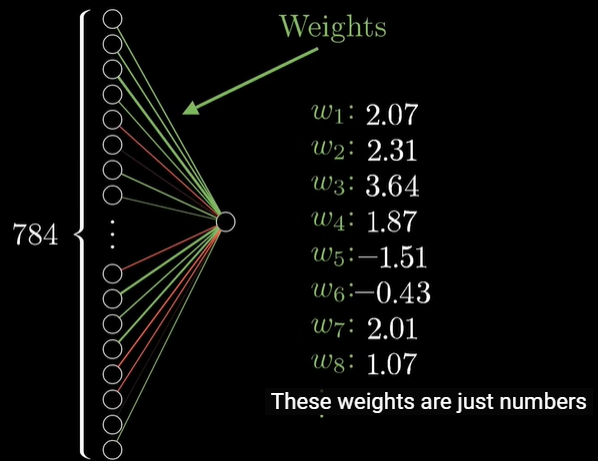
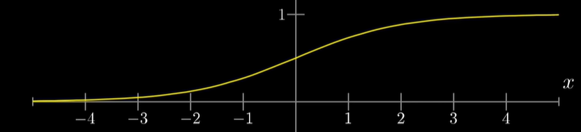
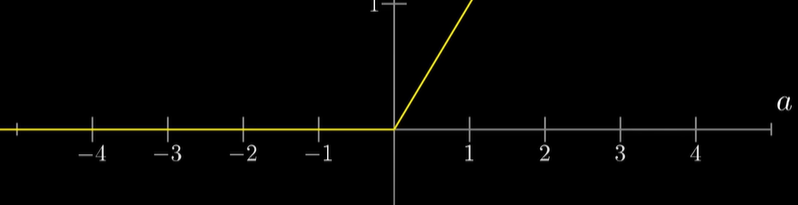
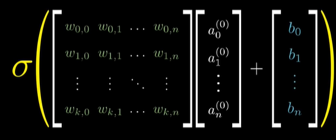
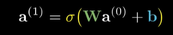
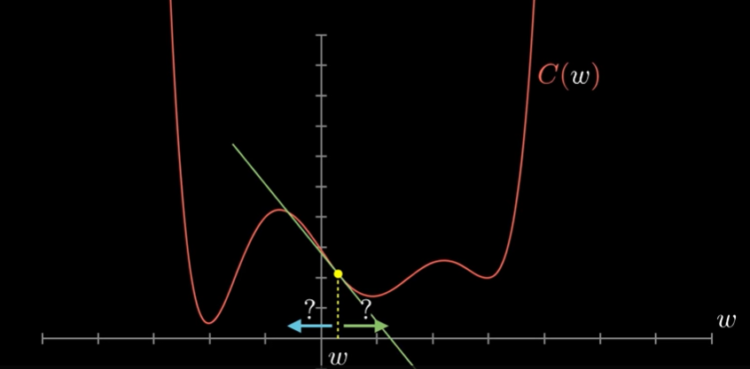
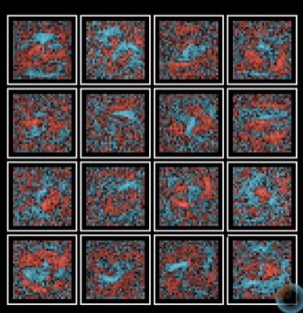

# Strucutre
- The importance of machine learning and neural network is self-explanatory. 
- We will dive into explore those concepts, in the following chapters. 
- Devote to the structure component of it and math of it. Therefore, it will no longer by a buzzword.
- Example we will use
	- The number digit recognition
	- Convolutional neural network
		- Good for image recognition
	- Long short-term memory network
		- Good for speech recognition
## Neural network
- Neuron
  - It is a thing that holds number, `[0, 1]
  - The number inside the neuron is activation
- Network
  - When we connect neurons together, we get a network
  - In the last layer of the network, has 10 neurons. Each neuron's activation suggest how much possibility that systems predict that it is this number.
  - Hidden layer in between the input and output
    - Inner implementation that can't be easily understood.
    - ![[Pasted image 20220529104950.png]]
    - The number of neurons is arbitrary chosen as 16, for this video.
    - The way, the network operators activations in one layer determine the activations of the next layer.
  - This is expected to work
    - Each layer should recognize the subcomponents of a number. 
      - For example, first hidden layer process subcomponents of subcomponents of number.
      - ![[Pasted image 20220529105325.png]]
      - After that, the next layer glue them together to recognize larger subcomponents
      - ![[Pasted image 20220529105409.png]]
    - In that iterative process, the network should be able to recognize numbers. But essentially, that is the hope we have for network
      - Other things that also doing that **break down to layers of abstractions**
      - Another example, raw audio break to distinct sounds, syllables, and words, and then phrases to sentences.
  - Activation
    - Assign a weight to each one of the pixel, between the current layer and previous layer(as an input)
      - 
      - Compute their weighted sum, $\sum_{i=1}^{n}{w_ia_i}$ as the activation of the next neuron.
        - Suppose the weight is all very low, excepts in certain area of input. Then this neuron, will do what we want -- it exactly picks up that specific edge feature.
      - As we want the activation to $[0,1]$ Therefore, some normalize function must be employed so that it mapped them to right region
        - Common function, Sigmoid
          - $\sigma(x)=\frac{1}{1+e^{-x}}$
          - Logistic curve. 
          - 
        - ReLU
          - Rectified linear unit, another squashing function we have now. Essentially, it mimic biological network -- activated only when larger than threshold. 
          - It seems to work better sometimes.
          - `R(a)=max(0,a)`
          - 
      - Then the activation become $\sigma(\textrm{sum}+\textrm{bias})$
        - This bias control the how high the neuron must be in order to be active
      - For all neuron, it has 
        - its own weights
        - its own bias
        - Therefore, it is a lot of calculation. It means it has 13,002 weights and biases.
- Learning
  - Find the right weights and biases (13,002), so that it will actually solve the problem.
  - Tweaking the biases and weights by hand, is an cumbersome job. However, it is sometimes necessary for making network work.
- Math notation
  - 
  - Write them as an matrix, which essentially does the same thing as before.
  - After that, give them symbols to represents them.
    - 
    - It makes the code simpler and faster, since matrix multiplication really get faster with `numpy`.
- The entire network is an interesting function, that involve a lot of parameters.

# Learning - Just minimize cost function

- We want an algorithm, which could allow the network to get those biases and weights, by presenting to it a bunch of data and their results (label data).
- Finally, this network should get an generalized model, that could work well with data that are not part of training data.
  - This is tested by split data into training and testing.
  - Show some data that the network have never seen before, to let it recognize.
  - MNIST has got a lot of data, which are ready for us to use.
- Cost function
  - An function to tell that whether the algorithm performs good or bad.
  - Add up the square difference between the expected value and output value, as our cost function.
    - Essentially, $\sum_{i=0}^{n}{(\textrm{actual}-\textrm{expected})_i^2}$ is the cost function.
    - When the network confidently classify the image correctly, the cost function yield small result. Otherwise, the cost function yield large result.
    - We feed a lot of data to test the network, and the **average of cost function** served as measurement of how lousy the network is and how bad the computer should feel.
  - Cost function can be viewed as a function, where the input is the weights/biases (parameters of the network), and output the **cost**, or how bad that the network should feel about.

## Gradient descending

- Tell what parameters should be adjusted, to lower the cost function.
  - It is infeasible to find derivative of the cost function, as it is so complicated. 
  - Therefore, start at any old input and figure out how to make output lower is the better idea.
    - 
    - We can estimate the derivative at certain point by adjusting the inputs differently, and see what changed.
  - Eventually, an local minimum would be obtained. 
  - Depends on which random input we start at, there will be different local minimum that we get. **no way to find global minimum**, it is crazy hard. But **local minimum** is enough and feasible.
  - Make step sizes proportional to the slope, therefore, the minimum would be approached right way. It helps you from overshooting.
- Input space. Consider input points, or two input values, $(x, y)$. In that situation, we consider which direction would we step in input space to achieve minimum?
  - 
  - The gradient of the function, gives the direction of steepest increase. 
    - Therefore, take the direction opposite of the gradient to get minimum. 
    - The magnitude of gradient, shows the speed of decreasing.
  - In principle, there exists such an gradient vector. That being said, the algorithm is following:
    - Compute the gradient direction, $\nabla C$
    - Small step in $-\nabla C$ direction
    - Repeat step 1, 2
  - For more input variable, we just going to use higher order input space.
    - All the weights and biases are organized in an giant vector
      - $\vec{W}=\left[\begin{matrix}w_0\\w_1\\w_2\\\ldots\\w_n\end{matrix}\right]$
    - We are going to have an giant gradient vector, which instruct us how to adjust them too.
      - $-\nabla C(\vec{w})=\left[\begin{matrix}a_0\\a_1\\a_2\\\ldots\\a_n\end{matrix}\right]$
  - And find the minimum of such cost, it means the better performance of all those samples.
  - It also therefore, we want the neural network to have continuous yield.
    - Without that, it is impossible to find minimum, as we want to step little by little to get minimum.
  - This process is called **gradient descent**
    - Converge towards some local minimum.
  - Understand
    - The magnitude, or absolute value of the $-\nabla C(\vec{w})$ tells which weight matters more to the performance of the network.
      - Higher magnitude means larger impact.
- Back propagation
  - To compute the gradient effectively, **heart of neural network**
    - Weight in previous layer affects the output in next layer
    - Bias affects the output
    - The output of previous layer, affects the output of next layer.
  - Store the desired adjustments as an temp variable, following things happened:
    - we are able to accumulate desired adjustments to previous layer. Therefore, every layer only have to deal with its own desired adjustments and adjusts weights proportionally.
      - then same thing applied. Recursive process until come back to the input.
    - assuming the previous layer doing right job, we can adjust the weights.
      - Hebbian theory. Neurons that fire together, wire together.
    - Sum all the desired changes for all the neurons in specific layer. Then propagate backword, we have list of stuff that we want the previous layer to change.

## Analyse network

- The network is pretty much an black box, that can not be explained.
  - Drawing the weights associates which transition from each layer to the next.
  - But actually, it looks pretty much random, beside concentrated on the middle.
    - 
  - The network does not seems really pick up on edges and patterns. Really, it does nothing intelligent and yield random patterns!

## Improved

- 