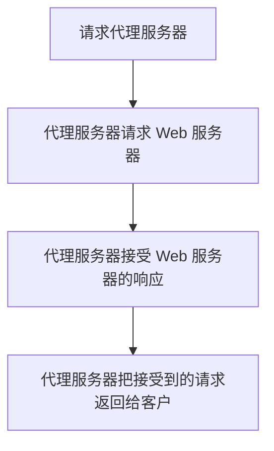

# 爬虫的基本原理

- 互联网是一张网，爬虫遍历网络中每一个网页的相邻节点，并在每个节点获取需要的信息，借此，所有的需要的网络都被爬虫爬取，并且网站的数据就获得了。

## 概述

### 获取网页

- 爬虫构造请求并发送给服务器，收到响应并将其解析，然后就可以获得**网页的源代码**——包含了网页有用的信息。
- 常用的库
  - `urllib`
  - `requests`
  - 通过使用这些库来实现 `HTTP` 请求操作，并且借此解析得到的网页。

## 提取信息

- 分析网页的源代码，并从中提取需要的数据。
  - 正则表达式是通用的方法，但是构造困难并且容易出错。
  - 网页是 `xml` 文档，为此
    - 使用 CSS 选择器
    - 使用 XPath
    - 使用网页节点的属性和关系
  - 我们可以使用上述技术来对网页中的信息进行提取。

### 保存信息

- 保存为 TXT 文本或者 JSON 文本
- 保存到数据库，例如 MySQL 和 MongoDB

### 自动化程序

- 把上面的步骤变成自动化的程序，并且提供完备的异常处理、错误重试等工作，确保爬取的持续运行。

## 能力

### 可以抓取的数据

- 只要是可以再浏览器中访问的，就都可以抓取到
  - `HTML` 代码
  - `JSON` 字符串，如 `API` 接口
  - 二进制数据，图片，音频以及视频
  - CSS, JS, 以及配置文件等

### JS 渲染的问题

- 现代的网页使用　`Vue`, `Ajax`　等前端工具进行部署，原始的　`HTML` 代码里面其实什么都没有。
- 有时候，使用 HTTP 请求库得到的源代码可能和浏览器中的代码不一样
  - 通过分析 Ajax 端口
  - 使用 Selenium, Splash 来模拟实现 Javascript 渲染的方式来绕过这种限制

## 会话和 Cookies

- 有些页面只有登录之后才可以访问
  - 有些页面的 Cookie 的有效时间较长，可以连续访问
  - 有些网站，过一段时间就需要重新登录
  - 有些网站甚至打开浏览器就可以自动登录

### 静态网页和动态网页

- 静态网页是最基本的 HTML 代码，将其保存为一个 `.html` 文件，然后放在一个有公网 IP 的主机上并装上 `Apache` 和 `Nginx` 服务器上，就可以作为服务器并让其他人访问这个网站。
- 动态网页可以动态解析 `URL` 参数的变化，关联数据库并动态呈现不同的页面内容。
  - 使用 `JSP, PHP, Python` 等语言编写
  - 功能比静态网页强大的多
- 动态网页还实现了用户登录和注册的功能。

### 无状态 HTTP

See: [[Web Basic]] [[Internet Basic, HTTP(s), TCP, and UDP]]

- HTTP 有一个特点，叫做无状态
  - HTTP 协议对事务处理没有记忆能力，服务器不知道客户端的状态。
    - 每次向无服务器发送请求，服务器解析请求并且返回对应的响应，整个过程是完全独立的，并且服务器不会记录前后状态的变化，也就是缺乏状态记录。
    - 为此，总是需要重复传输一些内容——为了解决这个问题，`Session` 和 Cookie 出现了
      - `Seesion` 在服务器端部署，用于保存用户的信息
      - Cookie 在浏览器端，浏览器每次访问网页都会副带上这部分内容发送给服务器
    - 借此，我们直接获取 `Cookies` 并且放在请求头中，然后就不需要重新模拟等录了。

#### Session

- 会话，表示从开始到结束的一系列信息和动作的集合。
- 会话用于存储特定用户会话需要的属性和配置信息
  - 用户在应用程序的页面间跳转，用户信息将会持久下去，得以保存
  - 如果用户会话过期，服务器终止这个会话
  - 如果用户没有会话，服务器创建一个会话

#### Cookies

- 用于辨别用户身份、进行会话跟踪而存储在用户本地终端上的数据。

##### 会话维持

- 客户端第一次请求服务器，服务器返回一个包含 `Set-Cookie` 字段的请求头，借此对用户进行标记。
- 下一次访问网站时，客户端会把 `Cookies` 放到请求头一起提交给服务器，然后服务器就可以查找到会话，借此判断用户状态。
  - 如果某些设置登录状态的变量有效，用户处于登录状态，此时，返回登录后才可以查看的网页内容。
  - 如果传入的 Cookie 无效，或者已经过期，那么就返回错误并让其登录。

#### 内容

![[Pasted image 20220524190701.png]]

- 上述展示的是在 `quizlet` 网站访问时的 Cookie 列表
- 常见字段概述
  - `Name`: Cookie 的名称，一旦创建不能更改
  - `Value`: Cookie 的值。如果为 `Unicode` 字符，需要编码。如果二进制，使用 Base64
  - `Domain`: 可以访问这个 Cookie 的域名。例如，设置为 `.quizlet.com`，那么所有以 `quizlet.com` 结尾的域名都可以访问这个 Cookie
  - `Max Age`: 该 Cookie 失效的时间，单位为秒
    - 和 `Expires` 一起使用，可以使用这个计算出有效时间
    - `Max Age > 0`，那么 Cookie 在 `Max Age` 秒后失效
    - `Max Age < 0`，那么 Cookie 在关闭浏览器之后马上失效，不会进行存储
  - `Path`: Cookie 的使用路径。设置为 `/path/`，那么只有路径为 `/path/` 的页面可以访问这个 Cookie.  设置为 `/`，那么本域名下所有页面都可以访问这个 Cookie
  - `Size`: Cookie 的大小
  - `Http`: 是否禁止 `document.cookie` 来访问这个 Cookie
  - `Secure`: 这个 Cookie 是不是这能使用安全协议传输

#### 会话 Cookie

- 简言之，如果 `Max age < 0`，浏览器仅仅把 Cookie 放到浏览器缓存中，浏览器关闭后 Cookie 就失效了。这样的 Cookie 被称为会话 Cookie
- 持久 Cookie 就是不是会话 Cookie 的 Cookie.

#### 误区

- 关闭浏览器的时候，会话**不会消失**。
  - 浏览器释放会话 Cookie，因此再次打开浏览器，就必须再次输入 Cookie.
  - 如果改写浏览器发出的 HTTP 请求头，并且附带原来的 Cookie, 那么会话还是存在的。
    - 为此，服务器给会话设置一个失效时间，避免这个问题。除此以外，服务器在超过这个失效时间之后，就会删除这个会话以节省存储空间。

## 代理

- 有些时候，网页通过 IP 访问频率的方式来判断你是不是一个爬虫。如果超过了这个阈值，就会组织爬虫对网络进行访问。**封 IP**。
- 为了解决这个问题，伪装 IP 的方式就是必须的了。

### 基本原理

- 代理服务器，又称为 `proxy server`，可以代理网络用户取得网络信息。

- 在这个过程中， Web 服务器识别出的真实 IP 就是代理的 IP。我们借此突破了 **封 IP**

### 作用

- 翻墙，突破 IP 访问限制，访问一些平时不能访问的站点。
- 访问单位内部或者团体内部资源，例如教育网，资料共享，公司内网。
- 提高访问速度，因为代理服务器内部有较大的硬盘缓冲区，可以对 Web 服务器返回的内容进行缓存；如果同样的资源被多次请求，直接返回缓冲区内容提升访问速度。
- 隐藏真实 IP，避免 **封 IP**

### 分类

#### 协议

| 协议类型      | 作用                                                                                 | 端口             |
| --------- | ---------------------------------------------------------------------------------- | -------------- |
| FTP       | 上传，下载，缓存。访问 FTP 服务器                                                                | 21,2121       |
| HTTP      | 访问网页，内容过滤以及缓存。                                                                     | 80,8080,3128 |
| SSL/TLS   | 访问加密网站， SSL/TLS 加密 (128 bits 加密)                                                   | 443            |
| RTSP      | 访问 Real 流媒体，缓存                                                                     | 554            |
| Telnet    | 远程控制                                                                               | 23             |
| POP3/SMTP | 收发邮件，缓存功能                                                                          | 110/25         |
| SOCKS     | 传递数据包，不关心协议的用法。缓存。 SOCKS4 仅支持 TCP, SOCKS5 支持 UDP & TCP & 身份验证，服务器域名解析。是 SOCKS4 的超集 | 1080           |

#### 匿名程度

- **高度匿名**：原封不动转发数据包，看起来像一个普通客户端在访问，记录代理服务器 IP
    - 一般来说，我们建议使用这种类型的代理。免费的少，大多数都需要使用 **付费代理** 或者 **ADSL** 拨号
- 普通匿名：对数据包进行改动，可能会发现客户端的存在并追查到其真实 IP。加入 `HTTP_VIA` 和 `HTTP_X_FORWARDED_FOR`
- 透明代理：告诉客户端的真实 IP，除了缓存和内容过滤用处不大。如硬件防火墙。
- 间谍代理： 用户研究、监控用户。
