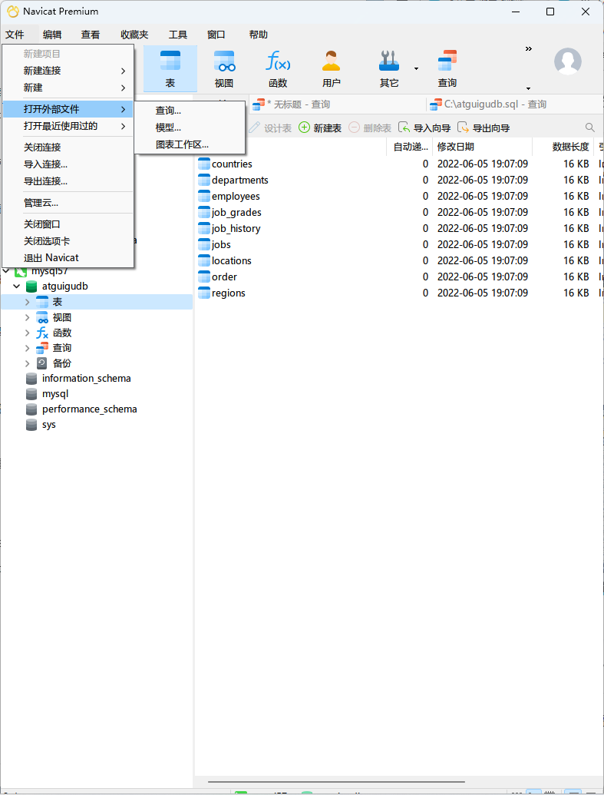
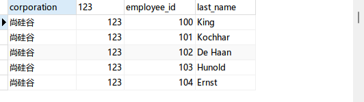
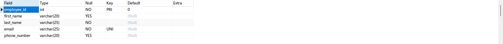

# SQL

## History

- SQL 在 1974 年推出，至今，SQL 的语法没有很大的变化。
  - IBM 研究员开发的
- SQL(Structured Query Language) 结构化查询语言，是十分必要的。
  - SQL-86, SQL-89, SQL-92, SQL-99 是 ANSI 制定的，不同版本的 SQL 标准。
  - `SQL-92` 和 `SQL-99` 奠定了我们今天使用的 SQL。
    - DBMS 支持 SQL 标准的程度不同
- 
  - DBMS 在大体上支持 SQL 规范，例如 `SELECT`,`INSERT`,等
  - 每一个 DBMS 都有自己对 SQL 的扩展
- SQL 现在已是 Tiobe 前十的语言

## SQL 分类

SQL 语言在功能上分成 3 大类

- DDL (Data definition language)
  - `CREATE`, `ALTER`, `DROP`, `RENAME`, `TRUNCATE` (清空)
  - 控制数据库和数据库
- DML (Data manipulation language) :star:
  - `INSERT`, `DELETE`, `UPDATE`, **`SELECT`**
  - 增删改查数据库中的记录。DML 使用频率最高，SQL 一般指 DML
- DCL (Data control language)
  - `COMMIT`, `ROLLBACK`, `SAVEPOINT`,`GRANT`,`REVOKE`
  - 事务相关的语言

别的分类

- 把 `SELECT` 单独拿出来，作为 DQL (Data Query Language)，最为重要
  - 使用频率高
  - 使用灵活，难度大
  - 优化主要关注查询的优化
- `COMMIT` 和 `ROLLBACK` 也可能被拿出来，作为 TCL (Transcation Control Language) 事务控制语言。

学习路线：DML -> DDL -> DCL

## 规则和规范

- 规则：必循遵守，否则不会运行
- 规范：你可以遵守，代码仍然会运行

### 规则

- SQL 语句可以写成一行，也可以分行写。建议各个子句分行写，并且使用缩进，以便提升可读性。

- 所有的 SQL 语句必须以 `;`, `\g`, 或者 `\G` 结束。

  - `;` 按表格的方式进行呈现

    - ```mysql
      MariaDB [test]> SELECT * FROM student;
      +------+------+
      | age  | name |
      +------+------+
      |   16 | yubo |
      +------+------+
      1 row in set (0.001 sec)
      ```

  - `\g` `\G` 让表格用列的方式呈现，方便阅读

    - ```mysql
      MariaDB [test]> SELECT * FROM student\G
      *************************** 1. row ***************************
       age: 16
      name: yubo
      1 row in set (0.000 sec)
      ```

- 关键字不能缩写或者换行，但是不分大小写
- 标点符号
  - 保证所有的 ()，单双引号都成对
  - 使用半角标点符号
  - 字符串和日期时间可用单引号
  - 列的别名使用双引号，并且不建议省略 `as`
- 命名
  - 数据库、表名不超过 30 字符，变量名不超过 29 个字符
  - `[A-Za-z0-9_]{,30}` 
    - 数据库名、表名、字段名等对象名中间不要包含空格  
  - 同一个DBMS软件中，数据库不能同名；同一个库中，表不能重名；同一个表中，字段不能重名
  - 必须保证你的字段没有和保留字、数据库系统或常用方法冲突。如果坚持使用，请在SQL语句中使用 <code>`</code>（着重号）引起来
  - 保持字段名和类型的一致性，在命名字段并为其指定数据类型的时候一定要保证一致性。  

### 规范

- `MySQL` 在 `Windows` 下大小写不敏感
- `MySQL` 在 `Linux` 下大小写敏感
  - 数据库名、表名、表的别名、变量名是严格区分大小写的
    - 和文件相关的都敏感
    - **你也可以设置成不敏感**
  - 关键字、函数名、列名(或字段名)、列的别名(字段的别名) 是忽略大小写的  

- 建议
  - 除了关键字，函数名，绑定变量都小写。

- 注释
  - `#` 和 `--` 创建单行注释。
    - `--` 是所有 `SQL` 数据库通用的注释语法。必须在后面加一个空格。
  - `/*` 和 `*/` 是多行注释，但是不能嵌套

## 导入数据

- `source`
  - 例如，`SOURCE C:\atguigudb.sql`
- 

# `SELECT`

```mysql
SELECT 列
FROM   表;
```

- 返回一个结果集

## 最基本

```mysql
SELECT 1 + 1, 3 * 2;
SELECT 1 + 1 FROM DUAL; 
```

- `DUAL` 是一个伪表，用来保持 `SELECT 字段... FROM 表` 的结构

```mysql
SELECT employee_id, last_name, salary
FROM employees;
```

```mysql
SELECT * FROM employees; # 查询所有列
```

- 生产环境中最好不要这么干

## 别名

```mysql
SELECT employee_id AS "emp_id", last_name "name", department_id dep_id, salary AS "annual sal"
FROM employees;
```


- 重命名一个列
- 紧跟列名，也可以在列名和别名之间加入关键字 `AS`，别名使用**双引号**，以便在别名中包含空格或特殊的字符并区分大小写。
  - `AS` 可以省略，表示 `ALIAS`
  - `MySQL` 支持使用单引号，<code>`</code>，或者双引号。但是 **建议坚持** 用双引号。

## 去重

```mysql
SELECT DISTINCT department_id
FROM employees;
```

- 用例：查询员工表中到底有哪些部门 id?

```mysql
SElECT DISTINCT salary, department_id
FROM employees;

SElECT salary, DISTINCT department_id
FROM employees;
```

- 需要注意的是， `DISTINCT` 必须放到开头，用来给所有的列都进行去重。
- 去重的不是紧跟在后面的第一个列，而是所有列的排列组合。

## 空 `NULL`

- `NULL != 0, '', 0.0` 等。

- 所有运算符或列值遇到null值，运算的结果都为null  

```mysql
SELECT
	employee_id,
	salary "月薪",
	salary * (1 + IFNULL( commission_pct, 0 )) * 12 "年薪" 
FROM
	employees;# 我们发现，所有 commission_pct 是 null 的，算出来的都是 null.
```

- 利用 `IFNULL` 替代一下 `NULL` 来解决这个问题

## <code>`</code>

```mysql
SELECT * FROM `order`;
```

- 如果字段/数据库/表名使用了系统中的保留字，那么使用 <code>`</code>括起来解决这个问题。

- 如果不是关键字或者保留字，那么加入着重号毫无意义。

## 查询常数

```mysql
SELECT '尚硅谷' as corporation, 123, employee_id, last_name
FROM employees;
```

- 给每一个查询集的列中加入一个常量



## 显示表结构

```mysql
DESC employees;
DESCRIBE employees;
```



- 返回对表中所有字段的描述。

  - Field：表示字段名称。

  - Type：表示字段类型，这里 barcode、goodsname 是文本型的，price 是整数类型的。

  - Null：表示该列是否可以存储NULL值。

  - Key：表示该列是否已编制索引。PRI表示该列是表主键的一部分；UNI表示该列是UNIQUE索引的一

  - 部分；MUL表示在列中某个给定值允许出现多次。

  - Default：表示该列是否有默认值，如果有，那么值是多少。

  - Extra：表示可以获取的与给定列有关的附加信息，例如AUTO_INCREMENT等  

## `WHERE` 过滤

- `Where` 必须写在 `FROM` 后面

```mysql
SELECT 字段
FROM 表
WHERE 过滤条件
```

- 查询 90 号部门员工信息

```mysql
SELECT *
FROM employees
WHERE department_id =90;
```

- 查询 King 员工

```mysql
SELECT *
FROM employees
WHERE last_name = 'King'; # MySQL 特别实现，忽略大小写
```

> 在 Oracle 数据库中，上述的代码的字符串比较是大小写敏感的。last_name = 'king' 的实现在 Oracle 数据库中什么都不会查出来。
>
> MySQL 的 SQL 实现比较随意~

## 课后练习

```sql
SELECT
	employee_id,
	last_name, -- 列和列之间必须使用逗号分开，否则变成别名
	salary -- 不要在最后一行加入逗号
FROM
	employees;
	
-- 寻找 12 月工资总和

SELECT
	employee_id,
	last_name,
	salary * 12 * (
	1 + IFNULL( commission_pct, 0 )) AS "ANNUAL SALARY" 
FROM
	employees;
	
-- 去除重复 job_id

SELECT DISTINCT job_id
FROM employees;

-- 查询工资大于 12000 的员工姓名和工资

SELECT last_name, salary
FROM employees
WHERE salary > 12000;

-- 查询工号为 176 的员工

SELECT last_name, department_id
FROM employees
WHERE employee_id = 176; -- 很像人类语言

-- 显示表 departments 的结构，查询其中全部数据

DESC departments;

SELECT * FROM departments;
```

