# Build Environment
## Uninstall

- Optional
  - Stop `MySQL80` service
  - 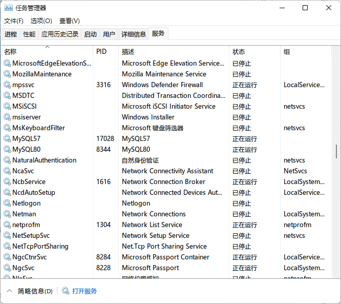
- `Win+R` `control`. Use control panel to uninstall it. 
  - 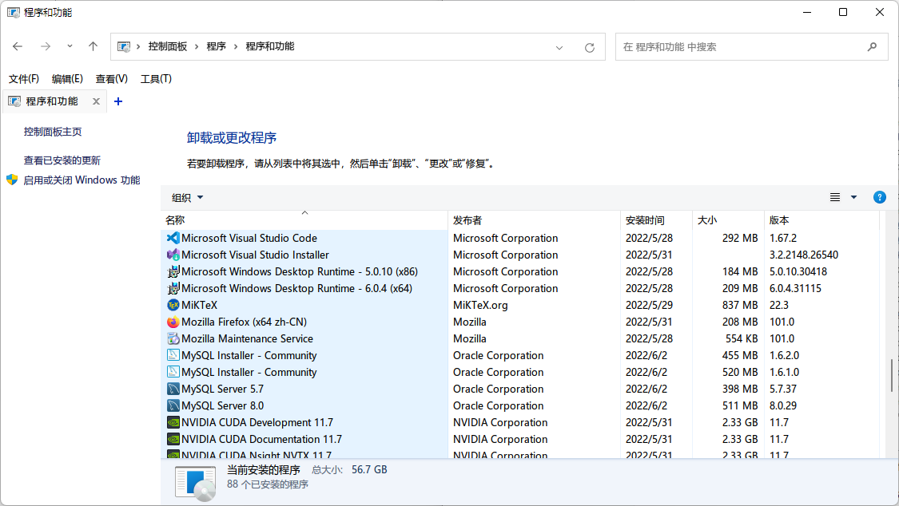
    - Uninstall `MySQL Server 8.0` and `MySQL Installer Community`
    - If remove data is desired, click `remove the data directory`

  - Download the installer to uninstall it is also possible.
    - 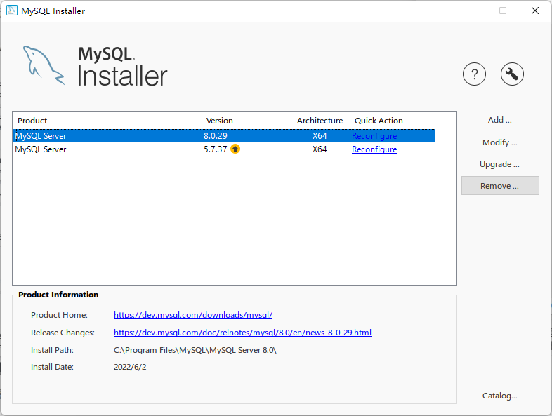
    - If this page is now shown and it asks you to update your product. Click `Cancel` to go to this page.


- Remove the `root_of_installation` manually as necessary.

- Remove the database files if desired. Notice those databases must be removed manually and uninstaller won't do it.
  - Similar example, uninstall photoshop won't delete your photos.

- Clean up `PATH` variable

- Remove `MySQL80` service manually if necessary. It is automatically removed in `MySQL8.0`, but in `MySQL5.7`, it does not.
  - It might be necessary to clean up registry, too. `Win+R` `regedit`

  - ```text
    HKEY_LOCAL_MACHINE\SYSTEM\ControlSet001\Services\Eventlog\Application\MySQL
    HKEY_LOCAL_MACHINE\SYSTEM\ControlSet001\Services\MySQL
    HKEY_LOCAL_MACHINE\SYSTEM\ControlSet001\Services\Eventlog\Application\MySQL
    HKEY_LOCAL_MACHINE\SYSTEM\ControlSet001\Services\MySQL
    HKEY_LOCAL_MACHINE\SYSTEM\CurrentControlSet\Services\Eventlog\Application\MySQL
    HKEY_LOCAL_MACHINE\SYSTEM\CurrentControlSet\Services\MySQL
    ```

  - If `ControlSet(\d{3})` matches directory name, it does not matter if capture group 1 does not capture 001, exactly, like in my machine.

- **Restart**

## Install

### 4 versions of MySQL

- ==**MySQL Community Server**==, open source & free & without technical support
- **MySQL Enterprise Edition**, pay & trial for 30 days & can not download directly
- **MySQL Cluster**, distributed employment
- **MySQL Cluster CGE**, pay & cutting-edge

### Version

- The newest version is `8.0.29`
- MySQL Workbench is GUI management tool provided by MySQL. 
  - ==Community Edition== (Workbench OSS)
  - Commercial Edition (Workbench SE)

### Install 8.0

- https://dev.mysql.com/downloads/installer/

  - GPL community edition
  - MySQL installer for Windows
    - Choose MSI installer, if it presented zip formats
    - Zip requires extra configuration
  - Download installer with larger file size, as smaller file size version require internet during installation
  - Choose Archives if download old editions is desired
    - 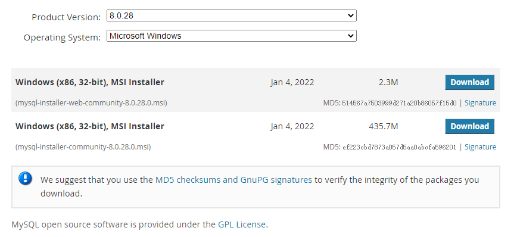
    - Install 5.7.37 edition

- Procedure

  - 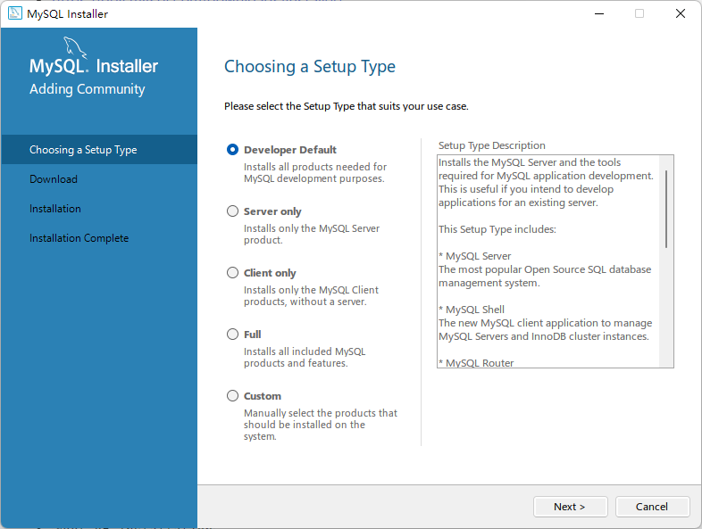
    - Choose "Custom"
  - 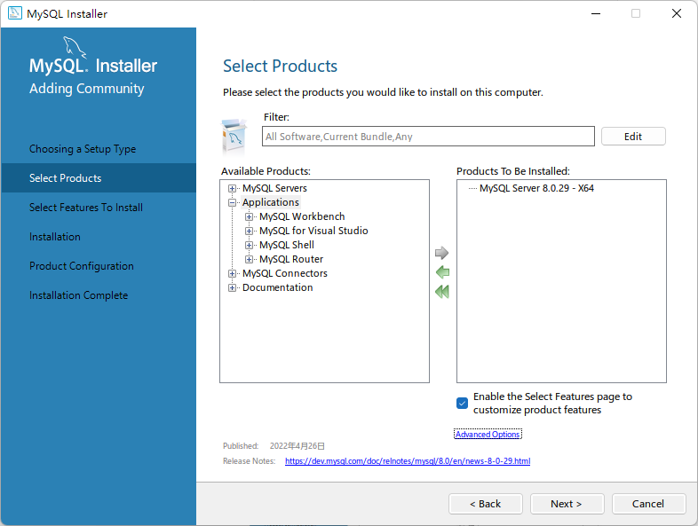
    - By selecting "Enable Select Feature page ...", and click on Advanced Options. One may choose different directory for store database and software installation
  - 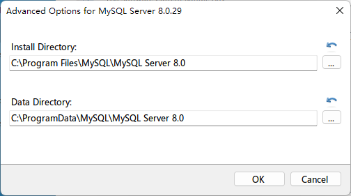
    - Do not choose a directory include any CJK characters.
  - 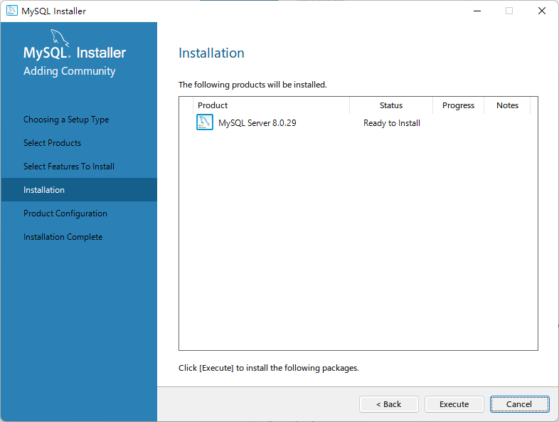
    - Then just "next", until reach "Product Configuration"
  - 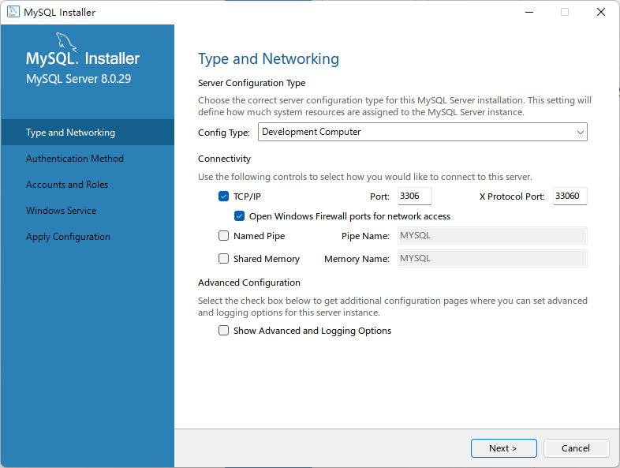
    - Do not modify any options presented.
      - Use "Development Computer"
      - Use the port number `3306`
  - 
    - Choose recommended option. Notice, using that option may cause problem with GUI management tools. See GUI section.
  - 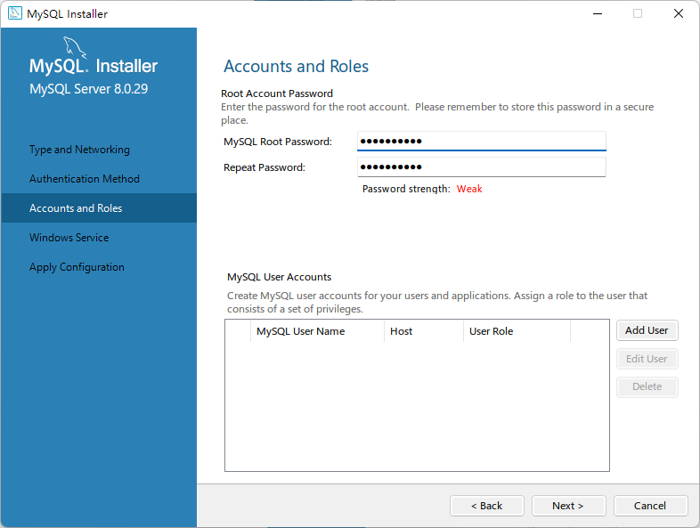
    - Choose root password -- whatever you want. In production environment, you probably won't need to set root passwords by yourself neither.
    - No user account will be added. See next lecture.
  - 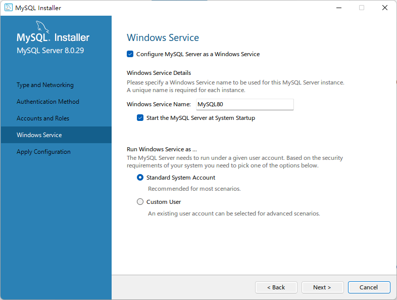
    - If choose not to start on start up, then manually start up before study is required.
  - Continue click "next" until done.

- Environment variable

  - Make `PATH` variable

  - 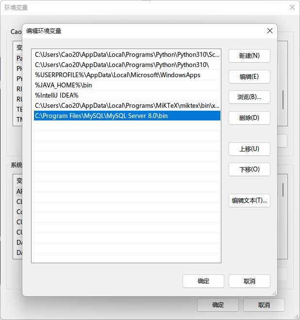

  - After that, we can use `MySQL` in the command line

  - ```powershell
    PS C:\Users\Cao20> mysql --version
    C:\Program Files\MySQL\MySQL Server 8.0\bin\mysql.exe  Ver 8.0.29 for Win64 on x86_64 (MySQL Community Server - GPL)
    PS C:\Users\Cao20> mysql -uroot -pe*ecf51d20
    mysql: [Warning] Using a password on the command line interface can be insecure.
    Welcome to the MySQL monitor.  Commands end with ; or \g.
    Your MySQL connection id is 12
    Server version: 8.0.29 MySQL Community Server - GPL
    
    Copyright (c) 2000, 2022, Oracle and/or its affiliates.
    
    Oracle is a registered trademark of Oracle Corporation and/or its
    affiliates. Other names may be trademarks of their respective
    owners.
    
    Type 'help;' or '\h' for help. Type '\c' to clear the current input statement.
    
    mysql>
    ```

### Install 5.7

- Because 5.7 is still very prevalent, we will also study MySQL 5.7

  - Just make sure that an different port number is used, then two different versions can be used simultaneously.

- 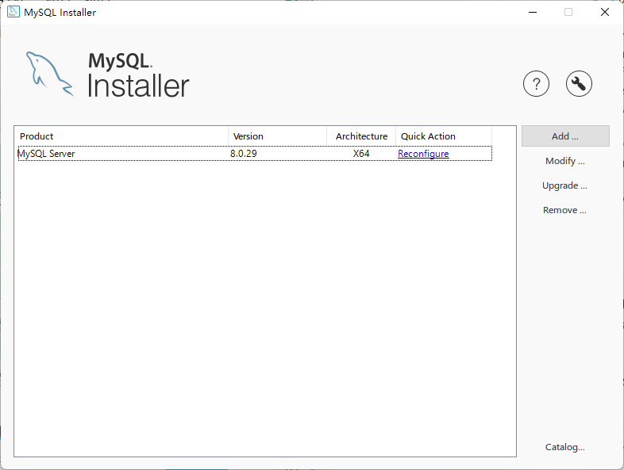

  - Choose add

- 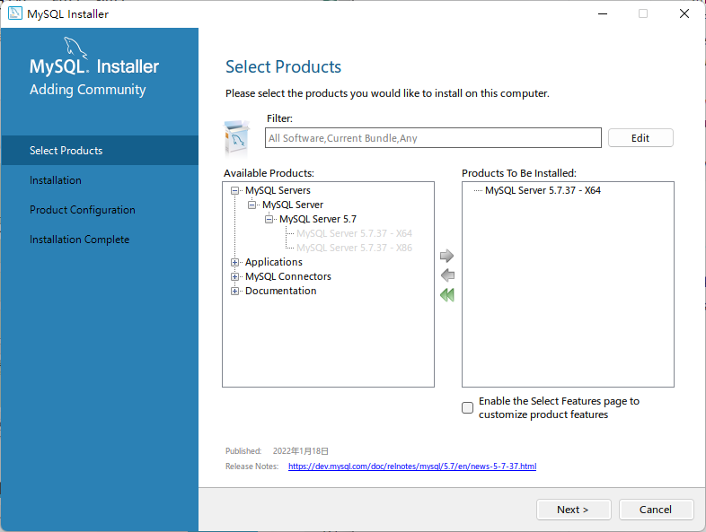

  - Same as section "Install 8.0" mentioned.

- 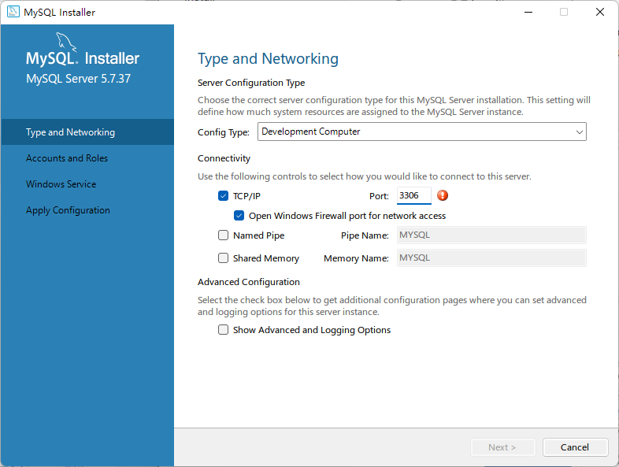

  - **Important**: Choose a different port number, because different service must occupy different port number.
  - We chose 65535

- Just hit continue, as we did previously.

- 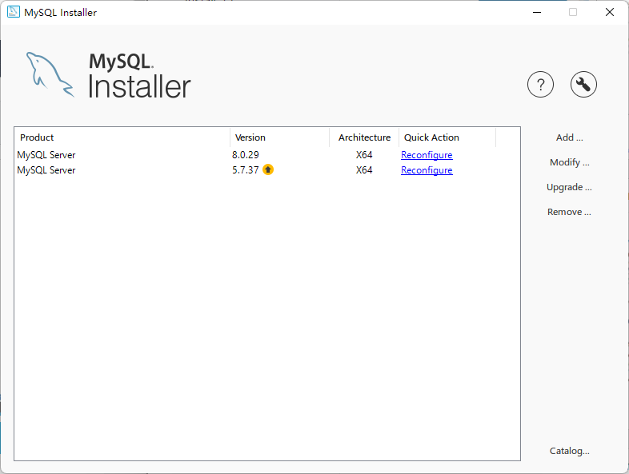

- Don't put this into `PATH`. There can only exists one `mysql` in executable path.

- ```powershell
  PS C:\Users\Cao20> mysql -uroot -pe*ecf51d20 -hlocalhost -P65535
  mysql: [Warning] Using a password on the command line interface can be insecure.
  Welcome to the MySQL monitor.  Commands end with ; or \g.
  Your MySQL connection id is 5
  Server version: 5.7.37-log MySQL Community Server (GPL)
  
  Copyright (c) 2000, 2022, Oracle and/or its affiliates.
  
  Oracle is a registered trademark of Oracle Corporation and/or its
  affiliates. Other names may be trademarks of their respective
  owners.
  
  Type 'help;' or '\h' for help. Type '\c' to clear the current input statement.
  
  mysql>
  ```

- Specify port number to use 5.7 version.

### Troubleshooting

- Make sure following dependencies
  - MS Visual C++ 2015-2019
  - MS .NET Framework 4.5
- Clean up
  - Remove all traces indicated by the following section.
    - To remove service, `sc delete MySQL80/MySQL57` would save sometime
    - `ProgramData` is by default hidden. Choose display hidden items to access this directory.
      - If same database want to be used, remember to fill same root passwords. Otherwise, you won't be able to login

## Traces of Installation

- `root_of_installation`
  - 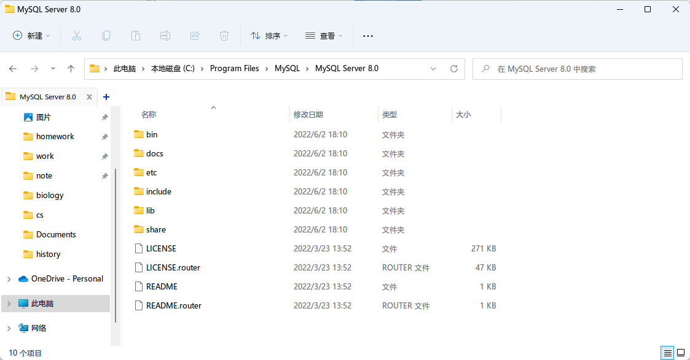

  - Directory structure
  
    - | Directory                 | Description                                                  |
      | ------------------------- | ------------------------------------------------------------ |
      | `bin`                     | Executable files                                             |
      | `MySQLInstanceConfig.exe` | Database config guidance, one that appeared during installation |
      | `data`                    | Where the data is stored                                     |
      | `my.ini`                  | Main configuration file                                      |
  
- `C:\ProgramData\MySQL\MySQL Server 8.0`
  
  - `Data` stores database and tables file.
    - All the database is stored as an directory
    - All the tables is stored as `.ibd` file in the corresponding directory (of its own database)
  - `my.ini` stores configuration of MySQL
  - 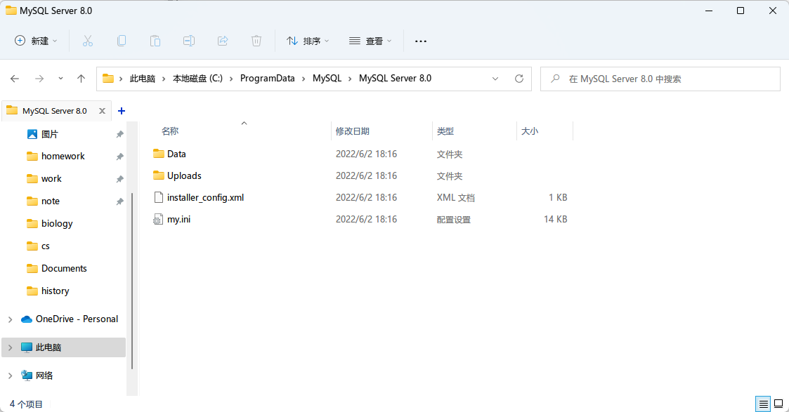
  
- `Service management`
  - `Win+R` `compmgmt.msc` and click on `Service`
  - `MySQL80` services is running. If such service is stopped, the connection to database would no longer exists, and we can't use MySQL anymore.
  
- `Environment variables`
  - `PATH` variable includes `%root_of_installation%\bin` 
  - This enables us to execute `mysql` at any working directory.

## Service Management

### GUI

- `Win+R` `services.msc`
- 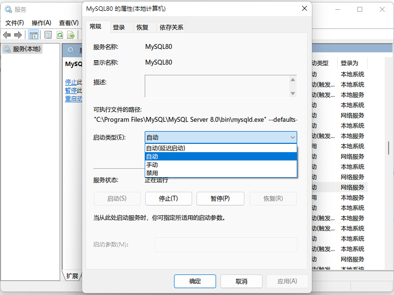

### CMD

```powershell
net start MySQL80 # To Start MySQL Service
net stop MySQL80 # To Stop MySQL Service
```

- Must be executed in a shell with admin privilege

## Login and Logout

- Use MySQL provided command line client
  - It uses root user by default
  - 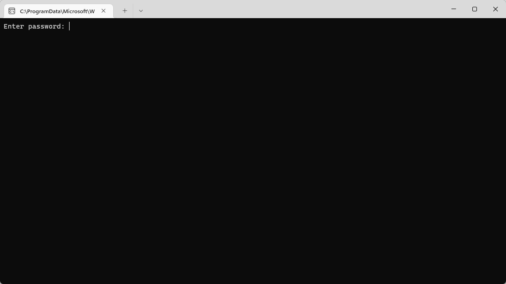
  - After that, done

- Command line arguments

  - ```powershell
    mysql -u <username> -p<password> -P <port> -h <hostname>
    ```

    - It is discouraged to put password in command line argument.
      - Leave the password empty and type password in the prompt is better idea.
    - The space between command line arguments and its value, is optional.
    - By default
      - `-P 3306`
      - `-h localhost`

  - ````powershell
    mysql -uroot -P65535 -hlocalhost -p
    ````

- To exit MySQL shell, type `quit`

## Demo

### CRUD

- Version `select version();`

- Query all databases

  - ```mysql
    MariaDB [(none)]> show databases;
    +--------------------+
    | Database           |
    +--------------------+
    | information_schema |
    | mysql              |
    | performance_schema |
    | sys                |
    +--------------------+
    5 rows in set (0.000 sec)
    ```

  - All those four databases are default

    - `Information_schema`, store database|field|table names and privileges
    - `mysql`, store runtime information, e.g., location of databases and character set
    - `performance_schema`, store performance indicators
    - `sys`, store performance indicators in an human readable way

- Create database `create database test;`

- Choose which database to use `use test`;

- Query all tables `show tables;`

- Create table in database `create table student(id int, name varchar(15));`

- Insert value into table `insert into student value(0, "Yubo");`

  - CJK character `insert into student value(2, "不支持");`
    - `ERROR 1366 (HY000): Incorrect string value: '\xB2\xBB\xD6\xA7\xB3\xD6' for column 'name' at row 1` 
    - CJK character is unsupported by default in MySQL 5.7

- Show metadata

  - Metadata of table `show create table student;` 
    - MySQL 5.7 use latin1 character set by default, not `utf-8`
    - Therefore, CJK character is not supported by default
  - Metadata of db `show create database test;`

- Remove database/table

  - `drop database test;`
  - `drop table student;`

### Encoding

- Show fields start with `character`

  - `show variables like "character_%";`

  - ```mysql
    +--------------------------+---------------------------------------------------------+
    | Variable_name            | Value                                                   |
    +--------------------------+---------------------------------------------------------+
    | character_set_client     | gbk                                                     |
    | character_set_connection | gbk                                                     |
    | character_set_database   | latin1                                                  |
    | character_set_filesystem | binary                                                  |
    | character_set_results    | gbk                                                     |
    | character_set_server     | latin1                                                  |
    | character_set_system     | utf8                                                    |
    | character_sets_dir       | C:\Program Files\MySQL\MySQL Server 5.7\share\charsets\ |
    +--------------------------+---------------------------------------------------------+
    ```

  - Change the encoding of `database` is necessary for CJK

- Show fields start with `collation` (comparison method)

  - `show variables like "collation_%";`

  - ```mysql
    +----------------------+-------------------+
    | Variable_name        | Value             |
    +----------------------+-------------------+
    | collation_connection | gbk_chinese_ci    |
    | collation_database   | latin1_swedish_ci |
    | collation_server     | latin1_swedish_ci |
    +----------------------+-------------------+
    ```

- To fix the encoding problem, change `my.ini` in MySQL 5.7

  - ```diff
    diff my.ini my.ini.bak
    66c66
    < default-character-set=utf8
    ---
    > # default-character-set=
    102,103c102
    < character-set-server=utf8
    < collation-server=utf8_general_ci
    ---
    > # character-set-server=
    ```

  - After that, restart the service. After that, all the `latin1` should be changed to `utf8`.

  - However, the databases and tables that already created won't change with that. Two ways:

    - Manually remove them and recreate them would work. After that, we would be able to insert CJK characters.
      - `drop database test;` 
    - Or alter them
      - `alter table student charset utf8;`
      - `after table student modify <field-name> varchar(20) charset utf8;`
      - `alter database test charset utf8;`

- In MySQL 8.0, it used `utf8mb4` by default, which means use 4 bytes to represents a character.

## GUI tools(IDE)

- Use CMD tools is necessary to know, especially in Linux system.

- However, GUI tool would accelerates speed of developments.

  - Use different GUI tool won't cause any fundamental difference for your workflow.
  - One may use different GUI tool during project developments, without asking for problem.

- General procedure

  - Create connection
    - IP Address: localhost
    - Port: 3306/65535
    - Username: root
    - Password: 123456
  - 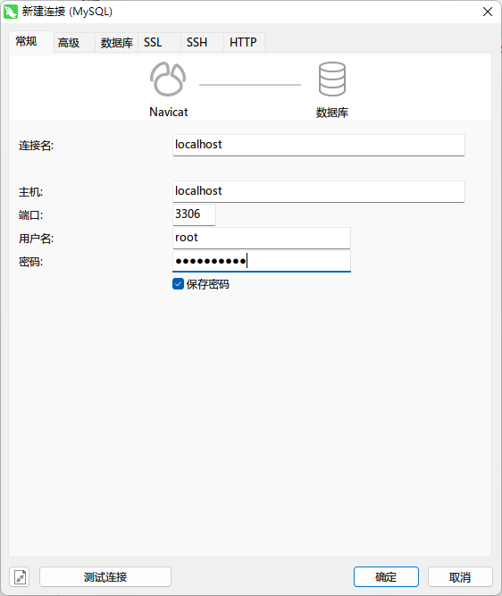
  - After that, we can use MySQL GUI tools
    - 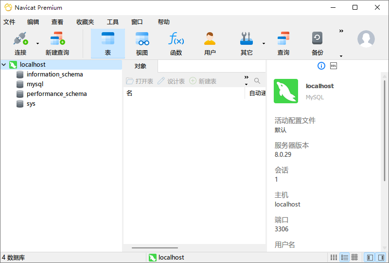
  - Open query, to write SQL into
    - 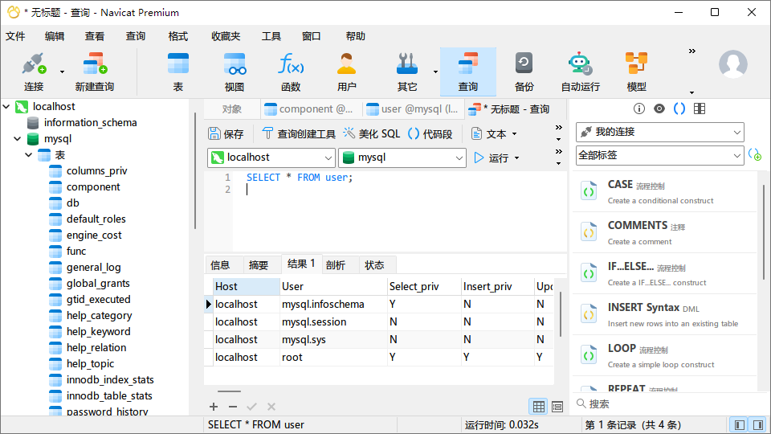

- Connection problem

  - If it does not connect MySQL 8.0 advanced encryption mechanism, then do the following.

  - ```mysql
    USE mysql;
    ALTER USER 'root'@'localhost' IDENTIFIED WITH mysql_native_password BY '123456';
    FLUSH PRIVILEGES;
    ```

### MySQL Workbench

- Provided officially by MySQL
- Community version is free
- Nobody use it, really.

### Navicat Premium 16 :star:

- Remember to crack it
- http://www.navicat.com/

### SQLyog :star:

- Remember to crack it
- http://www.webyog.com/

### Dbeaver 

- Require JDK, free
- https://dbeaver.io/download/
