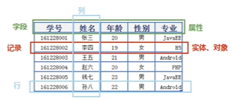
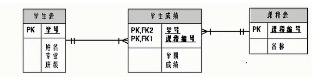
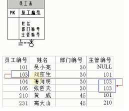

# 数据库概述

## 原因

- 持久化（Persistence），把数据保存到可掉电式的存储设备以供之后使用。
  - 内存 RAM 就是掉电之后就会丢失
  - 把内存中的数据保存到硬盘上保险，断电之后仍然可以读写
- 持久化主要使用
  - **关系型数据库**
  - 也可以存储在磁盘文件，XML 数据文件等
- 优点
  - 数据库可以存储几千万，几十万量级的数据
  - 数据库可以优化数据查找的速度，我们也可以通过索引等多种手段来加速
  - 数据库可以存储多样的，不同的数据以及其类型。文件往往不能存储数据类型，而只能存储数据。

## 数据库的概念

- DB（database） 数据库
  - 存储数据的仓库，本质是一个文件系统。
  - 保存了一系列有组织的数据。
- DBMS（database management system） 数据库管理系统
  - 操纵和管理数据的大型软件，用于建立、使用、和维护数据库。
    - MySQL 是一种 DBMS。
  - 用户通过这个软件来操作具体的数据库。
- SQL（Structured query language）
  - 专门用来和数据库通信的语言。
  - 我们通过 SQL 指挥 DBMS 来帮助我们干活。
- ![[Pasted image 20220602135848.png]]

## 常见的 DBMS 排名

- 300-400 家数据库管理系统存在
- db-engines 对数据库管理系统进行了排名。排名比较靠前的是 MySQL 和 Oracle。它们两个之间的流行程度差距不大！
  - <https://db-engines.com/en/ranking>
- 甲骨文把 MySQL 给收购了，所以它们两个区别就更小了。

### 常见介绍

- Oracle
  - 第一个商用的 RDBMS 关系型数据库系统
    - 使用较高的数据库都是 Relational DBMS!
  - Oracle 收购了 MySQL, SUN, 和 BEA Systems。MySQL 收购之后，Oracle 成为了数据库领域的绝对领导者。
  - 2013, 甲骨文变成微软之后的全球第二大软件公司。证明了商用软件的价值。
- SQL Server
  - 微软开发的大型商业数据库，和 WinNT 完全集成，并且可以和 C#/.net 语言一起使用。
- DB2
  - IBM 开发，用在银行系统中。
- PostgreSQL
  - 稳定性强，最符合 SQL 标准。
  - 开源免费，具备 DBMS 质量，对于数据量大的文本和 SQL 处理较快。
- SyBase
  - 淡出历史舞台，提供了 PowerDesigner, 专业的数据建模工具。
- SQLite
  - 嵌入型的小型数据库，在移动端使用。
  - 零配置，不需要启动，关闭，或者配置数据库实例。下次使用数据库自动回复。
- Informix
  - 用的少，第一个 Linux 上的商业数据库产品。

### MySQL 介绍

- ![[Pasted image 20220602141423.png]]
- **开放源代码的关系型数据库**管理系统。
- MySQL AB 公司在 1995 年开发出来，成为**开源**数据库的第一名。
  - 收购之后，创始人担心 Oracle 会把 MySQL 闭源，于是创建了一个新的分支项目，MariaDB.
  - MariaDB 逐渐抢占市场。
- 自 5.7 版本之后，出现了两个版本
  - 社区版，免费的
  - 商业版，付费的LTS版本。稳定好用。
- 采用了 GPL 协议
- 可以处理有上千万条记录的数据库。
  - 32 位系统最大可以有 4GB 表文件
  - 64 位系统最大可以有 8TB 表文件
- 使用了标准的 SQL 数据语言形式。支持的比较好，但是不是完全的。
- 引擎
  - MyASAM 和 InnoDB
  - InnoDB 现在是 MySQL 的默认存储引擎。
- 2016 年发布了 MySQL 8.0；直接跳过了 MySQL 5.7。
  - 需要注意的是，MySQL 从 5.7 直接跳跃发布了 8.0 版本。
    - 因为功能上做了显著的改进和增强
    - MySQL 大量代码进行重构，同时优化了 Opitimizer 造成了性能提升。
- MySQL 大量被互联网企业使用，经历了时间的验证并且靠谱。成本低。
- Oracle 适合大型的跨国企业使用，因为他们对费用不敏感，但是对性能和安全要求高（贵啊！）。

## DBMS vs. RDBMS

### 关系型数据库

- 最古老的数据库类型，关系型数据库把信息归纳为一个表格（二元关系）
- 列和行组成表，很多表一起组合成了一个库。
- 表和表的数据记录有关系（relationship），现实世界中的各种实体以及实体之间的各种联系均用关系模型来表示。关系型数据库，就是建立在关系模型基础上的数据库。
- SQL 是关系型数据库的查询语言。
- 优势
  - 复杂查询，可以用 SQL 语句在一个表以及多个表之间做非常复杂的数据查询
  - 事务支持，对于安全性能很高的数据访问可以实现

### 非关系型数据库

- 非关系型数据库，可以看成是 RDBMS 的阉割版本，用键值对存储数据。不需要 SQL 解析，也有一些功能被省略。对于一些特别的功能，提供了更好的性能和效果。
- `NoSQL` 泛指这种数据库

#### 键值型数据库

- K, V 来存储内容。其中，K, V 可以是简单或者复杂的对象，K 作为唯一标识符使用。
- 查找速度快，明显快于关系型数据库。
- 不能使用 `WHERE` 等过滤条件，需要遍历所有的键，消耗大量的计算。
- 用于
  - 内存缓存
  - `Redis` 是最为流行的键值型数据库

#### 文档

- 特别的键值型数据库，存储 XML, JSON 等格式的数据。
- MongoDB

#### 搜索引擎

- Elasticsearch, Splunk
- 核心在于倒排索引来提升检索效率。对于数据量很大的时候，我们使用这样的数据库。

#### 列式数据库

- ![[Pasted image 20220602143917.png]]
- 就是写入文件的方式不一样。这样的存储方式可以降低系统的 IO，适用于分布式文件系统。
- 例如，查询 > xxx 的数据，然后只要某些字段的数据。
  - 行式存储的数据库在进行这样的操作时，会把冗余的信息被加载到内存中。
  - 列式存储的数据库，只会把需要的数据加载到内存中，就避免了磁盘 IO 操作。

#### 图数据库

- 利用邻接表对图进行刻画，存储。

#### NoSQL 的演变

- NoSQL 就是尝试寻找一种数据库技术来远离 SQL。
- 最后发现，SQL 就是离不开。
- NoSQL 可以被认为是 SQL 功能的补充，而不是替代。
  - 合理利用非关系型数据库可以提升性能，节省成本。因为，SQL 提供的有些功能，在一些业务场景下是不必须的。
  - 例如，日志收集、排行榜、定时器等。

## 设计规则

- 关系型数据库的典型数据结构是数据表，这些数据表的组成都是结构化的。
- 数据放到表中，表再放到库中。
- 一个数据库有多个表，每个表都有自己独立的名字，用来标识自己。表名具有唯一性。

### ER

- `E-R` (entity relationship) 模型的主要概念：实体集、属性、联系集

- `ORM` 思想 (Object Relational Mapping)
  - 表描述了数据在表中存储的方式，类似于`class` 的设计。ER 模型中的实体集就是表。
  - 行/Record/Row 对应类的实例对象。ER 模型中的属性就是字段。
  - 列/Column 对应类的一个字段/属性。

- 

- **万事万物皆对象**

### 表的关联关系

- 表和表之间的数据记录有关系。
- 现实世界中的各种实体以及实体之间的联系也可以使用关系模型来表示。

#### 一对一（one to one）

- 实际开发使用较少，因为一对一可以直接创建成一张表。

- 例子
  - 学生表：姓名，身份证，学号。拆分长两个表，两个表的记录一一对应
    - 基础信息表（常用）：学号，姓名
    - 档案信息表（不常用）：学号，身份证
    - 学号是一对一的。这样实现的原因在于，这可以提升查询速度，避免了查询的字段没有使用（造成资源的浪费）——数据库的设计

- 建表原则
  - 外键唯一
  - 外键是主键

#### 一对多（one to many）

- 例子
  - 客户表和订单表
  - 分类表和商品表
  - 部门表和员工表

- 一对多建表原则
  - 在从表创建一个字段，字段作为外键只想主表的主键
  - （一个课程对应多个学生)

#### 多对多（many to many）

- 多对多必须创建第三个表，也就是联接表——这个表把多对多的关系变成两个一对多。
- 例子
  - 学生信息表：学号，姓名
  - 课程信息表：课号，老师
  - 选课信息表（联接表）（一个学生选多门课，一个课被多个学生选）记录学号和课程编号，来记录学生和课程。
    - 记录多个学号，课程编号对。然后就可以实现一个学生对应多个课，一个课对应多个学生。

#### 自我引用（self reference）

- 员工号和经理管辖的员工。经理作为员工计算。此时，员工表中的员工号产生了自我引用：经理中所管人员的员工号引用员工号（或员工对象）在一个表中。
  - 

