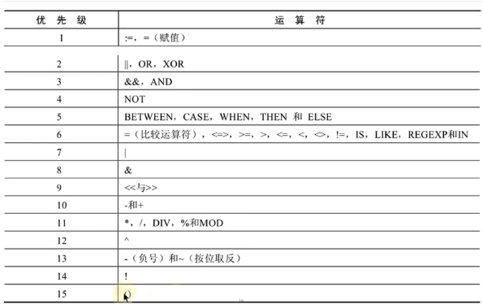

# 运算符

## 概述

- 变量和变量之间的运算
- 大多数语言的运算符都是差不多的

## 算数运算符

- 加减乘除模 `+-*/%`

- 特别的， `div` 和 `mod` 是被接受作为除法和取模运算符

```sql
SELECT
	100,
	100 + 0,
	100 - 0,
	100 + 50,
	100 + 50 - 30,-- 从左往右的运算，same precedence
	100 + 35.5,-- 35.5 是浮点数, 结果隐式转化为浮点数 135.5
	100 - 35.5 
FROM
	DUAL;
	
SELECT
	100 + '1', -- 101，而非 concatenate. SQL 中，+ can't concatenate string. 此时，隐式将字符串转化为数值型
	100 + 'hello sql', -- 如果失败，为 0
	1000 + NULL, -- NULL 和任何参与运算都是 NULL
	CONCAT(100, 'ab') -- 非要拼接，用单行函数
FROM
	DUAL;

SELECT
	100 * 1, -- 100
	100 * 1.0, -- 100.0
	100 / 1.0, -- 100.0000
	100 / 2, -- 数字进行除法时，默认转化为浮点数计算, 50.0000
	100 + 2 * 5 / 2, -- 105.0000
	100 DIV 0 -- NULL，而非异常
FROM
	DUAL;

SELECT
	12 % 3,
	12 % 5,
	12 MOD - 5, -- 2
	-12 % 5, -- -2
	-12 % -5 -- -2
FROM
	DUAL;
```

- 特别的，默认保留 4 位小数(除法)
- 取模运算的符号仅仅和被模数的符号有关

## 比较运算符

- 比较运算符用来和表达式左边和右边的操作数进行比较。真返回 1, 假返回 0, 其他情况返回 `NULL`
- 运算符 和 关键字

```sql
-- 字符串存在转换(包含一个数值的话)。如转换不成功，为 0
SELECT
	1 = 1,
	1 != 2,
	1 = '1',
	0 = 'a' 
FROM
	DUAL;

-- 字符串比较不分大小写。纯粹字符串比较就是 ANSI 编码进行比较的
SELECT
	'a' = 'a',
	'ab' = 'ab',
	'a' = 'A',
	'a' = 'b',
	"中文" = "中文" 
FROM
	DUAL;

-- 只要有 NULL 参与，结果就是 NULL
-- 需要注意的是，NULL 在 WHERE 语句中被认为不通过断言
SELECT 1 = NULL, NULL = NULL FROM DUAL; 

-- 安全等于可以判断两个操作数都是 NULL
-- 并且，不会返回 NULL
SELECT 1 <=> 2, 1 <=> '1', NULL <=> NULL, 1 <=> NULL, NULL <=> 1
FROM DUAL;

-- 使用安全解决 NULL

SELECT last_name, salary, commission_pct
FROM employees
-- WHERE commission_pct = NULL; -- 不会出现任何结果
WHERE commission_pct <=> NULL;
-- 安全等于可以和 NULL 进行判断

-- 所有不等于都不能处理 NULL
SELECT 3 <> 2, '4' <> NULL, '' != NULL, NULL != NULL, NULL <> NULL
FROM DUAL;

SELECT
	1 <=> 1,
	1 <> 1 
FROM
	DUAL;

-- 关键字系列
-- 是不是 NULL

SELECT 
	NULL IS NULL,
	NULL IS NOT NULL,
	ISNULL( NULL ) 
FROM
	DUAL;

-- 选择有 commission_pct 的员工

SELECT last_name
FROM employees
WHERE NOT commission_pct <=> NULL; -- 不是 NULL 的各种写法
-- WHERE commission_pct IS NOT NULL;

-- 最小
SELECT LEAST('a', 'b', 'c'), GREATEST('g','b', 't')
FROM DUAL;

-- Natural order LEAST
SELECT LEAST('abb', 'bbb')
FROM DUAL;

-- MIN LENGTH
SELECT LEAST(LENGTH(first_name), LENGTH(last_name))
FROM employees;

-- BETWEEN AND
-- 查询工资在 6000-8000 的员工信息 (闭区间)

SELECT employee_id, last_name, salary
FROM employees
-- BETWEEN AND 的另一个写法
WHERE salary NOT BETWEEN 6000 AND 8000;
-- 不在 6000-800 之内
-- WHERE salary < 6000 OR salary >8000;
-- WHERE salary BETWEEN 6000 AND 8000;

-- 特别的，我们要求前面的数必须小于后面的(前面的是下界)

-- IN/NOT IN
-- 或者， department_id = 10 or department_id = 20 ...

SELECT last_name, salary, department_id
FROM employees
WHERE department_id IN (10,20,30);

-- 查询工资不是 6000, 7000, 8000
SELECT last_name, salary, department_id
FROM employees
WHERE salary NOT IN (6000, 7000, 8000);

-- 模糊查询, LIKE
-- 查询 last_name 中包含字符 a 大的
-- % equiv .*

SELECT last_name
FROM employees
WHERE last_name REGEXP '^.*a.*$';

-- 已 a 开头的名字
SELECT last_name
FROM employees
WHERE last_name LIKE 'a%';

-- 包含字符 a 和 e 的员工信息

SELECT last_name
FROM employees
WHERE last_name LIKE '%a%' AND last_name LIKE '%e%'; -- 写法 1

SELECT last_name
FROM employees
WHERE last_name LIKE '%a%e%' OR last_name LIKE '%e%a%'; -- 需要注意，不能限定 a, e 的顺序，因此需要 OR

-- 第二个字符是 'a'
-- 下划线 _ 表示任意字符
-- 如果想要匹配 _，那么就需要使用 \_ 转义

SELECT last_name
FROM employees
WHERE last_name LIKE '_\_a%';
-- WHERE last_name LIKE '_a%';

-- 改变转义符
SELECT last_name
FROM employees
WHERE last_name LIKE '_$_a%' ESCAPE '$';

-- 正则表达式
-- REGEXP 和 RLIKE
SELECT
	'shkstart' REGEXP '^s',
	'shkstart' REGEXP 't$',
	'shkstart' RLIKE 's' 
FROM
	DUAL;

SELECT 'atguigu' REGEXP 'gu.gu'
FROM DUAL;
```

## 逻辑运算符

- `NOT` 和 `!` 非
- `AND` 和 `&&` 和
- `OR` 和 `||` 非
- `XOR` 异或

注意， `AND` 的优先级比 `OR` 的优先级更高。

## 优先级



- 凭借感觉来判断优先级。大多数时候，这都是可以的。
- 小括号优先级最高；如果觉得不稳妥，加入小括号即可。

## 课后

```sql
SELECT last_name, salary
FROM employees
WHERE salary NOT BETWEEN 5000 AND 12000;

SELECT last_name, department_id
FROM employees
WHERE department_id IN (20,50);

SELECT last_name, job_id
FROM employees
WHERE manager_id IS NULL;

SELECT last_name, salary, commission_pct
FROM employees
WHERE commission_pct IS NOT NULL;

SELECT last_name
FROM employees
WHERE last_name REGEXP '^.{2}a'; 

SELECT last_name
FROM employees
WHERE last_name REGEXP 'a' AND last_name REGEXP 'k';

SELECT last_name
FROM employees
WHERE first_name REGEXP 'e$';


SELECT last_name, job_id
FROM employees
WHERE department_id BETWEEN 80 AND 100;
-- 方式3：当且仅当已知 department_id 为离散数据可用，不推荐
-- WHERE department_id IN (80, 90, 100);


SELECT last_name, salary, manager_id
FROM employees
WHERE manager_id IN (100, 101, 110);
```


