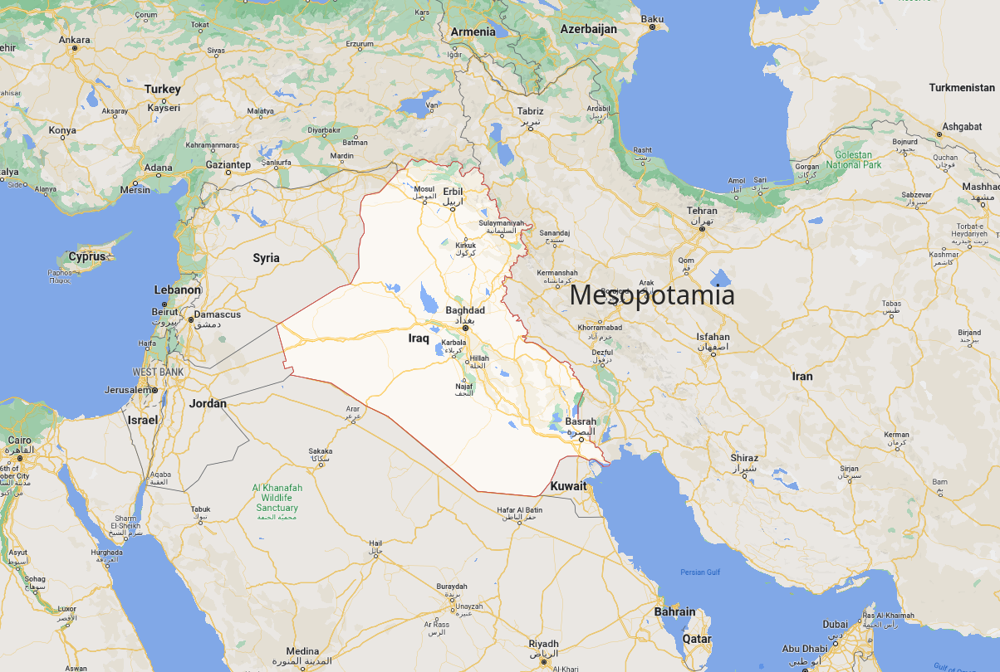
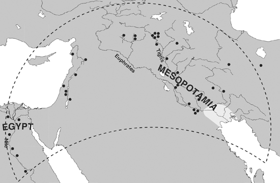
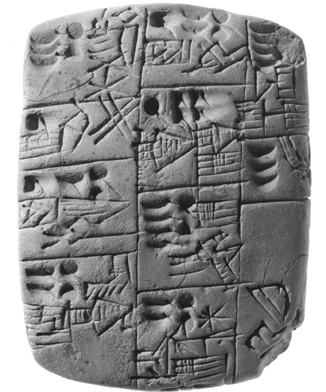
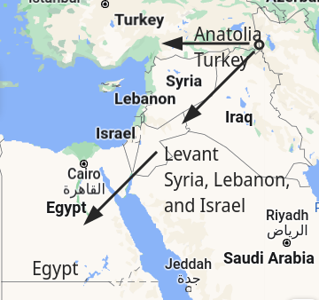

# Beer in Mesopotamia & Egypt

## 人类起源

- 150,000 years ago
  
  - 饮用水
  - *Homo sapiens sapiens* 出现
  
- 50,000 years ago

  - 小型游牧部落，以打猎为生。采集鱼、可食用的植物、以及各种各样的季节性食物。

- 12,000 years ago

  - 从旧石器时代（Paleolithic Period）的打猎的生活方式转为农牧业。
  - 形成聚落，村庄
  - 科技进步：手推车、书写、以及瓷器。

- 10,000 - 4,000 BCE

  - 这种饮料成为社会、宗教和经济生活的中心，是最早文明的主要饮料。

  - 最早帮助人类走向现代社会的饮料就是：**啤酒**

    

- 3,400 BCE

  - 最早的书写文档
  - 并没有诠释啤酒的起源；但是啤酒显然和农业的发展是有关的。

- Fertile Crescent

  - 物产丰富——冰河时代结束之后，高地成为了野生动物（绵羊，山羊，牛，以及猪）和野生植物（小麦和大麦）的家园。
  - 
  - 小麦提供了稳定的食物来源，在 10,000 BCE 甚至发现燧石制作的用于收割小麦镰刀（以及其他用于此目的工具）。特别是因为小麦可以长期存储的特性，人们更希望留在一个地方保护自己的劳动成果。
  - 10,000 BCE, 第一个**永久性的定居**在 Eastern coast Mediterranean 被发现。

- 啤酒伴随人类走过了 Prehistory 和旧石器时代，是人类文明的现存遗迹。

## 啤酒的发现

- 小麦的特性
  - 发芽的小麦是甜的，因为 diastase enzymes. **malted grain**。人们很喜欢这个，并产生了制作麦芽糖的工艺。
  - Gruel（燕麦粥）经过发酵后产生酒精和二氧化碳——**beer** 第一次被人们所发现。
    - 虽然果汁以及蜂蜜水也可以制酒（wine/mead），但是他们的来源不稳定，因此，直到 6,000 BCE 以前，主要都是以啤酒为主。
- 啤酒的发现
  - 更多麦芽糖 + 制成粥之后再酿造 + 长时间发酵 => 更强的啤酒。
  - 使用同样的容器制酒，可以产生更稳定的效果 => **mash tubs**，Mesopotamia 人那时随身携带自己的制酒容器。
  - 更多品类的啤酒通过加入浆果、香料、草药等被制作出来。
    - 祭祀用的
    - 日常用的
    - 等等，Egyptian 生产了 20 种不同的啤酒。
      - fresh beer, dark beer, fresh-dark beer, strong beer, red-brown beer, light beer, and pressed beer. 
      - Red-brown beer was a dark beer made using extra malt,
      - Pressed beer was a weaker, more watery brew that contained less grain
    - Mesopotamia 有自己独特的配方， bappir
      - 发芽的大麦被塑造成块状，就像小面包一样，经过两次烘烤，产生一种深棕色、松脆的无酵面包
      - 它与其说是一种食品，不如说是一种储存制造啤酒的原材料的方便方法（除非饥荒，人们不吃这个）
  - 先有面包还是先有啤酒，这是个问题；不妨认为他们不过是粥的两种产物：
  - 浓稠的粥可以在太阳下或热石上烘烤，制成面包干；稀薄的粥可以留着发酵成啤酒。两者是一枚硬币的两面：面包是固体啤酒，而啤酒是液体面包。

## 啤酒的社交意义

- 从一开始，啤酒似乎就有作为社交饮料的重要功能。
- Sumerian 和 Egyptian 在他们的书写中记录了啤酒在文明中发挥的重要作用。
  - Sumerian
    - 3,000 BCE 两个人通过吸管从一个容器中享用啤酒。尽管吸管在当时以不是必须，人们仍然用这种方式来分享。
    - **clinking of glasses**

## 宗教和啤酒

- 因为发酵和麻醉的过程不为人知，人们认为酒是神的礼物。
  - Egyptian
    - beer was accidentally discovered by **Osiris**, the god of agriculture and king of the afterlife
    - beer saved human
      - Ra 希望惩罚人类
      - Hathor 太过凶残，所以他在回心转意之后，将啤酒染成红色撒在 Hathor 的路上。最后 Hathor 因为喝醉了，成了啤酒神。
    - a strong disapproval of drunkenness (from scribal training text, 但是他们基本上反对任何东西。)
  - Sumerian
    - 他们轻视醉酒，并且往往幽默的描述其影响。
    - Lying out a meal on a table in the temple before a divine image
    - a banquet at which the consumption of food and drink by the priests and worshipers invoked the presence of the gods and the spirits of the dead
- 因为啤酒是神的礼物
  - Sumerian & Egyptian 在宗教仪式，农业生育仪式，以及葬礼上所使用啤酒。
  - Incas, *chicha*, 和太阳干杯，并且将第一口啤酒献给土地之神
  - Aztecs, *pulque*, 给 Mayahuel 生育之神
- 

## 啤酒的好处

- 酒精以及酿造过程中的高温使得啤酒相较于水，更加安全。（人类聚居的地方，排泄物会污染水源）
- 发酵过程中的酵母可以提供 Vitamin B 以及蛋白质。

## 农业和啤酒

- 为了保持啤酒供应 & 增长人口的问题——人们逐渐转向农业。
- 农业生产的过多食物，以及新的灌溉技巧进一步扩大了可以用于种植的土地
  - 牧业
  - 畜牧业
- 过多的食物可以避免饥荒，也被浪费在宗教仪式中——用于保证神确保丰收。
  - 人们对神的贡献（上交过多食物），产生了记录的要求。此时没有文字，人们使用 small clay tokens.
  - 粮仓也因此成为寺庙，供奉神和牧师。

## 城市化

- Mesopotamia，人们逐渐转向城市化生活。过剩的食物产生了管理者和工匠——他们是第一批完全生活在城市中的人。

### 动机

- 未知
- 可能是处于安全的考量——美索不达亚平原没有自然屏障，于是村庄在 4,300 BCE 结合起来，形成城市。
  - 3,000 BCE **Uruk**，世界上最大的城市；50,000 人口以及一系列卫星田地，距离其 10 miles。
  - 2,000 BCE Mesopotamia 所有人都居住在 city states 中，如 Uruk, Ur, Lagah, Eridu 和 Nippur。
  - 此后，Egypt 产生大城市，如 Memphis 和 Thebes

- **Both cultures were made possible by an agricultural surplus, in particular an excess of grain.**
  - 让少部分人脱离农业生产并且从事管理等精英工作。
  - 用于修建公共事业，如河道、寺庙、以及金字塔等等。

## 文明象征

- 3,400 BCE, 写作开始的地方。

- 在 Mesopotamia 中，啤酒被认为是文明的象征 *Epic of Gilgamesh*
  - Gilgamesh 是 2,700 BCE 期间 Sumerian 的国王
  - Enkidu 是他的朋友，原为野人——文中称，Enkidu 在吃面包和喝酒后，*turned into a human*.

- Egypt 称啤酒为 *hekt*，并被不断的提及。
  - Egypt 在不久之后发明了自己的文字
  - 2650 BCE - 2350 BCE，Egypt 在自己的文献中记录里啤酒。

### 文字

- natural extension of the Neolithic custom of using tokens
- 当时 Sumerian 的 priest 收集过剩的食物作为对神的奉献；在实施上，这是 compulsory taxes 被寺庙所消耗、或者用于修建公共基础设施。
  - 这对于当时的 Mesopotamian 地理环境而言，是有必要的：Tigris 和 Euphrates 周期性的洪水，以及不稳定的降雨。因此，求神以及借助共享的 (communal irrigation system) 是有必要的。
  - *ziggurats*
  - 原本使用 *bullae* 放在 clay envelopes 来记录，不同的形状表示不同的贡献，而信封则用来记录贡献人。
  - 后来，人们意识到，直接在粘土板上写字即可。粘土板随后在阳光下炙烤，形成永久记录；此后，粘土 tokens 就不再需要使用了。
  - 
  - 3,200 BCE, Uruk 城市中发掘的粘土板，用于记录啤酒的分配。当时，政府分配的食物是一些人主要的食物来源。

## Liquid Wealth/Heath

- In Egypt & Mesopotamia, 啤酒、小麦、大麦、以及面包是广为人知的货币。
  - Mesopotamia
    - $\textrm{sila} \approx 1\textrm{L}$
    - 低等工人一天 1 silla, 中级官员一天 2 silla, 更高级别的以及其夫人 3silla, 最高级别的一天 5silla.
    - 同等大小的碗被用来作为标准度量衡。
  - Egypt
    - 修建金字塔的工人通过啤酒结算工资
    - 2,500 BCE, 3-4 条面包以及 2 大杯啤酒（大约 4 L）是一个工人分配到的食物。经理和官员获得更多的食物 —— *Drunkards of Menkaure*
    - 这些工人大多是农民，因为Nile洪水颗粒无收，因而来此打工；state 则将收集到的供物作为工资放放下去，免得他们饿死。
  - 液体因为可微分的特性，是方便的货币。
  - bread and beer as wages or currency meant that they became synonymous with prosperity and well-being
  - beer 也被用来入药，并且人们相信，啤酒甚至帮助用于死后在 afterlife 过得更好。
  - beer & bread 因为成为了好生活的象征，因此人们常以 beer & bread 祝愿他人身体健康、幸福美满 —— 这事实上是一个日常问候。
  - Tutankhamen 的墓地中存放啤酒以及酿造啤酒的工具（1335 BCE）；普通人也会和啤酒一起下葬。

## Drink From the Dawn of Civilization

- beer 陪伴 Egypt & Mesopotamia 人的生老病死
  - 他们的啤酒都没有啤酒花 (hops)，此物直到中世纪时期才被加入到啤酒中。

# Wine in Greece & Rome

## 亮相

- King Ashurnasirpal II of Assyria 在 870 BCE 举行了盛大的宴会
  - 迁都 Nimrud
  - 给所有来宾提供了葡萄酒 —— 在当时，葡萄仅因为不能在本地生产，都从 northest, mountainous 的部分进口而来；因此，**极端昂贵！**
- Assyrians 让饮葡萄酒变成了一个正式、复杂的仪式
- 825 BCE, Shalmaneser III, King Ashurnasirpal 的儿子喝葡萄酒的形象被刻画在方尖碑上。祈求着跪在他的脚下 —— **葡萄酒成为权力和繁荣的象征。**

## 起源

- 9000 - 4000 BCE

  - Zagros mountains
    - 6000 BCE 瓷器的生产允许存储葡萄酒
    - Eurasian grape vine 的声场
    - Cereal crops 提供是食物

  - 几乎和啤酒在同一时期生产，具体时间未知；大约在 Neolithic 时期。

- 5400 BCE

  - 葡萄酒生产的最早记录
  - Hajji Firuz Tepe, a Neolithic village in the Zagros Mountains

## 传播

- 很快，葡萄酒生产的只是就传到 Egypt, Anatolia, Levant, 等等
  - 在 3150 BCE, Egypt 统治者 King Scorpion I 和 700 杯葡萄酒一起下葬。Egypt 因为气候适宜，很快建立的自己的葡萄园并在 3000 BCE 开始国内生产。
  - Mesopotamia 的气候不舍和大规模生辰，因而只有富人可以负担得起喝葡萄酒；群众喝啤酒。
  - 在 Greek & Crete，情况和 Mesopotamia 类似。

- 在 Nimurd，Assyria
  - 自从 Ashnurasirpal 的宫廷聚会之后，地中海东部的国家都对葡萄酒感兴趣了。
  - 葡萄酒几乎成为一种大众饮品。皇宫中的人甚至有自己的葡萄酒配额（$[100, \frac{500}{3}]\ \textrm{mL}$ 每人每天）
- 在不能生产葡萄酒的地方，如 Mesopotamia，葡萄酒必须从外部快速的（因为容易变质）的进口，因此 

## 西方文明的摇篮 —— 希腊

- 600 - 400 BCE 的希腊人，他们的思想建立了西方政治、哲学、科学、以及法律的基础。
- Ancient Greece 是一个松散的城邦；在 900-800 BCE，讲希腊语的民族和外国人就有了区别 —— 说希腊语的是希腊人、而不说的为 *barbaroi*。
  - 这些野蛮人主要是 Persian 人，包括 Mesopotamia, Syria, Egypt, and Asia Minor (modern Turkey)。
  - 起初，Athens & Sparta 打败了 Persian
  - 后来， Athens & Sparta 自己打起来了
  - 最后，Alexander the Great 统一希腊，在 500-400 BCE 击败了Persian 人。此战，树立了 Greek 的文化自信 —— 他们觉得自己和希腊人有本质不同，比他们都更高贵。

- Wine was drunk at formal drinking parties, or *symposia*, which were venues for playful but adversarial discussion in which drinkers would try to outdo each other in wit, poetry, or rhetoric.
- 希腊
  - 人人皆可以以合适的价格购买并享用葡萄酒，因为温和的气候适合葡萄生长，无需从外部进口。
  - 从 Peloponnese Peninsula (Sparta/Arcadia) 开始，逐渐传不到 Athens。
  - 900-800 BCE, *WOrks and Days*，关于葡萄酒种植的第一本书发布了。
  - 后来，葡萄酒成为 Greek 主要出口产品（暴利啊！），以至于大多数农民不在种植小麦，甚至需要进口。（Attica）
  - 葡萄酒因为便宜，人们开始通过葡萄酒的品类以及昂贵程度来区分人们的社会地位。此外，人们喝酒时的仪态也被评价。

### 希腊饮酒

- 流程
  - mixing wine with water before consumption
  - content
    - formal entertainment
    - compete to improvise witty songs, poetry, and repartee
    - discussion of philosophy or literature, edcuated young man
    - *kottabos*, **not all are serious**

- location
  - *symposion*
  - *andron*, 屋子中特别的房屋，倾向于中间以便于打扫
- 人
  - 贵族男士参加
  - 女性舞者、服务员同样在场
  - *symposiarch*，*king of the symposon*；通过选票或者投骰子选出，负责保证所有人在清醒和醉酒的边缘。
  - *hetaireia*, drinking group
- 物品
  - *krater* 一个共享的碗，用来混合水和酒
  - *hydria* 一个乘水的仪器；一般来说，都是将水混合到酒中，而非相反
  - 酒盏
    - *cylix* 很浅的双柄碗，常用
    - *cantharos* 相较于 *cylix* 更大，更深的容器
    - *rhyton* 饮酒喇叭
  - *Ohiochoe*，酒壶；类似于一个长柄勺，用来将 *krater* 中的酒转移到容器中。
- 影响
  - 人们认为不经过这样流程喝酒（如 King Cleomenes of Sparta, Scythians, and Thracians）会造成不好的结果 —— 暴力、愤怒、不好的行为。但是，*teetotaler* 同样被人嫌弃 —— 滴酒不沾和饮纯酒一样不好。
  - 葡萄酒和水让彼此都变得更加适合引用 —— 葡萄酒杀菌，水降低酒精浓度。
  - *symposion* 提供了一个民主的交流方式 —— 所有人都可以平等地在这里讨论问题，尽管只有贵族中的男性才可以参加。
  - Plato 利用 *symposion* 来判断一个人是否值得信赖，并且在这里和自己的学生讨论学术问题。
  - 希腊文明随着葡萄酒传递到四方；**葡萄酒始终是 symbol of intellectual achievements & sophistication**

## 罗马

- 150 BCE 左右，罗马人取代了希腊人成为i地中海地区的主导力量。

- 罗马人和其他许多欧洲民族一样，喜欢通过挪用希腊文化的各个方面来显示他们有多么先进；以至于，尽管他们武力征服了希腊人，但是他们的文化似乎也成为了希腊文化。

  > the vanquished have conquered us, not we them
  >
  > ​									--- Cato The Elder (212 BCE)

### 生产

- 葡萄酒的种植和消费为连接希腊和罗马价值观提供了一条途径。
  - 这样他们就可以觉得自己 *remaining true to their root*
  - 但在同时享受希腊风格的别墅、聚会等等
- 200 BCE，Greek 仍然主导葡萄酒的生产。
- 146 BCE，罗马成为了世界上生产葡萄酒最多的地区（因为占领了 Italian peninsula）
- 罗马效仿希腊生产葡萄酒的方式
  - 例如，仿照 Chian wine，产出类似的 Cos。
  - 很快，希腊的葡萄酒商来到意大利。
- 农业生产效率跟不上了
  - large villa estates operated by slaves
  - 葡萄酒生产的扩张以牺牲谷物生产为代价，因此罗马开始依赖从非洲殖民地进口谷物
  - 农村人口将土地卖给别人，并迁移城市；罗马的人口从 300 BCE 的约10万膨胀到 1 BCE 的约100万
  - 罗马的葡萄酒以及其文化（随着罗马的统治的扩张）传向世界。

- 出口
  - 葡萄酒通过货船从地中海的一个地区运往另一个地区，这些货船通常能够装载2000至3000个陶土双耳罐
  - 装运葡萄酒的双耳罐通常被认为是一次性的、不可退回的容器，在达到其目的后通常会被砸碎
    - 这些砸碎的遗骸可以提供贸易的统计信息，因为上面都有表示自己位置的印章。在 Marseilles, Athens, Alexandria, and other Mediterranean ports, and in Rome itself 发现了这样的遗骸。
  - 大多数好的啤酒来到罗马
    - 到达 Ostia 港
    - 卸货，放入更小的容器中，然后从 river Tiber 一路到达 Rome
    - 穿过混乱的街道
      - 零售（让奴隶来买）
      - 双耳罐直接出售
      - 预订（送货上门）

## 社会阶级

### 例子

- Marcus Antonius
- 87 BCE
- 和 Sulla 战队；Gaius Marius 得势之后用凶残的手段镇压老对手的同谋。
- 躲在穷人家中；因为主人家的仆人买了过于高端的葡萄酒，身份泄露惨遭杀害。

### 内容

- 罗马人将葡萄酒的鉴赏（connoisseurship）提升到了一个前所未有的高度
  - **social differentiation**
  - **mark wealth and status of drinker**
- 富人
  - recognize and name the finest wines was an important form of conspicuous（炫耀） consumption
  - rich enough to afford the finest wines and had spent time learning which was which
  - **Falernian**
- 穷人