# The First Civilizations and Empires `Prehistory-A.D. 500`

## Overview

- Human used to live in small communities
  - Hunting & Fishing
  - Gathering food and supplies in wild
- Agriculture starts to dominate
  - Surplus food & Job Specialization
  - Cities, Governments
  - Writing & Art & Shared value
- **This process of state transition** is **civilization**.
  - Occurred in **river valleys** of Western Asia, Egypt, India, and China

## First Humans `Prehistory-3500 B.C.`

Palaeolithic peoples learned how to adapt to their nomadic lifestyle, improve on their primitive tools, and use fire to their advantage, thus enabling them to create a more sophisticated human culture.

The agricultural revolution of the Neolithic Age gave rise to more complex human societies that became known as the first civilizations.

Scientists continue to search for the remains of early humans, and their discoveries are changing the way we view the first humans.

 Palaeolithic peoples used technological inventions to change their physical environment, just as humans do today.

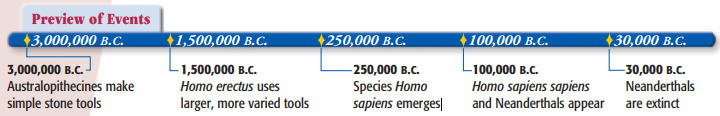

### Discovery

- **Louis B. Leakey** and his wife **Mary Nicol Leakey**
- **Olduvai Gorge** in East Africa
  - They had discovered the world’s earliest known human
- They helps us understood
  - Early humans struggles to survive by hunting, fishing, and gathering
  - They pictured the process of agriculture

### Prehistory

- **Prehistory** means the period before writing was developed.
  - Archaeological information & Biological Information
  - Archaeology
    - study of past societies through an analysis of what people have left behind
    - dig up and examine **artifacts**, tools, pottery, etc.
  - Anthropology
    - study of human life and culture
    - human fossils—to determine how people lived their lives
- Dating artifacts and fossils
  - Radiocarbon dating, $\ce{C-14}$
    - Only accurate for 50,000 years old.
  
    - Since after 8 half-lives (45,710 years), there are only a little bit of $\ce{C-14}$ left.
  
  - Thermoluminescence dating
    - Accurate for 200,000 years old
    - Measure light given off by electrons in surrounding soils
- **Guess work**

### Hominids to Homo Sapiens

- 3,000,000 - 4,000,000 B.C. **australopithecines**
  - **Donald Johanson** discovered them
  - Southern apes
  - First **hominids**
    - Creates that walk upright
  - Second hominids
    - Kenyanthropus platyops, **Kenya**
    - 3,500,000 B.C.
- 1,500,000 B.C. **homo erectus**
  - 学会使用工具和火
  - 离开非洲，前往欧洲和亚洲
    - 生火保持温暖
- 250,000 B.C. **homo sapiens**
  - Wise human being, 至关重要
  - 两个小团体
    - Neanderthals
      - 首次在德国的 Neander Valley 被发现
      - 100,000 - 30,000 B.C.
      - 利用石器工具，埋葬死者（宗教信仰的产生），穿戴兽皮制衣服
    - Homo sapiens sapiens
      - 第一个解剖学上和现代人接近的物种
      - 在非洲出现，150,000-200,000 B.C.
      - 离开非洲，100,000 B.C.
      - 散播
        - 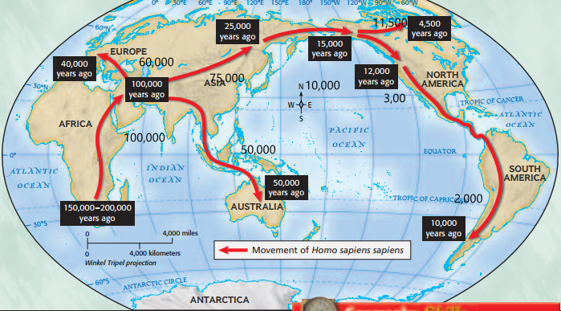
        - 随着技术的发展，他们迁徙的速度不断加快。
        - 30,000 B.C., Homo sapiens sapiens 替代了 Neanderthals
          - 可能是因为冲突
          - Neanderthals 自己就死了
        - 现代人都是 Homo sapiens sapiens 

## Hunter & Palaeolithic

- 人类具有制作和使用工具的特别能力。我们使用工具来改变自然环境，就和 Paleolithic 时代的人们一样。
- **Paleolithic Age**, aka, Old Stone Age, 指代 2,500,000 到 10,000 B.C. 之间的时间。在这之间，人们使用简单的石器工具。

### 生活方式

- 打猎
  - 内陆：buffalo, horses, bison, and reindeer
  - 海岸：打鱼
- 采集野果
- **nomads**，游牧
  - 因为他们必须遵循动物迁徙和植物生长
  - 为此，大多数人类社群的体积很小，在 20 - 30 之间
- 男女生活
  - **男女都承担寻找食物的职责**
  - 女性承担哺育孩童的职责，主要负责采集野果、坚果、以及稻粒。
    - 通过经验传承，旧石器时代人保证后代可以活下来。
  - 男性负责狩猎大型的动物
- 房屋，尤其是在寒冷地区较多
  - 由兽皮和木棍（或骨头）搭建的帐篷。
- 火
  - Homo erectus 学会用火，400,000 B.C.
  - 保护人类
    - 恐吓动物
    - 保持体温，尤其是在 100,000 B.C. - 8000 B.C. 的 Ice Ages 中发挥重要作用。
    - 烹制食物，提升口感便于吸收
  - 摩擦生火，或者 iron pyrites （硫化矿生火）
- 艺术
  - Lascaux, 法国西北部 & Altamira，西班牙东部被发现了艺术活动。
  - 25,000 - 12,000 B.C.
  - 动物被精确刻画；人的形象粗略刻画

### 工具

- 骨头制成的鱼叉（Harpoons）和鱼钩（Fishhooks），提升了打鱼的数量

- Technology，就是人类创造工具来控制周边环境和更好的生存。旧石器时代的工具主要是石器——使用坚硬的岩石，如燧石来制造。
  - 手斧，以及包含一个或多个刀刃的刀。
  - 刀刃放置在木柄上，便于使用。
  - 木柄削尖烤硬，产生矛（spear）
  - 骨针等小型工具逐渐被制造（在旧石器时代晚期）

## 新石器 Neolithic Revolution

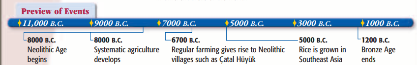

- Characteristics of Civilization
  - Surplus of food
  - Agriculture
  - Conglomeration of human
  - Writing
  - Culture
  - Religion(Shared Value)

- 3000 B.C., 城市在农耕地区的村庄中出现。
  - 逐渐的，在 Mesopotamia 河谷，Egypt，India，和 China，第一次文明化、城市化的浪潮涌现。
  - 农业革命是这一切的起因——事实上，我们现在的生存仍然依赖于起源于新石器时代系统的作物种植和存储系统。
- 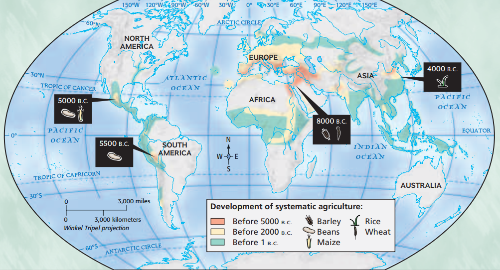
  - 最早的农业生产在中纬度地区（30 N）的 Mesopotamia 和 Asia 发生。这样的气候环境利于农业作物的生长。

### Neolithic Revolution

- 8000 B.C., 冰河时代结束；**Neolithic Revolution** 掀开了序幕。
  - 8000 B.C. - 4000 B.C.
  - 新时期时代，*New Stone Age*。
- 新石器时代的特点
  - 从打猎，采集食物的生活转为畜牧业，农业为导向的 **systemic agriculture**
    - **domestication** 驯化动物使其供人类所用
      - 肉、奶、毛的生产
      - 利用动物的力量进行农业活动
    - 系统化农业生产帮助人类完成**城市化转型**，放弃游牧生活
  - 系统化农业的传播
    - 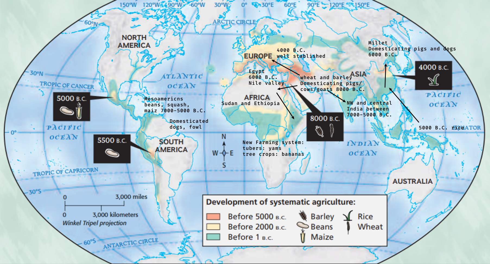
  - 石器时代的种植村庄
    - 种植村庄在 Europe, India, Egypt, China 以及 Mesoamerica 等地出现。
      - 历史最为悠久，并且最大的是 **Jericho**，在 Southwest Asia。
        - Palestine near the Dead Sea
        - 8000 B.C.
      - Çatal Hüyük，在 Turkey，存在一个更大的社区。
        - 32 acres
        - 6000 People
        - 6700 - 5700 B.C.
        - Food sources
          - Agriculture: 12 products, 水果，坚果，以及3种不同的小麦
          - 畜牧业：牛，生产牛奶、肉、以及兽皮
          - 也会去打猎
        - 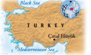
        - Specialized labor 和过多的食物
          - Artisans, 工匠，制作武器和珠宝。
          - 和外界进行贸易
        - Religion
          - 神像
          - 女性神像
  - 石器时代的影响
    - 人们定居下来
      - 制造存储工具和房屋
      - 进行贸易活动
      - Specialized labour, division of labour
        - 石器工具做的更好了，制作镰刀(sickle) 和锄头(hoe)
      - 亚麻(flax)和棉花(cotton)用于制作衣服
    - 男女关系和农业
      - 男性放牧动物，耕种在农田中
        - **父权社会**
      - 女性纺织，制造芝士等牛奶的副产品，以及其他只需要在一个地方呆着的劳动
  - 结束
    - 4000-3000 B.C.
    - 金属的使用替代了石器
      - 4000 B.C. 之前石匠已经发现了通过加热包含金属的岩石，他们可以将金属转化为液体，并借此制造工具
      - 铜是第一个用于制造工具的金属。
      - 4000 B.C. 之后，western Asia 的人发现使用 copper & tin 可以制造青铜(bronze)，更为坚硬和好用。

### Bronze Age 青铜时代

- 3000-1200 B.C.

  - 青铜时代
  - river valleys of Mesopotamia, Egypt, India, and China

-  Civilization

  - **culture** of a people is the way of life that they follow
  - **civilization** is a complex culture in which large numbers of human beings share a number of common elements
  - Components of Civilization
    - Rise of Cities
      - 大规模的农业生产是支撑 Civilization 的必要因素
    - Growth of Governments
      - 政府安凯和组织人类活动。
      - 提供了个人和群体之间流畅的交互。
      - Monarchs, 独占。
    - Role of Religion
      - 信神
      - Priest, 牧师负责讨好神
      - 统治者声称神给予了他们力量，或者他们就是神
    - New Social Structure
      - Stratified social classes:
        - Upper class: priests, government officials, and warriors
        - Free people: farmers, artisans, and craftspeople
        - Lower class: slave
      - 因为 abundant food supplies, 有些人可以不从事农业生产。
        - Upper class 对奢饰品的需求，刺激了新产品和技术的发展。
        - 贸易，技术得以传播。
      - **Revolutionary stage in the growth of human society**
    - Use of Writing
      - 利用写作的方式来记录信息
      - Inca in Peru, 利用经历训练的记忆力专家来存储重要的事情。
      - **所有文明最后都使用写作来保留信息**，**文学创作**
    - Artistic Activity
      - Temples and pyramids
      - Painting and sculpture
      - 以祭祀和表达对自然力量的崇拜为主

  

## Western Asia and Egypt `3500-500 B.C.`

### Overview

- The Sumerians in Mesopotamia were among the first groups to build a civilization, and they were the first to develop a system of writing.
- Due in large part to the Nile, early Egyptian civilization was stable and prosperous. Massive monuments, the pyramids, were built to honor the deaths of the pharaohs.
- The Israelites emerged as a distinct people
- Of the other empires that came into being in Southwest Asia, the longest lasting and most powerful were the Assyrian and Persian Empires.

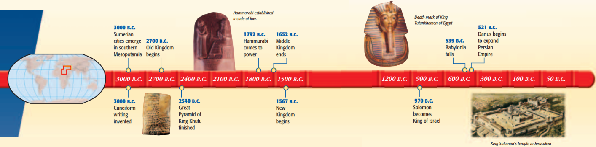

### Civilization Beings in Mesopotamia

- Mesopotamia civilization include different parts
  - Sumer
  - Assyria
  - Akkad
- If not specified, Mesopotamia civilization means all three of those general areas.

#### Geography

- **Mesopotamia**: the valley between the **Tigris** and **Euphrates** Rivers, the land “between the rivers.”
- **Fertile Crescent**: arc of land from the Mediterranean Sea to the Persian Gulf
  - Mesopotamia is located here
  - **rich soil** and **abundant crop**
  - formed because of Tigris and Euphrates 河留下的 **silt** (淤泥)
    - Tigris & Euphrates 在晚春时节涨潮，随后留下其肥沃的淤泥。
    - 这样的现象因为其发源地山谷融雪造成。为此，河谷的人没有办法预测这种自然现象
      - 修建水利工程使得规律的种植变得可能。
  - 土壤肥沃+灌溉工程+温和的气候 = 完美的种植环境

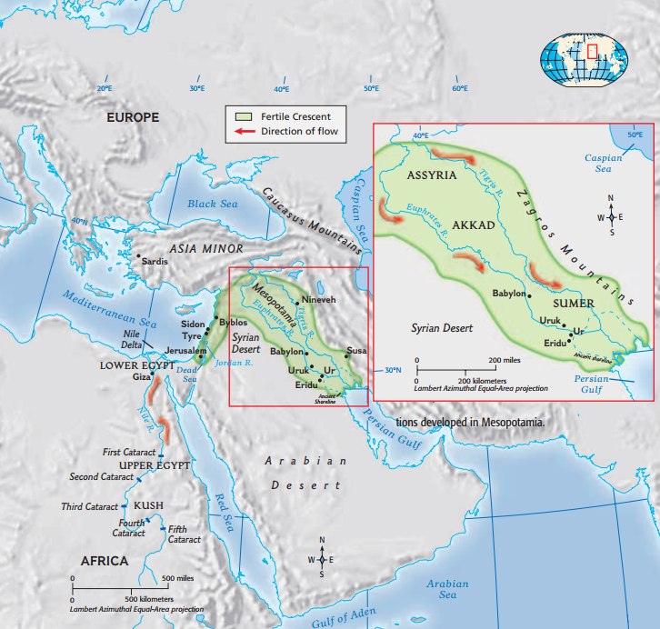

#### Sumerians & City States

- Sumerian 的起源不明
- 在 3000 B.C., 他们在 Mesopotamia 的南部创建了大量的城市
  - Eridu
  - Ur
  - **Uruk**
- 随着城市的发展，他们对城市周围的郊外获得了政治和经济上的控制。形成 **city-states**, (城邦）Sumerian Civilization 的基本组成部分。

- 城市
  - 被围墙包围 - 10 km
  - 围墙上有保护措施 - 9-10 m
  - 城市主要使用砖块制作（因地制宜），因为缺乏石材和木材。至今，Southwest Asia 仍然使用砖块。
- 神和统治者
  - Ziggurat, 作为 temple 的底座。
  - Sumerians 相信神拥有城市。他们把绝大多数的金钱都用于建筑寺庙，牧师（priest/priestess) 的房屋，以及类似的建筑。
    - **Theocracy**，神权统治。
      - 国王(king)统治城市。
      - 国王被认为从神的手中获取力量，作为神的代言人。
        - 领导军队
        - 监视公共建筑
        - 修建水利工程
      - 国王和牧师一样，生活在宫殿中(palace)
  - 这些建筑作为市中心出现。
- 经济和社会
  - 农业为主，工商业为辅。
  - 工业
    - Metalwork 最为出名
    - Woolen textile 羊毛制品和 pottery 瓷器
  - 商业
    - 进口 copper, tin, 和 tiember
    - 出口鱼干，羊毛，大麦和小麦，以及金属制品
    - 轮子的发展，方便了商品的运输
    - 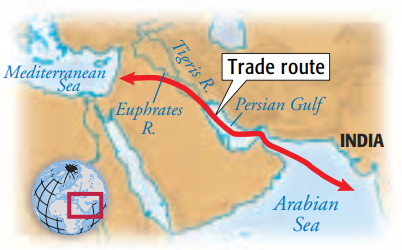
  - 社会分层，和青铜时代的社会环境一样
    - Nobles: priest, royal, and their familes
    - Commers: farmers, merchants, fishers, and crafts people works for nobles **90%**
    - Slaves: works for nobles in building, e.g., temple use female slaves to weave cloth and grind grain; landowners use slaves to farm.

#### Empires

- 起因

  - 内斗：city-state 不断扩张，互相争斗以求获得更多领土和水源
  - 外患：Mesopotamia 是一片平原，容易被外部入侵

- Akkadians 帝国

  - **Akkadians** 的领导者， **Sargon**，在 2340 B.C. 入侵了 Sumerian city-states
    - **创立了世界上第一个帝国（empire）**
      - 帝国是一个在一人（或多人）领导下，掌控大量人和土地的，大的政治单元
      - a large political unit or state, usually under a single leader, that controls many peoples or territories
      - 帝国很容易创建，但是往往很快就四分五裂。帝国的起起落落(rise and fall)**是历史的重要组成部分**
    - Akkadians 在 Sumerian City States 的北部，是 *Semitic* 人因为他么说 Semitic Language.
  - 因为周围居民的攻击，Akkadians 帝国在 2100 B.C. 黯然退场。新的帝国(Babylon) 在 1792 B.C. 再次创立。

- Babylon 帝国

  - City States south of Sumerian, 在 **Hammurabi** 的领导下创建了新的帝国。
  - 这个帝国控制了 Akkad & Sumer.
  - Hammurabi 在 1750 B.C. 死去，随后的国王没能保持帝国的稳定。不久，帝国四分五裂，并在侵略者的入侵下失败。

  - Code of Hammurabi
    - Hammurabi is remembered for his law code, a collection of 282 laws
    - The **Code of Hammurabi** was based on a system of strict justice
      - Severe penalty
      - Equality, with regarding social classes of the vitim
        - Lower => Higher = High penalty
        - Higher => Lower = Low penalty
      - Took seriously the duties of **public officials**
        - Officials need to catch burglars, if they failed to do so, official responsible for that area need to replace the lost property.
        - official need to pay for relatives of victim, if murderer was not found.
        - Judges are fined for judge right.
      -  Consumer protection laws
        - Builders are responsible for all losses that happened to customer, e.g.
          - Kill builder and or its relative if owner of building, or its family member, is dead due to collapse of building.
          - Builder need to pay fine for all those losses.
      - Marriage and the family
        - **Largest part**
        - Sign marriage contract
      - **Patriarchal** reinforcement
        - Mesopotamian society was dominated by men
        - Woman has fewer privileges
          - If woman does not do home job right, they could be drowned.
        - Father rules their children and their wives.
      - **Hammurabi’s law code covered almost every aspect of people’s lives**

#### Religion

- Uncontrollable physical environment makes Mesopotamians believe the existence of god and they are inferior &| helpless.

- Mesopotamian religion was **polytheistic** because of this belief in many gods.

  - They believe 

  > Human beings were supposed to obey and serve the gods.

#### Creativity & Writing

- **Cuneiform** Writing
  - 3000 B.C.
  - Sumerians invented the oldest writing system.
    - **Cuneiform**, writing using a stylus on clay tablets and dry it.
    - **Wedge shaped**
  - Several hundred thousand tablets have been found.
  - Usage
    - record keeping
    - schools to train scribes -- also copyists, teachers, and jurists
      - becoming a scribe was the key to a successful career
      - scribes hold the most important positions in Sumerian Society **知识就是力量！**
  - 意义
    - 传递知识
    - 保留记录
- School and education
  - boys from wealthy families
  - 2500 B.C.
  - discipline was harsh, being caned (藤条抽打) was frequent.
  - 从日升到日落教学
  - 主要的教学认为就是抄写，不断的抄写用于教学的材料（standard works），然后学会所有的 cuneiform 字符并且背诵这些材料。
- Literature
  - 作为书写的另外一种应用
  - ***The Epic of Gilgamesh***
  - 记录了一个传奇般的国王，名 Gilgamesh, 和其最好的朋友（这个朋友是一个毛茸茸的野兽） Enkidu 干下了传奇的举动的故事。
    - 最后，他们都死了，表明 **everlasting life** 是神仙的专有物

- 技术
  - Wagon wheel 用于人和货物的传送
  - Potter's wheel 陶钧，用于制作瓷器
  - Sundials 日晷
  - Arch 建筑上的发明
  - Copper & tin 青铜合金
  - 数学和天文学
    - 60 进制系统
    - 几何学
    - 星座的观察，60 分钟，60 秒的度量衡单位

### Civilization in Egypt

#### Overview

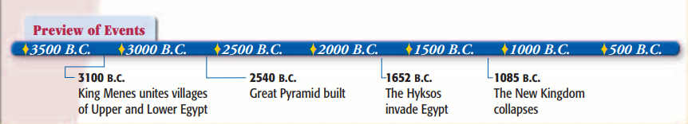

#### Geography

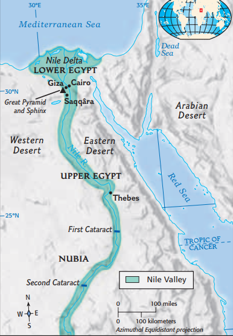

- Nile 河对于 Egyptian 文明的发展起到了至关重要的作用。
  - 尼罗河是世界上第一大河
    - 尼罗河每年产生洪水，帮助灌溉以及将河中的沃土运送到沿河的田地中。Miracle of the Nile
      - 夏季因为 heavy rains in central Africa, 在九月到十月为盛。
      - Black lands, fertile land formed due to the Nile river, was created 7 miles on each side of the river.
      - Red land, the land beyond the narrow strip of fertile fields, are deserts.
      - **产生 abundance of food**，因为肥沃土壤。
    - 尼罗河作为水利运输
      - 自南向北注入地中海
      - 风将帆船（Sailboats）自北向南推动
  - Nile Delta, 也被称为 Lower Egypt
  - 南方的上游，被称为 Upper Egypt
  - Egypt 大多数重要的城市都在尼罗河三角中产生
- Egyptian 历史划分为 3 个主要部分。
- 稳固的地理防线
  - West & East: 沙漠
  - East: Red sea
  - Southern Part of Nile: 大瀑布 cateracts
  - North: Mediterranean Sea
- 影响
  - 地理防线：大多数 Egyptians 有一种安全和不变性的感觉。
    - faced life with a spirit of confidence in the stability of things 
  - 肥沃土壤：城市的发展
  - 尼罗河运输：各地的交流和交通都很方便。

### Religion

- 宗教是他们生活不可分割的一部分。
  - Polytheistic
  - Sun gods and land gods 是比较重要的部分
    - Sun gods
      - 根据不同的形态获得不同的名字
      - `Atum` 是其人形的名字
      - `Re` 人身隼头
      - `Son of Re` 是 Egyptian Ruler 名字，因为他们被认为是 Re 在世俗的化身。
    - River and land gods
      - Osiris and Isis
        - 他们是夫妻
        - Osiris 使得 Egypt 变得文明化。
        - Seth 杀死了 Osiris, 并分尸14块将其抛入尼罗河。其碎片被其妻，Isis发现并在其他神明的帮助下复活了 Osiris.
      - Osiris 被 Egyptian 人认为是复兴，复活的标志。
        - 为此，死者被放入金字塔或墓穴，并被成为 Osiris，以期他们可以再次投胎为人。

### 3 Section of Egyptian History

- Old Kingdom
- Middle Kingdom
- New Kingdom

上述为 Egyptian 历史中的三大部分，每个部分都有：

- 强大的领导统治
- 没有外敌入侵
- 修建金字塔和寺庙
- **智慧和文化活动**

3100 B.C. 埃及的历史开始了。**Menes** 一统 upper Egypt & lower Egypt 为一个单独的王朝，铸造了 **first Egyptian royal dynasty**。

- Dynasty 是统治者的家族，他们的统治权在家族内部传承。
- Egyptian ruler would be called “King of Upper and Lower Egypt,” after that. They make Egyptian united politically.

#### Old Kingdom

- 2700 to 2200 B.C.
- age of prosperity and splendor
- **pharaoh** become the most common title of Egyptian monarchs.
  - Kingship was a divine institution in ancient Egypt
    - subjects believed that they were helping to maintain a stable world order
    - a breakdown in royal power could only mean that citizens were offending the gods and weakening that order
  - Egyptian pharaohs possessed absolute power
- **bureaucracy**—an administrative organization with officials and regular procedures— developed
  - **office of vizier** is the most important, 整个领土的管家
  - 当时，Egypt 被划分为 42 个 provinces, 每个省都有一个由法老指定的governor管理当地事宜。他们对法老和vizier负责。

##### Pyramids

- Pyramids is one part of larger complex buildings dedicated to dead -- **city of dead**

 
    

        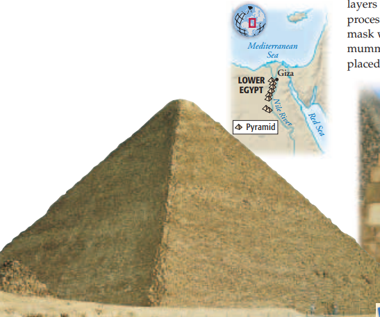
        <ul>
            <li>Large pyramid for pharaoh's burial</li>
            <li>Smaller pyramid for his family</li>
        </ul>
    
 
    

        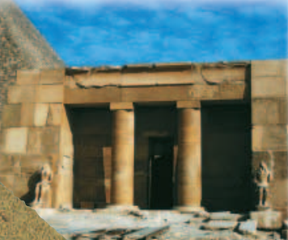
        <ul>
            <li>Mastabas are for pharaoh's officials</li>
        </ul>
    
 

- Tombs were well prepared for their residents
  - chairs, boats, chests, weapons, games, dishes, and a variety of foods
  - Egyptians believed that human beings had two bodies - **ka**, the spiritual one, is supposed to live in here.
    - They expect **ka** to continue its life despite the death of physical body, by doing that.

	

         <ul>
            <li>
                

                    <strong>mummification</strong>, which is used to preserve the physical body after death.
                

                <ul>
                    <li>
                        
slowly drying a dead body to prevent it from rotting

                    </li>
                    <li>
                        
took place in workshops

                    </li>
                    <li>
                        
run by priests

                    </li>
                    <li>
                        
used by
                            <strong>wealthy families</strong>, normal families can not afford it.
                        

                    </li>
                    <li>
                        
process

                        <ul>
                            <li>removes liver, lungs, stomach, and intestines – 4 special jars</li>
                            <li>removes the brain by extracting it through the nose</li>
                            <li>use salt and spices to dry it, put resin around it</li>
                            <li>after 70 days to drying, a lifelike mask was placed over the head and shoulders of the mummy.</li>
                            <li>sealed in case and placed in its tomb</li>
                        </ul>
                    </li>
                </ul>
            </li>
        </ul>
    

    

        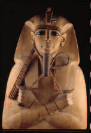
    

- **King Khufu**, constructed the largest pyramid, **Giza**, around 2540 B.C.
  - The Greek historian Herodotus reported the traditional story that it took 100,000 Egyptians 20 years to build the Great Pyramid.
  - important symbol of royal power

#### Middle Kingdom

- The Old Kingdom 倒下了，随后便是一段长达 150 年的混乱。
- 最后，新的皇朝控制了 Egypt 并开启了 Middle Kingdom, 从 2050 B.C. - 1652 B.C.
  - Egyptian 认为这是黄金时期，最好的年代。
  - 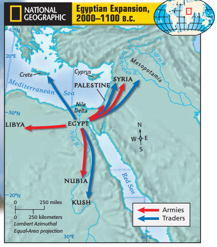
- 扩张
  - Nubia 被征服
  - 尝试占领 Palestine 和 Syria
- Kush, Syria, Mesopotamia, and Crete 之间产生贸易来往

- Pharaoh 地位的改变
  - 被认为是人们的牧羊人，不再是神
  - 他们管理公共工程，提供公共福利，并且建造了大量的利国利民的项目
    - 尼罗河三角洲灌溉工程的修建提供了新的农田
    - 连接尼罗河和红海的运河的修建促进了贸易和运输

#### The New Kingdom

- The Middle Kingdom came to an end around 1652 B.C 因为 Hyksos 的入侵
  - Hyksos 来自 Asia
  - Hyksos 使用马车来进攻，打赢了使用驴车的埃及士兵
- Hyksos 在之后的一百年前，控制了埃及的大部分。被征服的埃及士兵痛定思痛，从中学到了很多。
  - 他们学会使用青铜来制造工具和武器。
  - 从 Hyksos 的军队技巧中学到了很多，如马车。
- 最后，新的法老利用这些先进技术打败了 Hyksos 并一统埃及
  - 1567 - 1085 B.C.
  - 成为希腊帝国，以及在亚洲西南部的最有力霸主。埃及自此走上了军国主义道路。
- New temples, showoff of their wealth
  - **Hatshepsut**—the first woman to become pharaoh
  - 在 Thebes 修建新的寺庙
  - Thutmose 带领军队进攻 Syria 和 Palestine
- 宗教信仰的转变
  - Amenhotep IV
    - 变为 monotheistic 并且干掉了希腊人所信仰的其他神明
    - **文化的破坏**
    - 只信仰 Aton, god of the sun disk, as the sole god. 
    - 改名为 Akhenaton
  - **Tutankhamen**
    - 下一代王，恢复了之前的神明
- 短暂的动荡
  - Akhenaton/Amenhotep的统治造成了希腊的宗教革命，导致了埃及帝国的灭亡。
  - Ramses II 在 1279-1213 B.C. 统治希腊，然后造成了又一次动荡——Egypt 重新恢复了对 Palestine 以及自治的地位，不过，没能收回全部的土地。
  - 最后， Sea Peoples, 使得埃及帝国回到自己原有的边界上。新帝国在 1085 B.C. 崩溃。
- 结局
  - 1085 B.C., New Kingdom 倒塌
  - Egypt was dominated by Libyans, Nubians, Persians, and finally Macedonians after the conquest of Alexander the Great
  - 在 100-0 B.C. 之间，**Cleopatra VII** 尝试恢复 Egypt 的自治地位，不过失败了，因为他尝试和 Rome 为敌，最终， Egypt 成为 Rome 的一个省份。

#### Social Classes

- Pyramid strcuture
  - Ruling class:
    - God-like King -- Pharaoh
    - Upper class: nobles & priest
      - Joined rituals of pharaoh
    - Ran government and their own estates for money
  - Middle class:
    - Merchant, Artisans, Scribes, and Tax collectors
    - Live in city, descent life
    - Merchant
      - Trade up and down in the Nile, International trade with Crete & Syria
    - Artisans
      - Stone dishes
      - Painted boxes
      - Beautiful, and good
  - Most people -- Lower classes
    - Most: peasants farmed on land of owners of those estates, 佃农
    - Pay taxes for upper classes, i.e., crops
    - Lived in small villages or towns
    - Provided military services and forced labor for building projects.
  - **Notice Egypt does have slaves**

#### Daily Life

- very positive attitude
- **Monogamy** (marriage to one person) was the general rule
  - Husbands are allow to have additional wives, if the first wife was childless
- The husband was master in the house, but wives were very well respected
  - Women’s property and inheritance stayed in their hands, even in marriage.
  - Most careers and public offices were closed to woman, yet women can:
    - operate businesses
    - works in the fields
    - priestesses
    - pharaohs -- queens
- Parents arranged marriages for their children. Their chief concerns were family and property.
  - 只有男孩可以保留 family name
  - 女孩和男孩以同样的方式被父母疼爱
  - 尽管包办婚姻，不过孩子们仍然是幸福且自愿结婚的（12 岁女孩和14 岁男孩结婚）
- 允许离婚，并且妻子收到补偿

#### Writing and Education

- Writing in Egypt emerged around 3000 B.C. 
- The Greeks later called this earliest Egyptian writing **hieroglyphics**（象形文字/神圣的文字）
  - Used both pictures and more abstract forms, was complex.
  - **hieratic script** was used in daily life, e.g., transaction, record keeping, etc.
    - **simplified** drawing with dashes, strokes, and curves as to make it easier to learn and use.
- Writing utensils
  - 起初，这些文字通过刻在石板上书写
  - 后来，使用纸草书书写(papyrus -- paper made from reed that grew along the Nile)
  - Scribes 是写作艺术的大家，也是老师。
    - 大户人家的男孩在 10 岁左右前往学校学习，多年的抄写练习使得他们学会书写象形文字。
    - 规矩严苛。

### Art and Science

- Artists and sculptors were expected to follow particular formulas in style  
  - Distinct look for thousands of years
- Egyptians also made advances in mathematics. 
  - Geometry for measure flooded land
  - Build pyramids
- Astronomy
  - 365 days of years
  - Based on moon and Sirius (a star)
- Medicine
  - Mummification helps that

### New Centers of Civilization

- 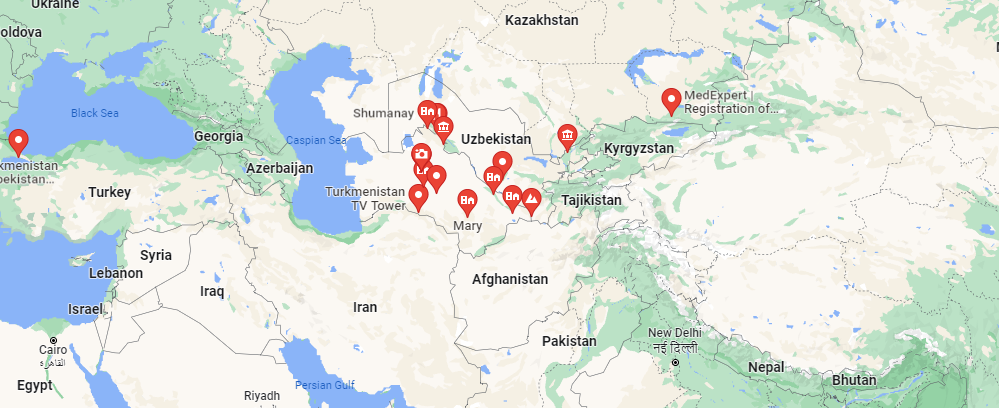

**Pastoral nomads** domesticated animals for both food and clothing.

The **Indo-Europeans** were one of the most important nomadic peoples.

- They refers to a particular group of people who used a language derived from a single parent tongue
- Black Sea (2000 B.C.) `->` Europe, India, and western Asia `->` Asia Minor and Anatolia (1750 B.C.) `->` Hittite kingdom at Hattusha
  - **Hitties** First to use Iron
  - Empire
  - Sea Peoples destroyed them

The **Phoenicians** lived in the area of Palestine along the Mediterranean coast on a narrow band of land 120 miles (193 km) long

- **Alphabets** is most important inventions they have
  - It passed to **greek**, Greek passes to Roman, which is alphabets we use today
- Improved ships, and so do trades
  - Atlantic Ocean trade
  - West Coast of Asia

**Israelites**

- They make **Judaism**, the religion that exists till now
- Procedure
  - Hebrew Bible, recorded this history
  - Israelites migrated from Mesopotamia to Palestine
    - lifestyle based on grazing flocks and herds rather than on farming
  - Migrated to Egypt
    - Enslaved
    - **Moses** lead them out, and wandered in desert, finally, back to Palestine
    - **That is their religion**
- 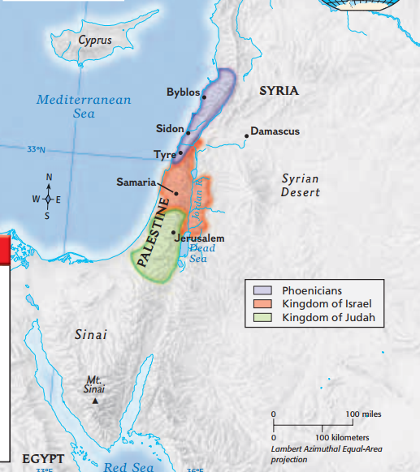
  - After King Solomon has died, the Kingdom of Israel divided into two separate kingdoms
    - Isreal
    - Judah
- 在他们在此处定居的时候，此处已经有一些人了。最为出名的为 Philistines
  - Israelites and Philistines 为了争夺土地打仗
  - 在 1020 B.C., Israelites 在即将失败的边缘，同意联合起来对 Philistines 进行抵挡。 Saul 成为联合部队的领导。
    - 1000 B.C. Saul 的领导失败了
    - David 打败了 Philistines 并且控制了整个 Palestine
      - **这就出毛病了，Israelites 觉得自己应当拥有这片土地**
    - 至今，这两拨人还在 Palestine 打仗

- King Solomon
  - 970 to 930 B.C.
  - established control over all of Palestine and made Jerusalem
    - **building a temple in the city of Jerusalem**, which become the center of their religion and of Israelite Kingdom itself
    - **improved trade and royal power**
  - aftermath of death
    - **Separated Israel**, become two kingdoms.
      - Kingdom of Israel, north ten tribes, capital at Samaria
        - In 722 B.C., the Assyrians overran the Kingdom of Israel and sent many Israelites to other parts of the Assyrian Empire.
        - Those **ten lost tribes**, merged with neighbouring people and lost their identities.
      - Kingdom of Judah, two tribes, capital at **Jerusalem**
        - The Chaldeans defeated Assyria, conquered the Kingdom of Judah, and completely destroyed Jerusalem in 586 B.C
        - Persians, destroyed the Chaldean kingdom and allowed the people of Judah to return to Jerusalem
        - Alexander the Great in the fourth century B.C
          - **Jews today** and believe in **Judaism**
          - Those captivated experience under Chaldean and Persians, converted this religion a little
            - **Yahweh**, **monotheistic**
            - **Believe god is creator of world**
              - Nature are handiworks of god
              - God was just and good
                - Personal relationship with this powerful being
                - Ask everyone to give out goodness to lord
            - The covenant, law, and prophets
              - The covenant, law, and prophets
                - **Covenant**, the stuff that Moses had made with Yahweh then he led them out toward promised land
                - **Law**, stuff they must obey since they made covenant with god to guide them out of Egypt
                - **Prophets**, are sent by God to serve as his voice to People
                  - 1100 - 400 B.C. Under conquests. They believe that believe in god would make you get out of that.
                  - Later prophets, such as Isaiah, embraced a concern for all humanity: **bring peace for all humanity**
            - **Compare**
              - **Social justice**: equal, everyone have access to god (and there is only one), not **priests**
              - 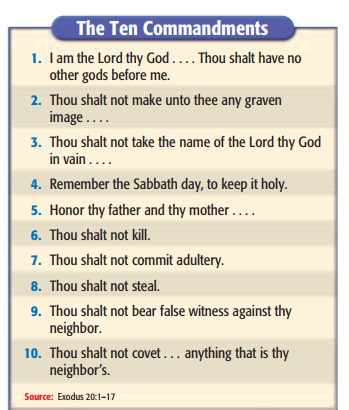
              - Religion is more important then obey political leaders

### Rise of New Empires

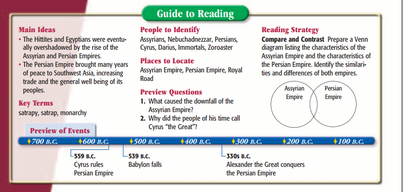

#### The Assyrian Empire

